# 医疗器械标准数据库与应用系统 - PDM网络图

**文档版本：** v1.0  
**编制日期：** 2025-11-01   
**编制团队：** 软件项目管理-第四组

---

## 1. PDM网络图说明

### 1.1 网络图概述

本PDM（Precedence Diagramming Method，前导图法）网络图基于《WBS工作分解结构 v2.0》中的130个工作包，展示了项目活动之间的逻辑关系和执行顺序。

### 1.2 网络图特点

- **节点表示**：每个节点(Box)表示一个活动或工作包
- **箭线表示**：箭线表示活动之间的逻辑依赖关系
- **活动编码**：采用WBS编码体系（X.Y.Z格式）
- **关系类型**：主要采用完成-开始(FS)关系

### 1.3 分层展示

由于项目包含130个工作包，本文档采用分层展示方式：
1. **整体项目级网络图**：展示8个主要模块间的依赖关系
2. **模块级网络图**：展示每个模块内部工作包的详细依赖关系

---

## 2. 整体项目级PDM网络图

### 2.1 项目主要阶段流程图

### 2.2 模块级PDM网络图（按阶段展示）

#### 阶段1：基础设施建设（10.13-11.16，共5周）

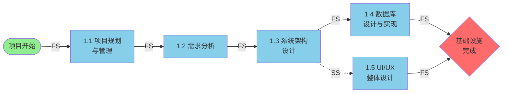

#### 阶段2：基础功能模块开发（11.17-11.30，共2周）

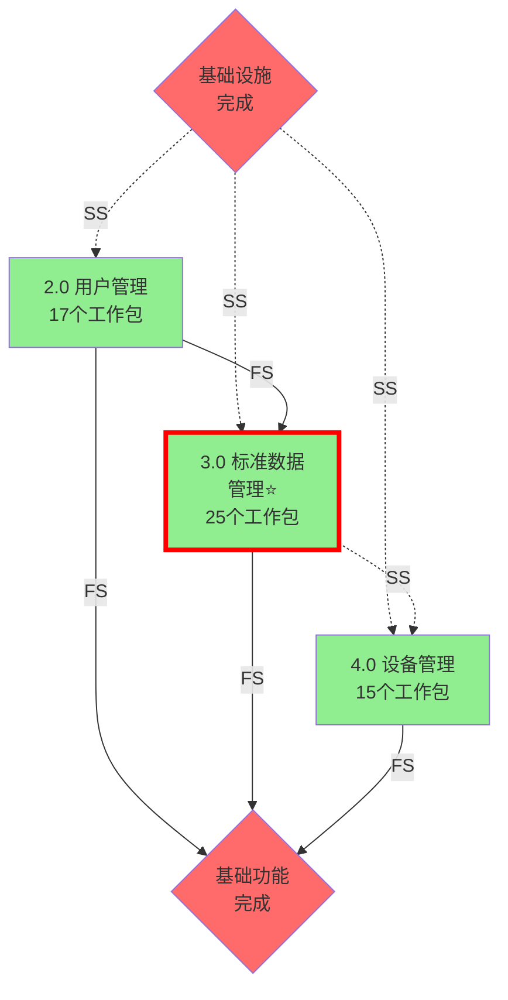

#### 阶段3：业务功能模块开发（12.01-12.14，共2周）

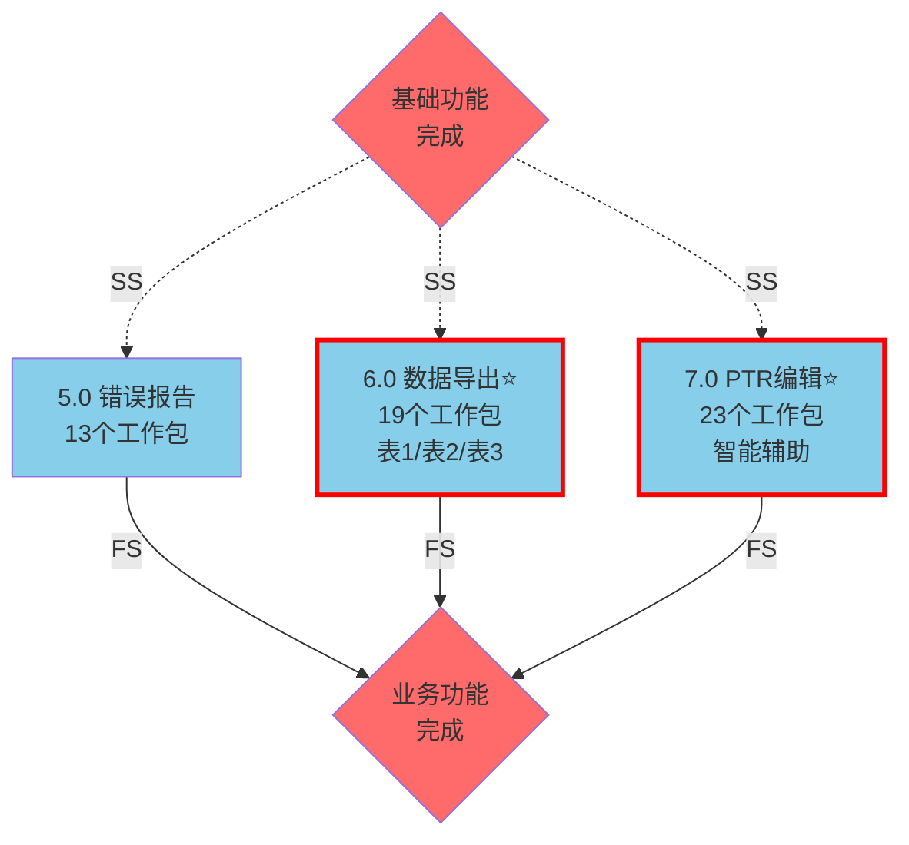

#### 阶段4：系统测试与交付（12.15，共1天）

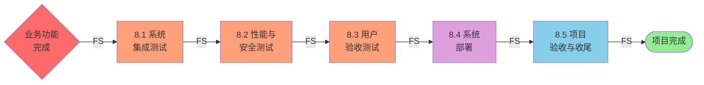

**图例说明：**

| 图形元素 | 说明 |
|---------|------|
| 🟢 **绿色圆角框** | 项目开始/结束里程碑 |
| 🔴 **红色菱形** | 阶段门控点（Gate） |
| 🔵 **蓝色方框** | 基础设施活动 |
| 🟢 **浅绿色方框** | 阶段2：基础功能模块 |
| 🔵 **浅蓝色方框** | 阶段3：业务功能模块 |
| 🟠 **橙色方框** | 测试活动 |
| 🟣 **紫色方框** | 部署活动 |
| ⭐ **红色粗边框** | 关键路径上的核心模块 |

**依赖关系类型：**

| 箭头类型 | PDM关系 | 说明 |
|---------|---------|------|
| **A → B** 实线箭头 | **FS** (Finish-to-Start) | 完成-开始关系：A完成后B才能开始 |
| **A -.-> B** 虚线箭头 | **SS** (Start-to-Start) | 同时开始关系：A开始后B可以开始（可并行） |

---

## 3. 模块级详细PDM网络图

### 3.1 模块1：项目管理与基础设施

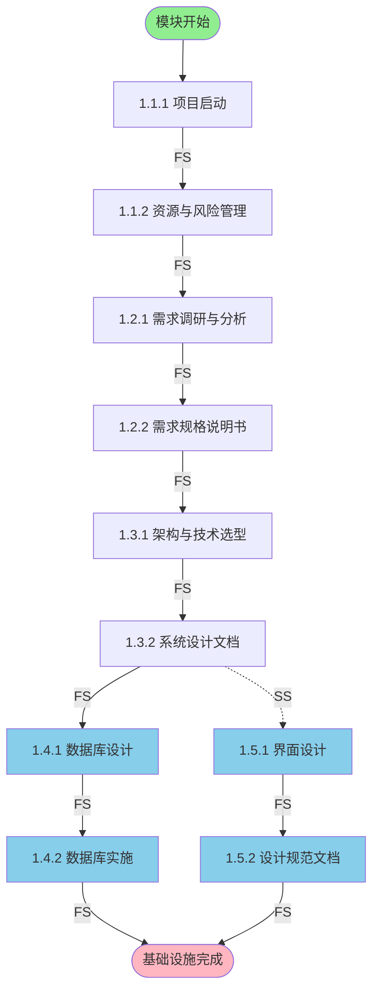

**关键依赖说明：**
- 所有活动按顺序执行（FS关系）
- **并行活动**：数据库设计（1.4）与UI/UX设计（1.5）在架构完成后可同时开始（SS关系）

---

### 3.2 模块2：用户管理功能

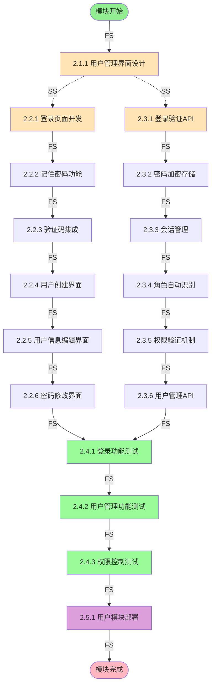

**关键依赖说明：**
- UI设计完成后，前端（2.2）与后端（2.3）并行开发（SS关系）
- 前端和后端各自内部按顺序执行（FS关系）
- 测试阶段需要前后端都完成

---

### 3.3 模块3：标准数据管理功能

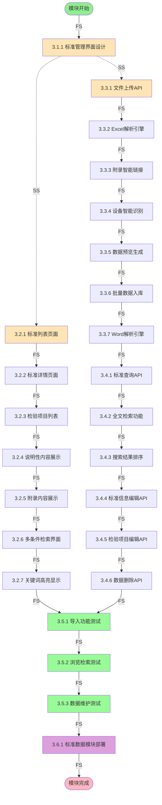

**关键依赖说明：**
- UI设计完成后，前端（3.2）与后端（3.3-3.4）并行开发（SS关系）
- Excel/Word解析是关键路径，按顺序执行
- 测试阶段需要前后端都完成

---

### 3.4 模块4：设备管理功能

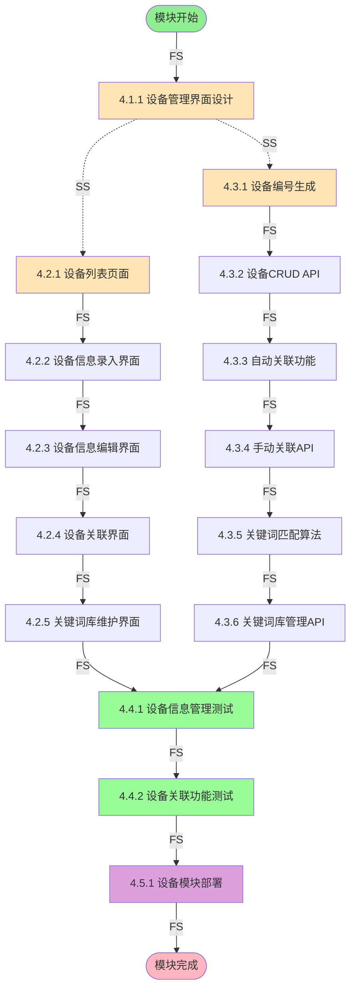

**关键依赖说明：**
- UI设计完成后，前端（4.2）与后端（4.3）并行开发（SS关系）

---

### 3.5 模块5：错误报告功能

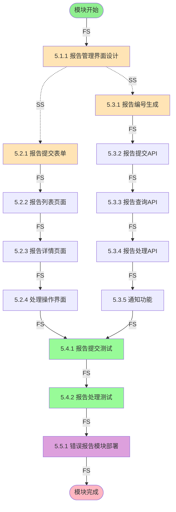

**关键依赖说明：**
- UI设计完成后，前端（5.2）与后端（5.3）并行开发（SS关系）

---

### 3.6 模块6：数据导出功能

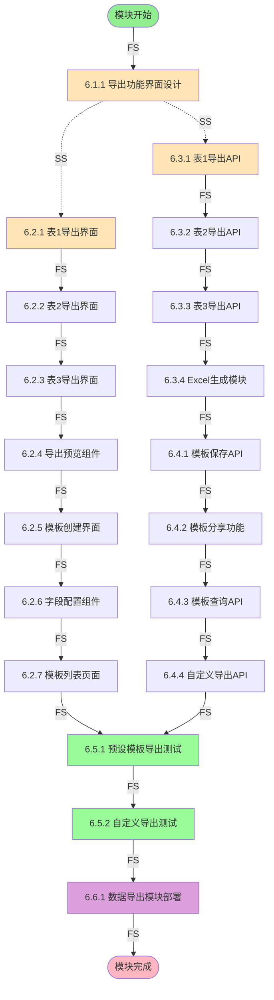

**关键依赖说明：**
- UI设计完成后，前端（6.2）与后端（6.3-6.4）并行开发（SS关系）

---

### 3.7 模块7：产品技术要求编辑功能

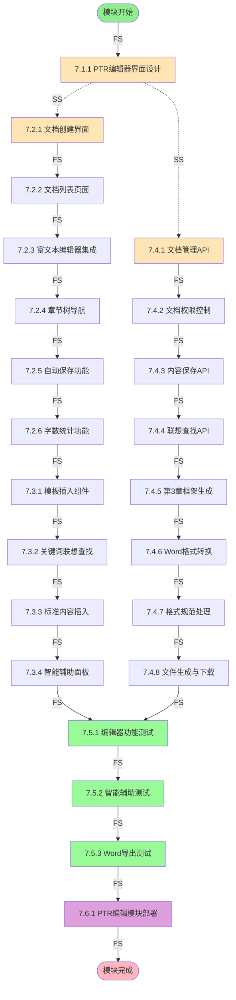

**关键依赖说明：**
- UI设计完成后，前端（7.2-7.3）与后端（7.4）并行开发（SS关系）
- Word导出功能是关键路径

---

### 3.8 模块8：系统测试与交付

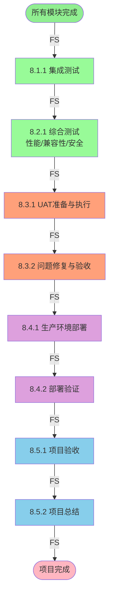

**关键依赖说明：**
- 所有测试和部署活动按顺序执行（FS关系）
- UAT完成后才能进行生产部署

---

## 附录A：项目时间安排与资源配置

### A.1 项目周期

**项目周期：2025年10月13日 - 2025年12月19日（共9.5周）**

| 阶段 | 时间 | 模块 | 工作包数量 | 说明 |
|------|------|------|-----------|------|
| 阶段1 | 5周 | 基础设施 | 10个 | 技术预研和架构设计 |
| 阶段2 | 2周 | 用户+标准数据+设备 | 17+25+15=57个 | 三模块并行开发 |
| 阶段3 | 2周 | 导出+PTR+错误报告 | 19+23+13=55个 | 三模块并行开发，边开发边测试 |
| 阶段4 | 5天 | 系统测试与交付 | 10个 | 集成测试、UAT、部署验收 |

### A.2 并行开发策略

**阶段1：基础设施（5周，10.13-11.16）**
- 第1-2周：项目规划、需求调研与分析
- 第3周：系统架构设计与技术选型
- 第4-5周：数据库设计与UI/UX设计并行进行

**阶段2：基础功能模块（2周，11.17-11.30）**
- 用户管理（17个）+ 标准数据管理（25个）+ 设备管理（15个）
- 三个模块同时并行开发
- 边开发边进行单元测试和集成测试

**阶段3：业务功能模块（2周，12.01-12.14）**
- 数据导出（19个）+ PTR编辑（23个）+ 错误报告（13个）
- 三个模块并行开发
- 边开发边进行单元测试和模块测试

**阶段4：系统测试与交付（5天，12.15-12.19）**
- **12月15日**：集成测试和综合测试（性能、兼容性、安全）
- **12月16-17日**：用户验收测试（UAT）准备与执行
- **12月18日**：问题修复与UAT验收确认
- **12月19日**：生产环境部署、验证与项目验收

---

## 附录B：参考文档

- 《WBS工作分解结构 v2.0》
- 《人员分配与沟通计划 v2.0》
- 《项目甘特图 v1.0》
- 《需求规格说明书 v4.0》

---

**文档变更记录**

| 版本 | 日期 | 修订人 | 修订内容 |
|------|------|--------|---------|
| v1.0 | 2025-11-01 | 项目经理 | 初始版本 |

---

