# 医疗器械标准数据库与应用系统 - PDM网络图

**文档版本:** v2.0
**编制日期:** 2025-11-01(v1.0) | 2025-11-10(v2.0)
**编制团队:** 软件项目管理-第四组

---

## 1. PDM网络图说明

### 1.1 网络图概述

本PDM(Precedence Diagramming Method,前导图法)网络图基于《WBS工作分解结构 v3.0》中的133个工作包,展示了项目活动之间的逻辑关系和执行顺序。

### 1.2 网络图特点

- **节点表示**:每个节点(Box)表示一个活动或工作包
- **箭线表示**:箭线表示活动之间的逻辑依赖关系
- **活动编码**:采用WBS编码体系(X.Y.Z格式)
- **关系类型**:主要采用完成-开始(FS)关系

### 1.3 分层展示

由于项目包含133个工作包,本文档采用分层展示方式:
1. **整体项目级网络图**:展示5个生命周期阶段间的依赖关系
2. **阶段级网络图**:展示每个阶段内部工作包的详细依赖关系

### 1.4 瀑布模型特征

本项目采用瀑布模型,各阶段按顺序执行:
- **需求分析** → **系统设计** → **实现编码** → **测试验证** → **部署与维护**
- 前一阶段完成后进入下一阶段,阶段间以完成-开始(FS)关系为主
- 阶段内部可采用并行开发策略以提高效率

---

## 2. 整体项目级PDM网络图

### 2.1 瀑布模型五阶段流程图


**阶段说明:**

| 阶段 | 名称 | 工作包数量 | 主要活动 |
|------|------|-----------|---------|
| 1.0 | 需求分析阶段 | 4个 | 项目启动、需求调研与分析、需求规格说明书编制 |
| 2.0 | 系统设计阶段 | 11个 | 系统架构设计、数据库设计与实现、UI/UX设计 |
| 3.0 | 实现编码阶段 | 79个 | 6大功能模块开发(用户管理、标准数据管理、设备管理、错误报告、数据导出、PTR编辑) |
| 4.0 | 测试验证阶段 | 26个 | 模块测试、集成测试、系统测试、性能与安全测试、UAT |
| 5.0 | 部署与维护阶段 | 13个 | 系统部署、项目验收与交付、系统维护 |

### 2.2 阶段级PDM网络图

#### 2.2.1 阶段1:需求分析阶段(1.0)

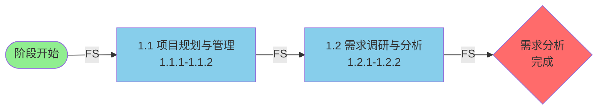

**关键活动:**
- 1.1.1 项目启动 → 1.1.2 资源与风险管理
- 1.2.1 需求调研与分析 → 1.2.2 需求规格说明书

#### 2.2.2 阶段2:系统设计阶段(2.0)

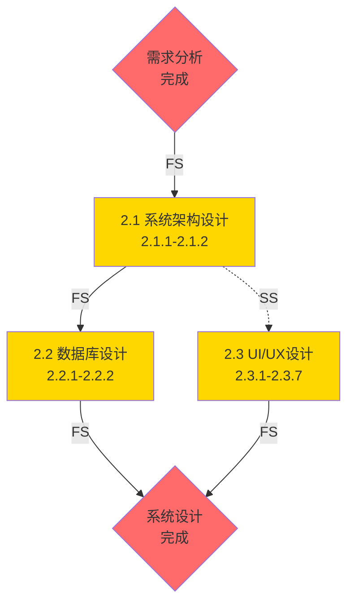

**关键活动:**
- 2.1 系统架构设计(架构与技术选型、系统设计文档)
- 2.2 数据库设计(数据库设计、数据库实施)
- 2.3 UI/UX设计(7个子任务:整体设计规范、6个模块界面设计)
- **并行策略**:数据库设计(2.2)与UI/UX设计(2.3)可并行开展(SS关系)

#### 2.2.3 阶段3:实现编码阶段(3.0) - 关键路径

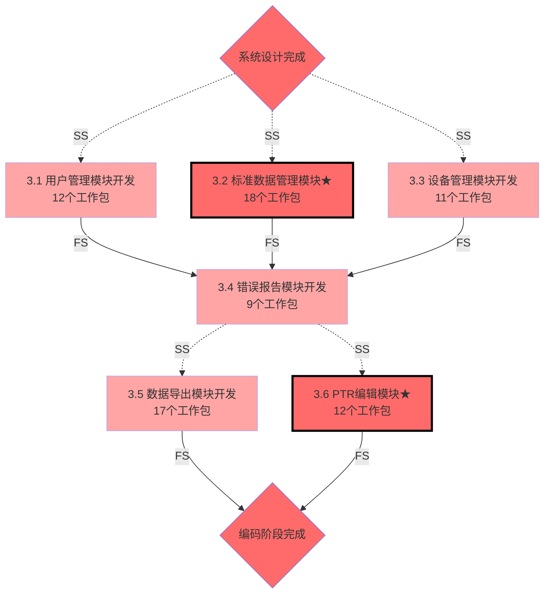

**关键活动:**
- **第一批(并行开发)**:用户管理(3.1)、标准数据管理(3.2)[关键路径]、设备管理(3.3)
- **第二批**:错误报告(3.4)
- **第三批(并行开发)**:数据导出(3.5)、PTR编辑(3.6)[关键路径]
- **关键模块**:标准数据管理(含Excel/Word解析)、PTR编辑(含智能辅助和Word生成)

#### 2.2.4 阶段4:测试验证阶段(4.0)

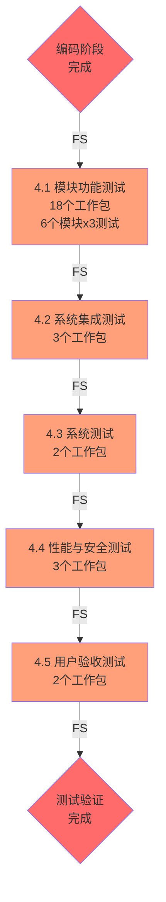

**关键活动:**
- 4.1 模块功能测试(6个模块各3项测试)
- 4.2 系统集成测试(前后端接口、模块间接口、数据流)
- 4.3 系统测试(端到端业务流程、功能完整性)
- 4.4 性能与安全测试(性能、兼容性、安全性)
- 4.5 用户验收测试(UAT准备与执行、问题修复与验收)

#### 2.2.5 阶段5:部署与维护阶段(5.0)

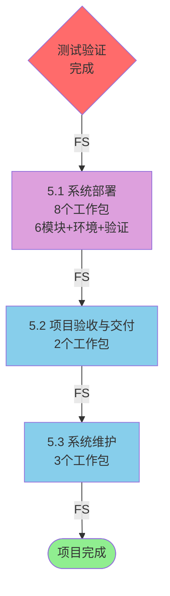

**关键活动:**
- 5.1 系统部署(6个模块部署、生产环境部署、部署验证)
- 5.2 项目验收与交付(项目验收、项目总结)
- 5.3 系统维护(维护计划、缺陷修复、用户培训与支持)

### 2.3 图例说明

| 图形元素 | 说明 |
|---------|------|
| 🟢 **绿色圆角框** | 项目开始/结束里程碑 |
| 🔴 **红色菱形** | 阶段门控点(Gate) |
| 🔵 **蓝色方框** | 需求分析阶段活动 |
| 🟡 **黄色方框** | 系统设计阶段活动 |
| 🔴 **红色方框** | 实现编码阶段活动(关键路径) |
| 🟠 **橙色方框** | 测试验证阶段活动 |
| 🟣 **紫色方框** | 部署与维护阶段活动 |
| ⭐ **黑色粗边框** | 关键路径上的核心模块 |

### 2.4 依赖关系类型

| 箭头类型 | PDM关系 | 说明 | 应用场景 |
|---------|---------|------|---------|
| **A → B** 实线箭头 | **FS** (Finish-to-Start) | 完成-开始关系:A完成后B才能开始 | 阶段间依赖、顺序执行的工作包 |
| **A -.-> B** 虚线箭头 | **SS** (Start-to-Start) | 同时开始关系:A开始后B可以开始(可并行) | 数据库设计与UI设计并行、模块开发并行 |

---

## 3. 阶段级详细PDM网络图

本节按照WBS v3.0的5个生命周期阶段,展示每个阶段内部工作包的详细依赖关系。

### 3.1 阶段1:需求分析阶段(1.0)

#### 3.1.1 项目规划与管理(1.1)

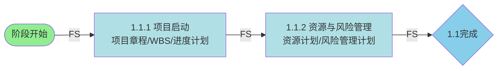

#### 3.1.2 需求调研与分析(1.2)


**依赖关系说明:**
- 所有活动按严格顺序执行(FS关系)
- 项目章程和WBS是后续所有工作的基础

---

### 3.2 阶段2:系统设计阶段(2.0)

#### 3.2.1 系统架构设计(2.1)


#### 3.2.2 数据库设计与UI/UX设计(2.2 & 2.3并行)

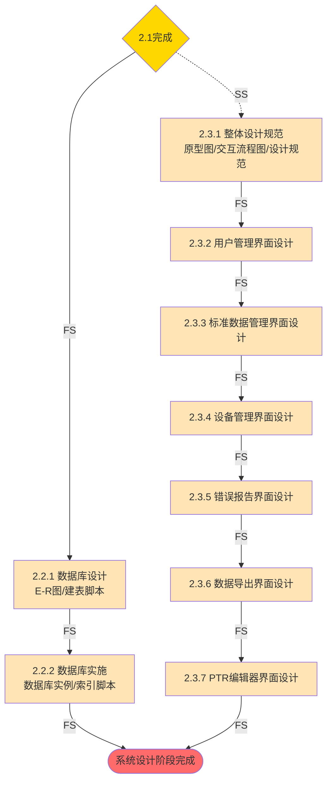

**依赖关系说明:**
- 架构设计完成后,数据库设计(2.2)与UI/UX设计(2.3)可**并行开展**(SS关系)
- UI/UX设计7个子任务按模块顺序执行(FS关系)

---

### 3.3 阶段3:实现编码阶段(3.0)

本阶段包含6个功能模块开发,采用分批并行策略。

#### 3.3.1 模块3.1:用户管理模块开发

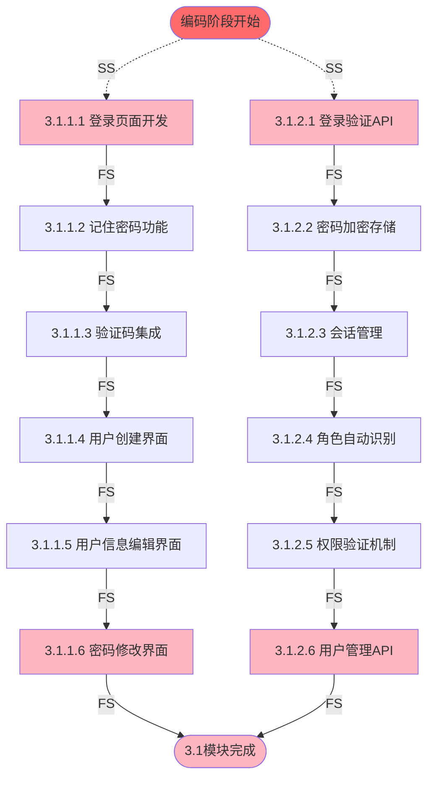

**依赖关系说明:**
- 前端开发(3.1.1)与后端开发(3.1.2)**并行开展**(SS关系)
- 各分支内部按顺序执行(FS关系)

#### 3.3.2 模块3.2:标准数据管理模块开发 [关键路径]

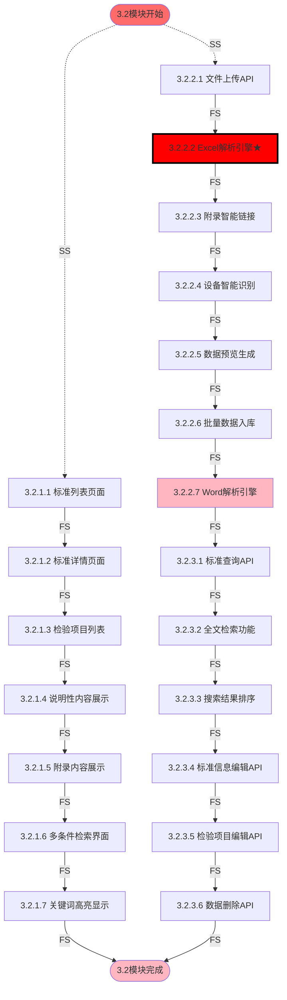

**依赖关系说明:**
- 前端(3.2.1)与后端(3.2.2-3.2.3)**并行开展**(SS关系)
- **Excel解析引擎(3.2.2.2)是关键路径**,技术难度高

#### 3.3.3 模块3.3:设备管理模块开发

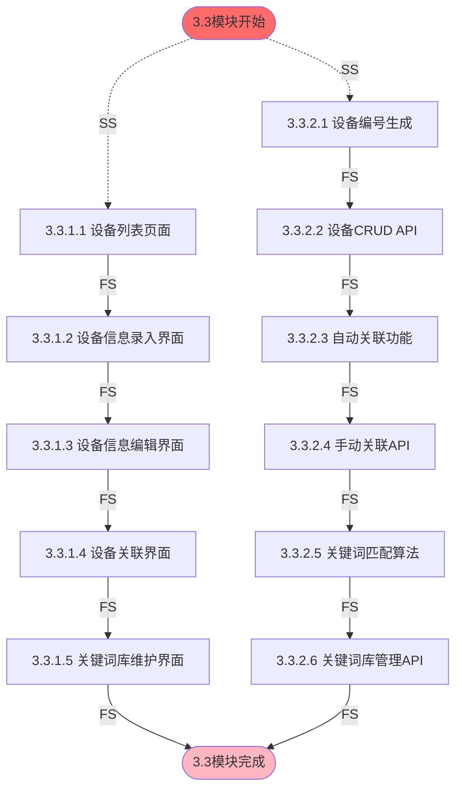

#### 3.3.4 模块3.4:错误报告模块开发

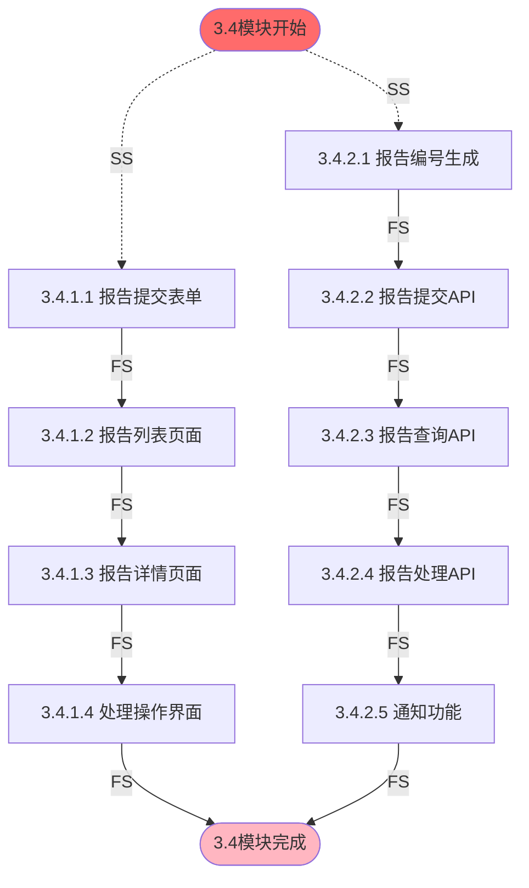

#### 3.3.5 模块3.5:数据导出模块开发

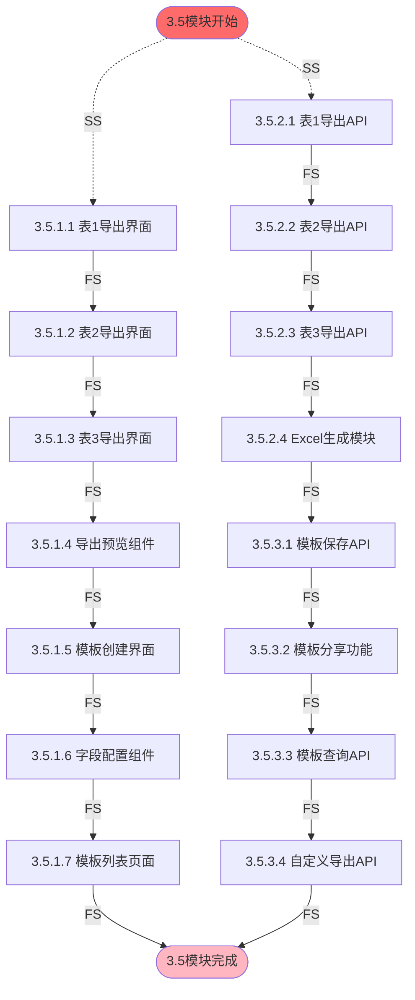

#### 3.3.6 模块3.6:产品技术要求编辑模块开发 [关键路径]

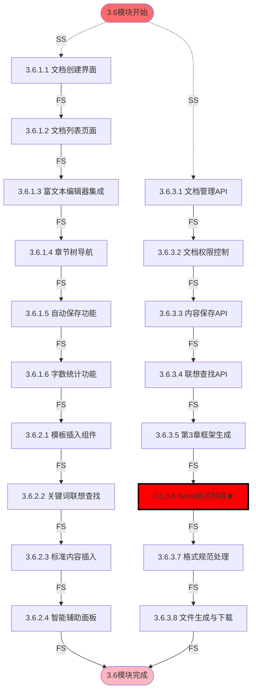

**依赖关系说明:**
- **Word格式转换(3.6.3.6)是关键路径**,需符合《医疗器械产品技术要求格式》

#### 3.3.7 编码阶段模块间依赖关系

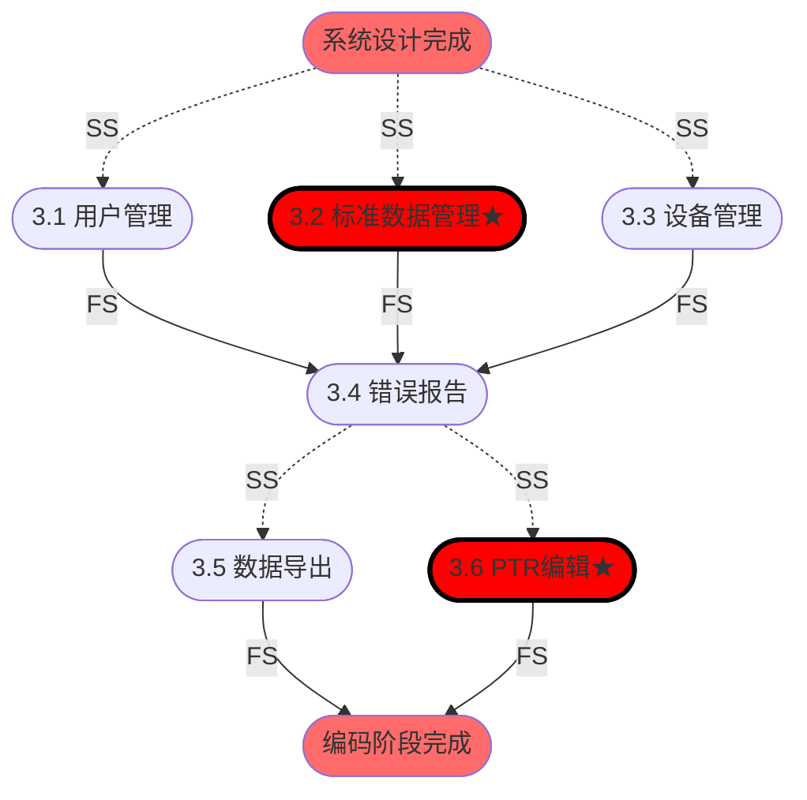

**模块间依赖说明:**
- **第一批(并行)**:用户管理、标准数据管理[关键路径]、设备管理
- **第二批**:错误报告(需要前3个模块的数据支持)
- **第三批(并行)**:数据导出、PTR编辑[关键路径]

---

### 3.4 阶段4:测试验证阶段(4.0)

#### 3.4.1 模块功能测试(4.1)

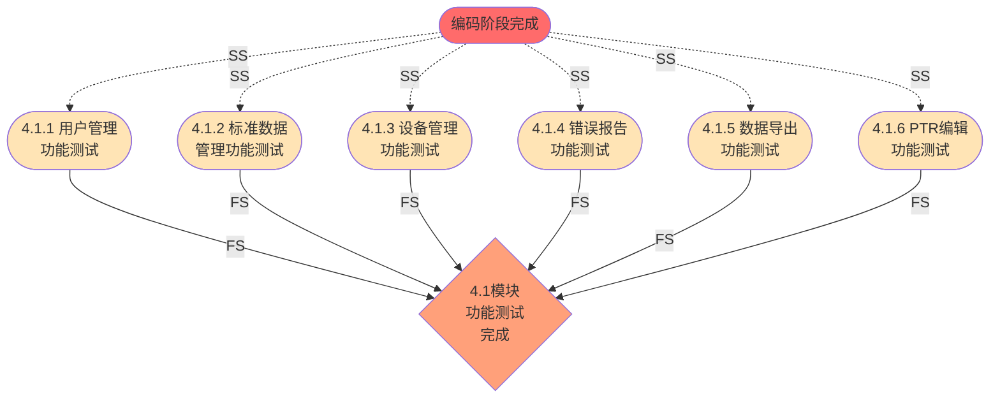

**各模块测试子任务:**
- 4.1.1: 登录功能测试、用户管理功能测试、权限控制测试
- 4.1.2: 导入功能测试、浏览检索测试、数据维护测试
- 4.1.3: 设备信息管理测试、设备关联功能测试
- 4.1.4: 报告提交测试、报告处理测试
- 4.1.5: 预设模板导出测试、自定义导出测试
- 4.1.6: 编辑器功能测试、智能辅助测试、Word导出测试

#### 3.4.2 系统集成测试到验收(4.2-4.5)

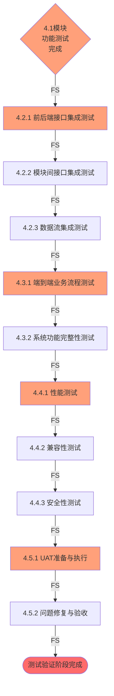

**依赖关系说明:**
- 所有测试活动按严格顺序执行(FS关系)
- 模块测试→集成测试→系统测试→性能与安全测试→UAT

---

### 3.5 阶段5:部署与维护阶段(5.0)

#### 3.5.1 系统部署(5.1)

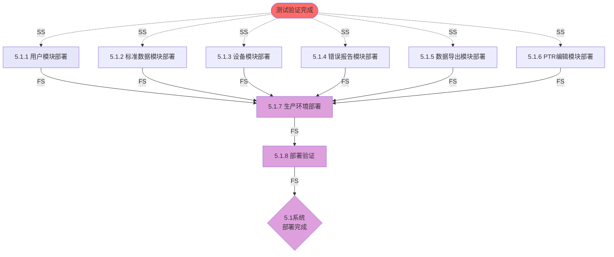

#### 3.5.2 项目验收与交付、系统维护(5.2-5.3)

```mermaid
graph TB
    Gate5_1{5.1系统<br/>部署完成} -->|FS| W5_2_1[5.2.1 项目验收]
    W5_2_1 -->|FS| W5_2_2[5.2.2 项目总结]

    W5_2_2 -->|FS| W5_3_1[5.3.1 系统维护计划]
    W5_3_1 -->|FS| W5_3_2[5.3.2 缺陷修复]
    W5_3_2 -->|FS| W5_3_3[5.3.3 用户培训与支持]

    W5_3_3 -->|FS| End5([项目完成])

    style Gate5_1 fill:#DDA0DD
    style End5 fill:#90EE90
    style W5_2_1 fill:#87CEEB
    style W5_2_2 fill:#87CEEB
    style W5_3_1 fill:#87CEEB
    style W5_3_2 fill:#87CEEB
    style W5_3_3 fill:#87CEEB
```

**依赖关系说明:**
- 6个模块部署可**并行开展**(SS关系)
- 所有模块部署完成后,进行生产环境部署和验证
- 项目验收、总结、维护按顺序执行(FS关系)

---

## 附录A:项目时间安排与资源配置

### A.1 项目周期

**项目周期:2025年10月13日 - 2025年12月19日(共9.5周)**

| 阶段编号 | 阶段名称 | 时间安排 | 工作包数量 | 主要内容 |
|---------|---------|---------|-----------|---------|
| 1.0 | 需求分析阶段 | 2周(10.13-10.26) | 4个 | 项目启动、需求调研与分析、需求规格说明书编制 |
| 2.0 | 系统设计阶段 | 3周(10.27-11.16) | 11个 | 系统架构设计、数据库设计与实现、UI/UX设计 |
| 3.0 | 实现编码阶段 | 4周(11.17-12.14) | 79个 | 6大功能模块开发(用户管理、标准数据管理、设备管理、错误报告、数据导出、PTR编辑) |
| 4.0 | 测试验证阶段 | 3天(12.15-12.17) | 26个 | 模块测试、集成测试、系统测试、性能与安全测试、UAT |
| 5.0 | 部署与维护阶段 | 2天(12.18-12.19) | 13个 | 系统部署、项目验收与交付、系统维护计划 |
| **合计** | **5个生命周期阶段** | **9.5周** | **133个** | **完整的软件开发生命周期** |

### A.2 各阶段时间安排详情

**阶段1:需求分析阶段(2周,10.13-10.26)**
- 第1周(10.13-10.19):项目启动、WBS编制、资源与风险管理计划
- 第2周(10.20-10.26):需求调研与分析、需求规格说明书编制
- **关键交付**:WBS v3.0、需求规格说明书v4.0

**阶段2:系统设计阶段(3周,10.27-11.16)**
- 第1周(10.27-11.02):系统架构设计与技术选型、API接口设计
- 第2周(11.03-11.09):数据库设计(E-R图、建表脚本)
- 第3周(11.10-11.16):数据库实施 + UI/UX整体设计并行进行
- **关键交付**:系统设计说明书、数据库实例、UI设计规范
- **并行策略**:数据库实施(2.2.2)与UI/UX设计(2.3)同时开展

**阶段3:实现编码阶段(4周,11.17-12.14)**

*第一批模块(2周,11.17-11.30):基础功能模块并行开发*
- 3.1 用户管理模块开发(12个工作包)
- 3.2 标准数据管理模块开发★(18个工作包,关键路径)
- 3.3 设备管理模块开发(11个工作包)
- **并行策略**:三个模块同时开发,各模块内前后端并行

*第二批模块(1周,12.01-12.07):依赖基础模块*
- 3.4 错误报告模块开发(9个工作包)

*第三批模块(1周,12.08-12.14):高级功能并行开发*
- 3.5 数据导出模块开发(17个工作包)
- 3.6 PTR编辑模块开发★(12个工作包,关键路径)
- **并行策略**:两个模块同时开发

**阶段4:测试验证阶段(3天,12.15-12.17)**
- **12月15日**:模块功能测试(6个模块并行) + 集成测试
- **12月16日**:系统测试 + 性能与安全测试
- **12月17日**:用户验收测试(UAT)准备与执行
- **关键交付**:测试报告、UAT验收报告

**阶段5:部署与维护阶段(2天,12.18-12.19)**
- **12月18日**:系统部署(6模块并行部署)、生产环境部署、部署验证
- **12月19日**:项目验收、项目总结、维护计划制定
- **关键交付**:部署完成的系统、项目验收报告、维护计划

### A.3 关键路径说明

项目关键路径位于实现编码阶段的两个核心模块:
1. **标准数据管理模块(3.2)**:Excel/Word解析引擎开发技术难度高
2. **PTR编辑模块(3.6)**:Word格式转换需符合《医疗器械产品技术要求格式》

---

## 附录B:参考文档

- 《WBS工作分解结构 v3.0》
- 《人员分配与沟通计划 v3.0》
- 《项目甘特图 v2.0》
- 《需求规格说明书 v4.0》

---

**文档变更记录**

| 版本 | 日期 | 修订人 | 修订内容 |
|------|------|--------|---------|
| v1.0 | 2025-11-01 | 项目经理 | 初始版本,基于WBS v2.0(130个工作包),采用功能模块分解法 |
| v2.0 | 2025-11-10 | 项目经理 | 1. 基于WBS v3.0(133个工作包)全面重构<br/>2. 采用瀑布模型生命周期法重新组织PDM网络图(5个阶段)<br/>3. 更新整体项目级和阶段级详细PDM网络图<br/>4. 更新参考文档版本(WBS v2.0→v3.0,人员分配计划 v2.0→v3.0) |

---
