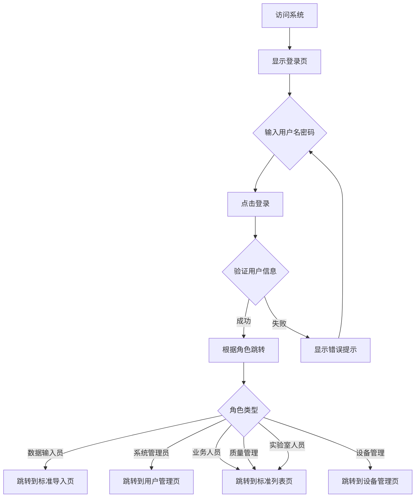
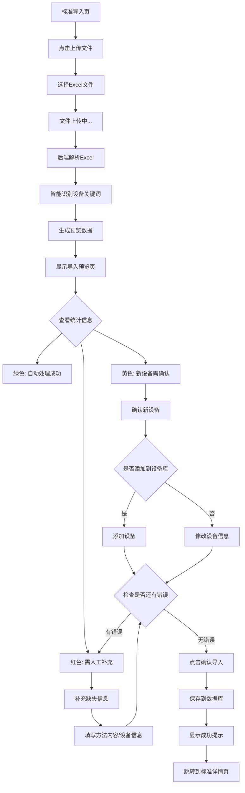
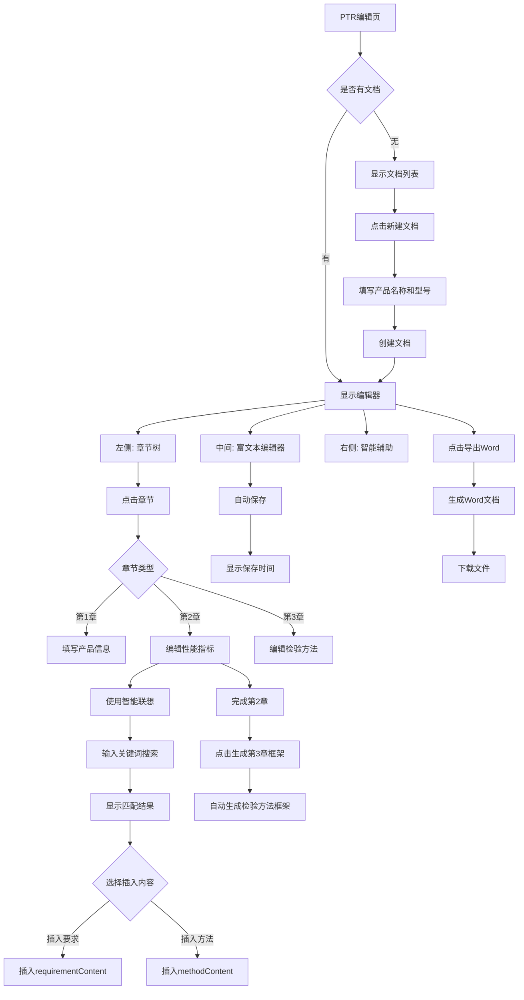
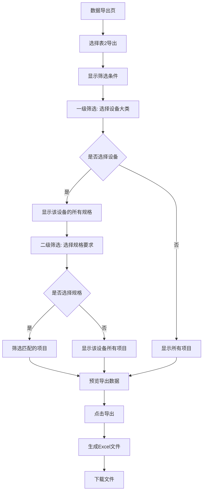
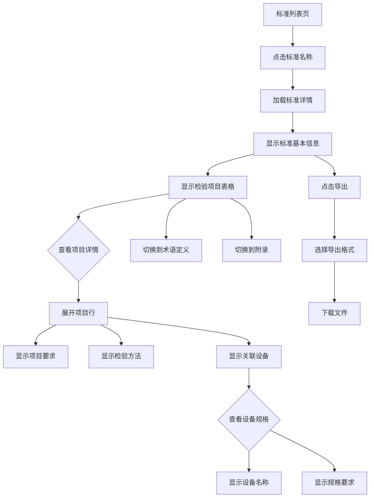

# UI/UX设计规范文档
## 医疗器械标准数据库与应用系统

**文档版本：** v1.0  
**编制日期：** 2025-11-12  
**编制人：** UI/UX设计团队  
**审核人：** 项目经理  

---

## 目录

1. [设计概述](#1-设计概述)
2. [设计原则](#2-设计原则)
3. [色彩规范](#3-色彩规范)
4. [字体规范](#4-字体规范)
5. [布局规范](#5-布局规范)
6. [组件规范](#6-组件规范)
7. [交互流程](#7-交互流程)
8. [原型图](#8-原型图)
9. [响应式设计](#9-响应式设计)
10. [无障碍设计](#10-无障碍设计)

---

## 1. 设计概述

### 1.1 设计目标

本系统是一款面向医疗器械检测实验室的专业数据管理系统，设计目标如下：

- **专业性**：符合医疗行业规范，界面严谨、专业
- **易用性**：降低学习成本，提高工作效率
- **一致性**：统一的视觉语言和交互模式
- **可靠性**：清晰的状态反馈，避免误操作

### 1.2 目标用户

| 用户角色 | 使用场景 | 设计重点 |
|---------|---------|---------|
| 数据输入员 | 标准导入、数据录入 | 高效的批量操作、清晰的状态提示 |
| 系统管理员 | 用户管理、系统配置 | 完整的权限控制、详细的日志记录 |
| 业务人员 | PTR编辑、标准查询 | 智能辅助、模板插入 |
| 质量管理人员 | 数据导出、报表生成 | 灵活的筛选条件、多种导出格式 |
| 设备管理人员 | 设备目录管理 | 设备与项目的关联关系可视化 |
| 实验室人员 | 标准浏览、方法查询 | 快速检索、详细展示 |

### 1.3 设计工具

- **原型设计**：Figma / 墨刀
- **UI组件库**：Element Plus（基于Vue 3）
- **图标库**：Element Plus Icons
- **颜色管理**：Adobe Color / Coolors

---

## 2. 设计原则

### 2.1 核心设计原则

#### 2.1.1 清晰性（Clarity）

- 信息层级分明，重要信息突出显示
- 使用颜色编码区分不同状态（绿色=成功，黄色=警告，红色=错误）
- 避免过度装饰，保持界面简洁

#### 2.1.2 一致性（Consistency）

- 统一的布局结构（顶部导航 + 左侧菜单 + 内容区）
- 统一的交互模式（按钮位置、操作流程）
- 统一的视觉语言（颜色、字体、间距）

#### 2.1.3 反馈性（Feedback）

- 操作后立即给予反馈（成功/失败提示）
- 加载状态明确显示（Loading动画）
- 错误信息具体、可操作

#### 2.1.4 容错性（Fault Tolerance）

- 重要操作需二次确认（删除、导入）
- 支持撤销操作（草稿保存）
- 输入验证及时提示

### 2.2 交互设计原则

- **最少点击原则**：常用功能不超过3次点击
- **渐进式披露**：复杂功能分步引导
- **智能默认值**：减少用户输入
- **快捷操作**：支持键盘快捷键（Enter提交、Esc取消）

---

## 3. 色彩规范

### 3.1 主色调（Primary Colors）

#### 3.1.1 品牌主色

```css
/* 主色 - 专业蓝 */
--primary-color: #409EFF;
--primary-light: #79BBFF;
--primary-lighter: #A0CFFF;
--primary-dark: #337ECC;
--primary-darker: #2B6CB0;
```

**使用场景：**
- 顶部导航栏背景
- 主要操作按钮（登录、确认、保存）
- 链接文字
- 选中状态

#### 3.1.2 渐变色

```css
/* 登录页渐变背景 */
background: linear-gradient(135deg, #667eea 0%, #764ba2 100%);

/* 卡片渐变背景（可选） */
background: linear-gradient(to bottom, #f5f7fa 0%, #ffffff 100%);
```

### 3.2 功能色（Functional Colors）

#### 3.2.1 成功色（Success）

```css
--success-color: #67C23A;      /* 主成功色 */
--success-light: #E1F3D8;      /* 浅成功色（背景） */
--success-dark: #529B2E;       /* 深成功色 */
```

**使用场景：**
- 导入成功状态（绿色高亮行）
- 成功提示消息
- 已发布状态标签

#### 3.2.2 警告色（Warning）

```css
--warning-color: #E6A23C;      /* 主警告色 */
--warning-light: #FDF6EC;      /* 浅警告色（背景） */
--warning-dark: #CF9236;       /* 深警告色 */
```

**使用场景：**
- 导入警告状态（黄色高亮行）
- 需确认操作
- 草稿状态标签

#### 3.2.3 错误色（Danger）

```css
--danger-color: #F56C6C;       /* 主错误色 */
--danger-light: #FEF0F0;       /* 浅错误色（背景） */
--danger-dark: #DD6161;        /* 深错误色 */
```

**使用场景：**
- 导入错误状态（红色高亮行）
- 错误提示消息
- 删除按钮

#### 3.2.4 信息色（Info）

```css
--info-color: #909399;         /* 主信息色 */
--info-light: #F4F4F5;         /* 浅信息色（背景） */
--info-dark: #73767A;          /* 深信息色 */
```

**使用场景：**
- 禁用状态
- 次要信息
- 占位符文字

### 3.3 中性色（Neutral Colors）

```css
/* 文字颜色 */
--text-primary: #333333;       /* 主要文字 */
--text-regular: #606266;       /* 常规文字 */
--text-secondary: #909399;     /* 次要文字 */
--text-placeholder: #C0C4CC;   /* 占位符文字 */

/* 边框颜色 */
--border-base: #DCDFE6;        /* 基础边框 */
--border-light: #E4E7ED;       /* 浅色边框 */
--border-lighter: #EBEEF5;     /* 更浅边框 */
--border-extra-light: #F2F6FC; /* 极浅边框 */

/* 背景颜色 */
--bg-white: #FFFFFF;           /* 纯白背景 */
--bg-page: #F5F7FA;            /* 页面背景 */
--bg-sidebar: #F0F2F5;         /* 侧边栏背景 */
--bg-hover: #F9FAFC;           /* 悬停背景 */
```

### 3.4 状态色应用示例

#### 3.4.1 导入预览表格行颜色

```css
/* 成功行（绿色） */
.row-success {
  background-color: #F1F8F4 !important;
}

/* 警告行（黄色） */
.row-warning {
  background-color: #FFF8F0 !important;
}

/* 错误行（红色） */
.row-error {
  background-color: #FFF1F0 !important;
}
```

#### 3.4.2 统计卡片渐变色

```css
/* 成功统计卡片 */
.stat-item.success {
  background: linear-gradient(135deg, #e8f5e9 0%, #c8e6c9 100%);
  color: #4caf50;
}

/* 警告统计卡片 */
.stat-item.warning {
  background: linear-gradient(135deg, #fff3e0 0%, #ffe0b2 100%);
  color: #ff9800;
}

/* 错误统计卡片 */
.stat-item.error {
  background: linear-gradient(135deg, #ffebee 0%, #ffcdd2 100%);
  color: #f44336;
}

/* 总计统计卡片 */
.stat-item.total {
  background: linear-gradient(135deg, #e3f2fd 0%, #bbdefb 100%);
  color: #2196f3;
}
```

---

## 4. 字体规范

### 4.1 字体家族

```css
font-family: 'Microsoft YaHei', '微软雅黑', Arial, sans-serif;
```

**说明：**
- 优先使用微软雅黑（中文清晰、易读）
- 英文使用Arial（专业、简洁）
- 避免使用宋体（屏幕显示效果差）

### 4.2 字体大小

| 用途 | 字号 | 行高 | CSS变量 | 使用场景 |
|------|------|------|---------|----------|
| 超大标题 | 24px | 32px | `--font-size-extra-large` | 登录页标题 |
| 大标题 | 18px | 26px | `--font-size-large` | 页面标题、卡片标题 |
| 中标题 | 16px | 24px | `--font-size-medium` | 子标题、表格标题 |
| 正文 | 14px | 22px | `--font-size-base` | 正文、表格内容、按钮 |
| 小字 | 13px | 20px | `--font-size-small` | 辅助说明 |
| 极小字 | 12px | 18px | `--font-size-extra-small` | 次要信息、时间戳 |

### 4.3 字体粗细

```css
--font-weight-normal: 400;     /* 常规 */
--font-weight-medium: 500;     /* 中等（标题） */
--font-weight-bold: 700;       /* 加粗（重要标题） */
```

### 4.4 字体应用示例

```css
/* 页面主标题 */
.page-title {
  font-size: 18px;
  font-weight: bold;
  color: #333;
  line-height: 26px;
}

/* 页面描述 */
.page-description {
  font-size: 13px;
  color: #999;
  line-height: 20px;
}

/* 卡片标题 */
.card-header {
  font-size: 16px;
  font-weight: 500;
  color: #333;
}

/* 表格内容 */
.el-table {
  font-size: 14px;
  color: #606266;
}
```

---

## 5. 布局规范

### 5.1 整体布局结构

```
┌─────────────────────────────────────────────────┐
│  顶部导航栏（Header）- 60px                        │
│  Logo + 系统名称 | 用户信息 + 设置                  │
├──────────┬──────────────────────────────────────┤
│          │                                      │
│  左侧    │  内容区域（Content）                   │
│  菜单    │  - 页面标题                           │
│  栏      │  - 查询表单（可选）                    │
│  220px   │  - 数据表格/内容卡片                   │
│          │  - 分页器（可选）                      │
│          │                                      │
└──────────┴──────────────────────────────────────┘
```

### 5.2 尺寸规范

#### 5.2.1 固定尺寸

```css
--header-height: 60px;         /* 顶部导航栏高度 */
--sidebar-width: 220px;        /* 左侧菜单栏宽度 */
--sidebar-collapsed-width: 64px; /* 菜单栏折叠宽度 */
```

#### 5.2.2 间距规范

```css
/* 外边距 */
--spacing-xs: 4px;
--spacing-sm: 8px;
--spacing-md: 12px;
--spacing-base: 15px;
--spacing-lg: 20px;
--spacing-xl: 30px;

/* 内边距 */
--padding-page: 20px;          /* 页面内边距 */
--padding-card: 20px;          /* 卡片内边距 */
--padding-form: 20px;          /* 表单内边距 */
```

### 5.3 圆角规范

```css
--border-radius-base: 4px;     /* 基础圆角（按钮、输入框） */
--border-radius-medium: 6px;   /* 中等圆角 */
--border-radius-large: 8px;    /* 大圆角（卡片、对话框） */
--border-radius-circle: 50%;   /* 圆形（头像） */
```

### 5.4 阴影规范

```css
/* 卡片阴影 */
--shadow-base: 0 2px 4px rgba(0, 0, 0, 0.1);
--shadow-hover: 0 2px 12px rgba(0, 0, 0, 0.15);
--shadow-active: 0 4px 20px rgba(0, 0, 0, 0.2);

/* 下拉菜单阴影 */
--shadow-dropdown: 0 2px 12px rgba(0, 0, 0, 0.1);
```

### 5.5 特殊布局

#### 5.5.1 PTR编辑器三栏布局

```
┌────────┬──────────────────┬────────────┐
│        │                  │            │
│ 章节树 │   富文本编辑器    │ 智能辅助   │
│ 20%    │      55%         │    25%     │
│        │                  │            │
└────────┴──────────────────┴────────────┘
```

**尺寸：**
- 左侧章节树：20%
- 中间编辑区：55%
- 右侧辅助区：25%
- 间距：10px

#### 5.5.2 导入预览页面布局

```
┌─────────────────────────────────────────┐
│  步骤指示器（Steps）                      │
├─────────────────────────────────────────┤
│  文件信息卡片                             │
├─────────────────────────────────────────┤
│  处理统计卡片（4个统计项横向排列）          │
├─────────────────────────────────────────┤
│  检验项目预览表格（带状态筛选）             │
├─────────────────────────────────────────┤
│  新设备确认表格（条件显示）                │
├─────────────────────────────────────────┤
│  需补充信息表格（条件显示）                │
├─────────────────────────────────────────┤
│  操作按钮（居中）                         │
└─────────────────────────────────────────┘
```

---

## 6. 组件规范

### 6.1 按钮（Button）

#### 6.1.1 按钮类型

| 类型 | 样式 | 使用场景 |
|------|------|----------|
| Primary | 蓝色实心 | 主要操作（登录、确认、保存） |
| Success | 绿色实心 | 成功操作（确认添加、发布） |
| Warning | 橙色实心 | 警告操作（保存草稿） |
| Danger | 红色实心 | 危险操作（删除） |
| Info | 灰色实心 | 信息操作（查看详情） |
| Default | 白色边框 | 次要操作（取消、返回） |
| Text/Link | 无边框文字 | 表格内操作 |

#### 6.1.2 按钮尺寸

```css
/* 大按钮 */
.el-button--large {
  height: 40px;
  padding: 12px 20px;
  font-size: 14px;
}

/* 默认按钮 */
.el-button--default {
  height: 32px;
  padding: 8px 15px;
  font-size: 14px;
}

/* 小按钮 */
.el-button--small {
  height: 28px;
  padding: 6px 12px;
  font-size: 12px;
}
```

#### 6.1.3 按钮状态

- **默认状态**：正常显示
- **悬停状态**：颜色加深10%，鼠标变为手型
- **点击状态**：颜色加深20%
- **禁用状态**：透明度50%，鼠标变为禁止符号
- **加载状态**：显示Loading图标，禁止点击

#### 6.1.4 按钮组合规范

```html
<!-- 操作按钮组（右对齐） -->
<div class="action-buttons">
  <el-button>取消</el-button>
  <el-button type="warning">保存草稿</el-button>
  <el-button type="primary">确认导入</el-button>
</div>
```

**规则：**
- 主要操作放在最右侧
- 危险操作放在最左侧
- 按钮间距：12px

### 6.2 输入框（Input）

#### 6.2.1 输入框尺寸

```css
/* 大输入框 */
.el-input--large {
  height: 40px;
  font-size: 14px;
}

/* 默认输入框 */
.el-input--default {
  height: 32px;
  font-size: 14px;
}

/* 小输入框 */
.el-input--small {
  height: 28px;
  font-size: 12px;
}
```

#### 6.2.2 输入框状态

- **默认状态**：边框#DCDFE6
- **聚焦状态**：边框#409EFF，显示蓝色外发光
- **禁用状态**：背景#F5F7FA，文字#C0C4CC
- **错误状态**：边框#F56C6C，显示红色错误提示

#### 6.2.3 文本域（Textarea）

```html
<el-input
  type="textarea"
  :rows="6"
  placeholder="请输入内容"
  maxlength="500"
  show-word-limit
/>
```

**规则：**
- 最小行数：3行
- 最大行数：根据内容自适应
- 显示字数统计（重要输入）

### 6.3 表格（Table）

#### 6.3.1 表格样式

```html
<el-table
  :data="tableData"
  stripe          <!-- 斑马纹 -->
  border          <!-- 边框 -->
  :row-class-name="getRowClassName"
  max-height="600"
>
```

**规则：**
- 默认使用斑马纹（stripe）
- 重要表格使用边框（border）
- 表头背景：#F5F7FA
- 行高：48px
- 最大高度：600px（超出滚动）

#### 6.3.2 表格列宽

| 列类型 | 宽度 | 说明 |
|--------|------|------|
| 序号列 | 60px | 固定宽度 |
| 操作列 | 120-250px | 根据按钮数量 |
| 状态列 | 100-120px | 固定宽度 |
| 日期列 | 180px | 固定宽度 |
| 短文本列 | 100-150px | 固定宽度 |
| 长文本列 | min-width: 200px | 最小宽度，自适应 |

#### 6.3.3 表格行颜色编码

```css
/* 成功行（绿色） */
.row-success {
  background-color: #F1F8F4 !important;
}

/* 警告行（黄色） */
.row-warning {
  background-color: #FFF8F0 !important;
}

/* 错误行（红色） */
.row-error {
  background-color: #FFF1F0 !important;
}
```

### 6.4 卡片（Card）

#### 6.4.1 卡片样式

```html
<el-card shadow="hover">
  <template #header>
    <div class="card-header">
      <span><el-icon><Document /></el-icon> 卡片标题</span>
      <el-button type="primary">操作</el-button>
    </div>
  </template>
  <!-- 卡片内容 -->
</el-card>
```

**规则：**
- 阴影：hover（悬停时显示）
- 圆角：8px
- 内边距：20px
- 卡片间距：20px

#### 6.4.2 卡片标题

```css
.card-header {
  display: flex;
  justify-content: space-between;
  align-items: center;
  font-size: 16px;
  font-weight: 500;
}

.card-header span {
  display: flex;
  align-items: center;
  gap: 8px;
}
```

### 6.5 标签（Tag）

#### 6.5.1 标签类型

```html
<!-- 成功标签 -->
<el-tag type="success">已发布</el-tag>

<!-- 警告标签 -->
<el-tag type="warning">草稿</el-tag>

<!-- 危险标签 -->
<el-tag type="danger">已删除</el-tag>

<!-- 信息标签 -->
<el-tag type="info">禁用</el-tag>

<!-- 主要标签 -->
<el-tag type="primary">GB 15810-2019</el-tag>
```

#### 6.5.2 标签尺寸

```css
/* 默认标签 */
.el-tag {
  height: 24px;
  padding: 0 8px;
  font-size: 12px;
}

/* 小标签 */
.el-tag--small {
  height: 20px;
  padding: 0 6px;
  font-size: 11px;
}
```

### 6.6 步骤条（Steps）

```html
<el-steps :active="currentStep" finish-status="success" align-center>
  <el-step title="上传文件" description="选择Excel文件" />
  <el-step title="系统自动处理" description="智能识别方法和设备" />
  <el-step title="预览确认" description="审核并补充信息" />
  <el-step title="完成导入" description="保存到数据库" />
</el-steps>
```

**规则：**
- 对齐方式：居中（align-center）
- 完成状态：success（绿色对勾）
- 当前步骤：蓝色高亮
- 未完成步骤：灰色

### 6.7 消息提示（Message）

#### 6.7.1 消息类型

```javascript
// 成功提示
ElMessage.success('操作成功！')

// 警告提示
ElMessage.warning('请先完成必填项')

// 错误提示
ElMessage.error('操作失败，请重试')

// 信息提示
ElMessage.info('这是一条提示信息')
```

#### 6.7.2 消息位置和持续时间

```javascript
ElMessage({
  message: '导入成功！',
  type: 'success',
  duration: 3000,        // 持续时间3秒
  showClose: true,       // 显示关闭按钮
  center: false          // 左对齐
})
```

### 6.8 对话框（Dialog）

```html
<el-dialog
  v-model="dialogVisible"
  title="新建文档"
  width="600px"
  :close-on-click-modal="false"
>
  <!-- 对话框内容 -->
  <template #footer>
    <el-button @click="dialogVisible = false">取消</el-button>
    <el-button type="primary" @click="handleConfirm">确定</el-button>
  </template>
</el-dialog>
```

**规则：**
- 宽度：400px（小）、600px（中）、800px（大）
- 点击遮罩层不关闭（close-on-click-modal="false"）
- 按钮顺序：取消在左，确定在右

### 6.9 表单（Form）

#### 6.9.1 表单布局

```html
<el-form :model="form" :rules="rules" label-width="120px">
  <el-form-item label="标准编号" prop="standardNo">
    <el-input v-model="form.standardNo" placeholder="请输入标准编号" />
  </el-form-item>
  <el-form-item label="标准名称" prop="standardName">
    <el-input v-model="form.standardName" placeholder="请输入标准名称" />
  </el-form-item>
</el-form>
```

**规则：**
- 标签宽度：120px（中文4-6字）、140px（中文7-8字）
- 必填项：标签前显示红色星号
- 验证提示：输入框下方显示红色错误信息

#### 6.9.2 查询表单

```css
.query-form {
  background: #f9fafc;
  padding: 20px;
  border-radius: 4px;
  margin-bottom: 20px;
}
```

**规则：**
- 背景色：#F9FAFC（浅灰）
- 内边距：20px
- 查询按钮：主要按钮（Primary）
- 重置按钮：默认按钮（Default）

---

## 7. 交互流程

### 7.1 用户登录流程



**关键交互点：**
1. **快速登录按钮**：Demo模式下提供6个角色快速登录
2. **记住密码**：勾选后下次自动填充
3. **Enter键提交**：支持键盘快捷操作
4. **角色自动识别**：根据用户名格式（dataadmin, yw001等）自动识别角色
5. **登录失败提示**：显示具体错误原因（用户名错误、密码错误、账户锁定）

### 7.2 标准Excel半自动导入流程 ⭐ 核心流程



**关键交互点：**
1. **步骤指示器**：显示当前在第几步（共4步）
2. **状态筛选**：支持筛选查看全部/成功/待确认/需补充
3. **行颜色编码**：绿色=成功，黄色=警告，红色=错误
4. **统计卡片**：4个统计项（成功、警告、错误、总计）
5. **新设备确认表格**：条件显示，仅当有新设备时显示
6. **需补充信息表格**：条件显示，仅当有错误时显示
7. **确认导入按钮**：有错误时禁用，必须先补充完整
8. **保存草稿按钮**：支持保存未完成的导入任务

### 7.3 PTR文档编辑流程



**关键交互点：**
1. **三栏布局**：章节树（20%）+ 编辑器（55%）+ 辅助（25%）
2. **章节树导航**：点击章节切换编辑内容
3. **智能联想**：输入关键词，显示匹配的标准内容
4. **分字段插入**：要求和方法分开插入（两个按钮）
5. **模板插入**：快速插入常用语句
6. **自动保存**：每30秒自动保存，显示保存时间
7. **生成第3章框架**：完成第2章后，自动生成检验方法框架
8. **字数统计**：实时显示当前章节字数

### 7.4 表2导出流程（两级筛选）



**关键交互点：**
1. **一级筛选**：下拉选择设备编号（如A001-电子天平）
2. **二级筛选**：多选规格要求（如"分度值0.1mg"、"分度值0.01mg"）
3. **级联联动**：选择设备后，规格选项动态更新
4. **预览功能**：导出前预览数据
5. **文件命名**：自动生成文件名（认可检验检测能力表_20231112.xlsx）

### 7.5 标准详情查看流程



**关键交互点：**
1. **Tab切换**：基本信息、检验项目、术语定义、附录
2. **项目展开**：点击展开查看详细信息
3. **设备关联**：显示项目关联的所有设备及规格
4. **快速搜索**：支持项目名称、设备名称搜索
5. **导出功能**：支持导出为PDF、Word、Excel

---

## 8. 原型图

### 8.1 登录页原型

```
┌─────────────────────────────────────────────────┐
│                                                 │
│         渐变背景（紫色到蓝色）                    │
│                                                 │
│         ┌─────────────────────┐                │
│         │  登录框（白色卡片）   │                │
│         │                     │                │
│         │  医疗器械标准内容     │                │
│         │  信息化数据库及运用   │                │
│         │  系统                │                │
│         │  Medical Device...  │                │
│         │                     │                │
│         │  ┌───────────────┐  │                │
│         │  │ 用户名输入框   │  │                │
│         │  └───────────────┘  │                │
│         │  ┌───────────────┐  │                │
│         │  │ 密码输入框     │  │                │
│         │  └───────────────┘  │                │
│         │  □ 记住密码         │                │
│         │  ┌───────────────┐  │                │
│         │  │   登录按钮     │  │                │
│         │  └───────────────┘  │                │
│         │  ─────────────────  │                │
│         │  快速登录（Demo）    │                │
│         │  [数据输入员][系统   │                │
│         │   管理员][业务人员]  │                │
│         │  [质量管理][设备管   │                │
│         │   理][实验室]        │                │
│         └─────────────────────┘                │
│                                                 │
└─────────────────────────────────────────────────┘
```

**设计要点：**
- 渐变背景：linear-gradient(135deg, #667eea 0%, #764ba2 100%)
- 登录框：白色卡片，圆角8px，阴影
- 输入框：大尺寸（40px），带图标
- 登录按钮：主色调，宽度100%
- 快速登录：6个小按钮，方便Demo演示

### 8.2 主界面布局原型

```
┌─────────────────────────────────────────────────────────────┐
│ 🏥 医疗器械标准数据库系统    |  👤 张三 [数据输入员] ⚙️    │ 60px
├──────────┬──────────────────────────────────────────────────┤
│          │                                                  │
│ 🏠 工作台 │  页面标题：标准数据管理                          │
│          │  ─────────────────────────────────────────────  │
│ 📄 标准   │                                                  │
│  数据管理 │  查询表单（浅灰背景）                             │
│  - 标准浏 │  ┌────────┬────────┬────────┐                  │
│    览     │  │标准编号│标准名称│ [查询] │                  │
│  - 标准导 │  └────────┴────────┴────────┘                  │
│    入     │                                                  │
│          │  操作按钮                                         │
│ 🔧 设备   │  [+ 新增标准] [导入] [导出]                      │
│  管理     │                                                  │
│          │  数据表格                                         │
│ ✏️ PTR   │  ┌──┬────────┬──────────┬────┬────┐            │
│  编辑     │  │序│标准编号│标准名称  │状态│操作│            │
│          │  ├──┼────────┼──────────┼────┼────┤            │
│ 📤 数据   │  │1 │GB...   │一次性... │✓  │编辑│            │
│  导出     │  │2 │YY...   │医用外... │✓  │编辑│            │
│  - 能力建 │  └──┴────────┴──────────┴────┴────┘            │
│    设信息 │                                                  │
│  - 认可检 │  分页器                                          │
│    验能力 │  [<] 1 2 3 4 5 [>]                              │
│  - 操作规 │                                                  │
│    程表   │                                                  │
│  - 自定义 │                                                  │
│    导出   │                                                  │
│          │                                                  │
│ ⚠️ 错误   │                                                  │
│  报告     │                                                  │
│          │                                                  │
│ ⚙️ 系统   │                                                  │
│  管理     │                                                  │
│  - 用户管 │                                                  │
│    理     │                                                  │
│  - 操作日 │                                                  │
│    志     │                                                  │
│  - 系统配 │                                                  │
│    置     │                                                  │
│          │                                                  │
└──────────┴──────────────────────────────────────────────────┘
  220px                     自适应宽度
```

**设计要点：**
- 顶部导航：蓝色背景（#409EFF），高度60px
- 左侧菜单：浅灰背景（#F0F2F5），宽度220px
- 内容区域：白色背景，内边距20px
- 菜单图标：使用Element Plus Icons
- 菜单高亮：当前页面菜单项蓝色高亮

### 8.3 标准导入预览页原型 ⭐ 核心页面

```
┌─────────────────────────────────────────────────────────────┐
│  医疗器械标准数据库系统 - 导入预览演示                        │
├─────────────────────────────────────────────────────────────┤
│                                                             │
│  步骤指示器                                                  │
│  ① 上传文件 ──→ ② 系统自动处理 ──→ ③ 预览确认 ──→ ④ 完成导入 │
│     ✓              ✓                 ●                      │
│                                                             │
│  ┌─────────────────────────────────────────────────────┐   │
│  │ 📄 文件信息                                          │   │
│  ├─────────────────────────────────────────────────────┤   │
│  │ 文件名：GB15810-2019.xlsx  上传时间：2023-11-12     │   │
│  │ 标准编号：GB 15810-2019                              │   │
│  │ 标准名称：一次性使用无菌注射器                        │   │
│  └─────────────────────────────────────────────────────┘   │
│                                                             │
│  ┌─────────────────────────────────────────────────────┐   │
│  │ 📊 自动处理结果统计                                  │   │
│  ├─────────────────────────────────────────────────────┤   │
│  │ ┌──────┐ ┌──────┐ ┌──────┐ ┌──────┐               │   │
│  │ │ ✓ 35 │ │ ⚠ 5  │ │ ✗ 2  │ │ 📋 42│               │   │
│  │ │ 自动  │ │ 新设 │ │ 需人 │ │ 总数 │               │   │
│  │ │ 成功  │ │ 备确 │ │ 工补 │ │      │               │   │
│  │ │      │ │ 认   │ │ 充   │ │      │               │   │
│  │ └──────┘ └──────┘ └──────┘ └──────┘               │   │
│  │  绿色     黄色     红色     蓝色                     │   │
│  └─────────────────────────────────────────────────────┘   │
│                                                             │
│  ┌─────────────────────────────────────────────────────┐   │
│  │ 📋 检验项目预览（带状态标注）                        │   │
│  │ 筛选：[全部][成功][待确认][需补充]                   │   │
│  ├─────────────────────────────────────────────────────┤   │
│  │ 序│项目│项目│项目要求│方法│方法│使用设备│状态│操作 │   │
│  │ 号│条款│名称│        │类型│引用│        │    │    │   │
│  ├─────────────────────────────────────────────────────┤   │
│  │ 1 │5.7.│残留│残留容量│完整│-   │电子天平│✓成│    │   │
│  │   │1   │容量│应不大于│方法│    │(0.1mg) │功  │    │   │
│  │   │    │    │...     │    │    │        │    │    │   │
│  │   │    │    │        │    │    │        │    │    │   │ 绿色背景
│  ├─────────────────────────────────────────────────────┤   │
│  │ 2 │5.7.│器身│器身密合│引用│附录│高精度测│⚠待│编辑│   │
│  │   │2   │密合│性应符合│附录│B.2 │量仪    │确认│    │   │
│  │   │    │性  │...     │    │    │        │    │    │   │ 黄色背景
│  ├─────────────────────────────────────────────────────┤   │
│  │ 3 │5.7.│滑动│滑动性能│无独│-   │无      │✗需│编辑│   │
│  │   │3   │性能│应符合要│立方│    │        │补充│    │   │
│  │   │    │    │求      │法  │    │        │    │    │   │ 红色背景
│  └─────────────────────────────────────────────────────┘   │
│                                                             │
│  ┌─────────────────────────────────────────────────────┐   │
│  │ ⚠️ 新设备需要确认（5个）                             │   │
│  ├─────────────────────────────────────────────────────┤   │
│  │ 识别关键词│建议设备名称│建议编号│规格要求│关联项目│操作│
│  ├─────────────────────────────────────────────────────┤   │
│  │ 高精度测量│高精度测量仪│B015    │精度0.01│器身密合│确认│
│  │ 仪        │            │        │mm      │性      │添加│
│  └─────────────────────────────────────────────────────┘   │
│                                                             │
│  ┌─────────────────────────────────────────────────────┐   │
│  │ ✗ 需要人工补充的项目（2个）                          │   │
│  ├─────────────────────────────────────────────────────┤   │
│  │ 项目条款│项目名称│缺失信息      │建议          │操作│   │
│  ├─────────────────────────────────────────────────────┤   │
│  │ 5.7.3   │滑动性能│缺少方法内容  │请补充检验方法│补充│   │
│  │         │        │              │              │信息│   │
│  └─────────────────────────────────────────────────────┘   │
│                                                             │
│  操作按钮（居中）                                            │
│  [取消导入] [保存草稿] [确认导入]（有错误时禁用）            │
│                                                             │
└─────────────────────────────────────────────────────────────┘
```

**设计要点：**
- **步骤指示器**：4步流程，当前在第3步（预览确认）
- **文件信息卡片**：显示上传的文件和标准基本信息
- **统计卡片**：4个统计项，使用渐变色背景
  - 成功（绿色）：#e8f5e9 → #c8e6c9
  - 警告（黄色）：#fff3e0 → #ffe0b2
  - 错误（红色）：#ffebee → #ffcdd2
  - 总计（蓝色）：#e3f2fd → #bbdefb
- **预览表格**：行颜色编码（绿/黄/红）
- **筛选按钮**：支持按状态筛选
- **新设备确认表格**：条件显示（仅当有新设备时）
- **需补充信息表格**：条件显示（仅当有错误时）
- **确认导入按钮**：有错误时禁用（灰色）

### 8.4 PTR编辑器原型

```
┌─────────────────────────────────────────────────────────────┐
│  产品技术要求编辑                                            │
│  [+ 新建文档] [返回列表] [💾 保存] [📥 导出Word]             │
├──────────┬──────────────────────────┬────────────────────────┤
│          │                          │                        │
│ 文档章节 │   富文本编辑器            │  智能辅助              │
│          │                          │                        │
│ 📄 1. 产 │  当前章节：2. 性能指标    │  [模板插入][联想查找]  │
│   品型号 │  ─────────────────────   │                        │
│   /规格  │                          │  模板插入：            │
│          │  2.1 残留容量             │  ┌──────────────┐    │
│ 📊 2. 性 │                          │  │试验结果应符合 │    │
│   能指标 │  残留容量应不大于标称容   │  │XX的要求       │    │
│          │  量的5%或0.1mL（取较大   │  └──────────────┘    │
│ 🔬 3. 检 │  值）。                   │  ┌──────────────┐    │
│   验方法 │                          │  │按XX方法试验   │    │
│          │  2.2 器身密合性           │  └──────────────┘    │
│ 📖 4. 术 │                          │                        │
│   语     │  器身密合性应符合附录B   │  联想查找：            │
│          │  中B.2的要求。           │  ┌──────────────┐    │
│ 📎 5. 附 │                          │  │搜索关键词：   │    │
│   录     │                          │  │[密封性____]   │    │
│          │                          │  └──────────────┘    │
│          │                          │                        │
│          │                          │  匹配结果（3条）：     │
│          │                          │  ┌──────────────┐    │
│          │                          │  │GB 15810-2019 │    │
│          │                          │  │器身密合性     │    │
│          │                          │  │[插入要求]     │    │
│          │                          │  │[插入方法]     │    │
│          │                          │  └──────────────┘    │
│          │                          │  ┌──────────────┐    │
│          │                          │  │YY 0469-2023  │    │
│          │                          │  │密封性         │    │
│          │                          │  │[插入要求]     │    │
│          │                          │  │[插入方法]     │    │
│          │                          │  └──────────────┘    │
│          │                          │                        │
│          │  ⏰ 自动保存：14:32:15    │                        │
│          │  📝 字数统计：256字       │                        │
│          │                          │                        │
└──────────┴──────────────────────────┴────────────────────────┘
  20%              55%                      25%
```

**设计要点：**
- **三栏布局**：章节树（20%）+ 编辑器（55%）+ 辅助（25%）
- **章节树**：显示文档结构，点击切换章节
- **富文本编辑器**：使用Textarea，支持多行输入
- **智能辅助**：Tab切换（模板插入、联想查找）
- **模板插入**：预设常用语句，点击插入
- **联想查找**：输入关键词，显示匹配结果
- **分字段插入**：要求和方法分开插入（两个按钮）
- **自动保存**：每30秒自动保存，显示保存时间
- **字数统计**：实时显示当前章节字数

### 8.5 表2导出页原型（两级筛选）

```
┌─────────────────────────────────────────────────────────────┐
│  数据导出 - 认可检验检测能力表（表2）                         │
├─────────────────────────────────────────────────────────────┤
│                                                             │
│  ┌─────────────────────────────────────────────────────┐   │
│  │ 筛选条件                                             │   │
│  ├─────────────────────────────────────────────────────┤   │
│  │ 标准选择（可选）：                                    │   │
│  │ ☑ GB 15810-2019  ☑ YY 0469-2023  ☐ YY 0334-2023    │   │
│  │                                                      │   │
│  │ 一级筛选 - 设备大类：                                 │   │
│  │ [请选择设备 ▼]                                       │   │
│  │   - A001 电子天平                                    │   │
│  │   - B002 密合性测试仪                                │   │
│  │   - C003 拉力试验机                                  │   │
│  │                                                      │   │
│  │ 二级筛选 - 规格要求（多选）：                         │   │
│  │ ☑ 分度值0.1mg                                        │   │
│  │ ☑ 分度值0.01mg                                       │   │
│  │ ☐ 分度值0.001mg                                      │   │
│  │                                                      │   │
│  │ [重置] [预览数据]                                     │   │
│  └─────────────────────────────────────────────────────┘   │
│                                                             │
│  ┌─────────────────────────────────────────────────────┐   │
│  │ 预览数据（共15条）                                    │   │
│  ├─────────────────────────────────────────────────────┤   │
│  │ 序│产品/项目/参数│依据的标准│限制│说明              │   │
│  │ 号│              │          │范围│                  │   │
│  ├─────────────────────────────────────────────────────┤   │
│  │ 1 │残留容量      │一次性使用│-   │电子天平          │   │
│  │   │              │无菌注射器│    │（分度值0.1mg）   │   │
│  │   │              │GB 15810- │    │                  │   │
│  │   │              │2019 5.7.1│    │                  │   │
│  ├─────────────────────────────────────────────────────┤   │
│  │ 2 │器身密合性    │一次性使用│-   │电子天平          │   │
│  │   │              │无菌注射器│    │（分度值0.01mg）  │   │
│  │   │              │GB 15810- │    │密合性测试仪      │   │
│  │   │              │2019 5.7.2│    │（压力0-100kPa）  │   │
│  └─────────────────────────────────────────────────────┘   │
│                                                             │
│  操作按钮                                                    │
│  [取消] [导出Excel]                                          │
│                                                             │
└─────────────────────────────────────────────────────────────┘
```

**设计要点：**
- **标准选择**：多选框，可选择多个标准
- **一级筛选**：下拉选择设备大类
- **二级筛选**：多选框，选择规格要求
- **级联联动**：选择设备后，规格选项动态更新
- **预览数据**：导出前预览表格内容
- **导出按钮**：点击后下载Excel文件

### 8.6 标准详情页原型

```
┌─────────────────────────────────────────────────────────────┐
│  标准详情                                                    │
│  [← 返回列表] [编辑] [导出PDF] [导出Word]                    │
├─────────────────────────────────────────────────────────────┤
│                                                             │
│  ┌─────────────────────────────────────────────────────┐   │
│  │ 标准基本信息                                         │   │
│  ├─────────────────────────────────────────────────────┤   │
│  │ 标准编号：GB 15810-2019                              │   │
│  │ 标准名称：一次性使用无菌注射器                        │   │
│  │ 发布日期：2019-05-10                                 │   │
│  │ 实施日期：2020-05-01                                 │   │
│  │ 状态：✓ 已发布                                       │   │
│  └─────────────────────────────────────────────────────┘   │
│                                                             │
│  Tab切换：[基本信息][检验项目][术语定义][附录]              │
│                                                             │
│  ┌─────────────────────────────────────────────────────┐   │
│  │ 检验项目列表（42项）                                  │   │
│  │ 搜索：[项目名称/设备名称_____] [搜索]                │   │
│  ├─────────────────────────────────────────────────────┤   │
│  │ 序│项目│项目│项目要求│方法│使用设备│操作            │   │
│  │ 号│条款│名称│        │类型│        │                │   │
│  ├─────────────────────────────────────────────────────┤   │
│  │ 1 │5.7.│残留│残留容量│完整│电子天平│[展开详情]      │   │
│  │   │1   │容量│应不大于│方法│(0.1mg) │                │   │
│  │   │    │    │...     │    │        │                │   │
│  ├─────────────────────────────────────────────────────┤   │
│  │   │    │    │【展开后显示】                         │   │
│  │   │    │    │项目要求：残留容量应不大于标称容量的5%  │   │
│  │   │    │    │或0.1mL（取较大值）                    │   │
│  │   │    │    │                                       │   │
│  │   │    │    │检验方法：使用分度值0.1mg的电子天平称量 │   │
│  │   │    │    │注射器...                              │   │
│  │   │    │    │                                       │   │
│  │   │    │    │关联设备：                             │   │
│  │   │    │    │- 电子天平（A001）规格：分度值0.1mg    │   │
│  │   │    │    │                                       │   │
│  │   │    │    │[收起]                                 │   │
│  ├─────────────────────────────────────────────────────┤   │
│  │ 2 │5.7.│器身│器身密合│引用│密合性测│[展开详情]      │   │
│  │   │2   │密合│性应符合│附录│试仪    │                │   │
│  │   │    │性  │...     │    │电子天平│                │   │
│  └─────────────────────────────────────────────────────┘   │
│                                                             │
│  分页器：[<] 1 2 3 4 5 [>]                                  │
│                                                             │
└─────────────────────────────────────────────────────────────┘
```

**设计要点：**
- **基本信息卡片**：显示标准的基本信息
- **Tab切换**：基本信息、检验项目、术语定义、附录
- **快速搜索**：支持项目名称、设备名称搜索
- **展开详情**：点击展开查看完整信息
- **关联设备**：显示项目关联的所有设备及规格
- **分页器**：每页显示10条

---

## 9. 响应式设计

### 9.1 断点设置

```css
/* 超大屏幕（桌面显示器） */
@media (min-width: 1920px) {
  .layout-content {
    max-width: 1600px;
    margin: 0 auto;
  }
}

/* 大屏幕（笔记本） */
@media (min-width: 1200px) and (max-width: 1919px) {
  /* 默认样式 */
}

/* 中等屏幕（平板横屏） */
@media (min-width: 1024px) and (max-width: 1199px) {
  .layout-sidebar {
    width: 180px;
  }

  .editor-sidebar {
    width: 25%;
  }

  .editor-main {
    width: 50%;
  }

  .editor-assistant {
    width: 25%;
  }
}

/* 小屏幕（平板竖屏） */
@media (min-width: 768px) and (max-width: 1023px) {
  .layout-sidebar {
    width: 160px;
  }

  .editor-container {
    flex-direction: column;
  }

  .editor-sidebar,
  .editor-main,
  .editor-assistant {
    width: 100%;
  }
}

/* 超小屏幕（手机） */
@media (max-width: 767px) {
  .layout-sidebar {
    position: fixed;
    left: -220px;
    transition: left 0.3s;
  }

  .layout-sidebar.open {
    left: 0;
  }

  .header-title {
    font-size: 14px;
  }

  .page-title {
    font-size: 16px;
  }
}
```

### 9.2 响应式布局策略

#### 9.2.1 桌面端（≥1200px）

- 显示完整的三栏布局（顶部导航 + 左侧菜单 + 内容区）
- PTR编辑器显示三栏（章节树 + 编辑器 + 辅助）
- 表格显示所有列

#### 9.2.2 平板端（768px - 1199px）

- 左侧菜单宽度缩小至160-180px
- PTR编辑器改为上下布局
- 表格隐藏次要列（如"更新时间"）

#### 9.2.3 手机端（<768px）

- 左侧菜单默认隐藏，点击汉堡菜单显示
- PTR编辑器改为单栏布局，Tab切换
- 表格改为卡片式布局
- 操作按钮改为全宽

### 9.3 触摸优化

```css
/* 增大触摸目标 */
@media (max-width: 767px) {
  .el-button {
    min-height: 44px;
    min-width: 44px;
  }

  .el-input {
    height: 44px;
  }

  .el-table td,
  .el-table th {
    padding: 16px 0;
  }
}
```

---

## 10. 无障碍设计

### 10.1 键盘导航

- **Tab键**：在可交互元素间切换
- **Enter键**：提交表单、确认操作
- **Esc键**：关闭对话框、取消操作
- **方向键**：在菜单、表格中导航

### 10.2 屏幕阅读器支持

```html
<!-- 使用语义化HTML -->
<nav aria-label="主导航">
  <ul>
    <li><a href="/dashboard">工作台</a></li>
  </ul>
</nav>

<!-- 添加ARIA标签 -->
<button aria-label="关闭对话框">×</button>

<!-- 表单标签关联 -->
<label for="username">用户名</label>
<input id="username" type="text" />
```

### 10.3 颜色对比度

- **正文文字**：#333 on #FFF，对比度 12.63:1（AAA级）
- **次要文字**：#606266 on #FFF，对比度 7.14:1（AAA级）
- **链接文字**：#409EFF on #FFF，对比度 3.54:1（AA级）
- **按钮文字**：#FFF on #409EFF，对比度 4.54:1（AA级）

### 10.4 焦点指示器

```css
/* 焦点样式 */
*:focus {
  outline: 2px solid #409EFF;
  outline-offset: 2px;
}

/* 按钮焦点 */
.el-button:focus {
  outline: 2px solid #409EFF;
  outline-offset: 2px;
}
```

---

## 11. 动画与过渡

### 11.1 过渡时间

```css
--transition-fast: 0.15s;      /* 快速过渡（按钮悬停） */
--transition-base: 0.3s;       /* 基础过渡（菜单展开） */
--transition-slow: 0.5s;       /* 慢速过渡（页面切换） */
```

### 11.2 常用动画

#### 11.2.1 淡入淡出

```css
.fade-enter-active,
.fade-leave-active {
  transition: opacity 0.3s;
}

.fade-enter-from,
.fade-leave-to {
  opacity: 0;
}
```

#### 11.2.2 滑动

```css
.slide-enter-active,
.slide-leave-active {
  transition: transform 0.3s;
}

.slide-enter-from {
  transform: translateX(-100%);
}

.slide-leave-to {
  transform: translateX(100%);
}
```

#### 11.2.3 加载动画

```css
@keyframes spin {
  from {
    transform: rotate(0deg);
  }
  to {
    transform: rotate(360deg);
  }
}

.loading-icon {
  animation: spin 1s linear infinite;
}
```

---

## 12. 设计资源

### 12.1 图标库

- **Element Plus Icons**：https://element-plus.org/zh-CN/component/icon.html
- 常用图标：
  - 🏠 HomeFilled - 工作台
  - 📄 Document - 标准数据
  - 🔧 Tools - 设备管理
  - ✏️ EditPen - PTR编辑
  - 📤 Download - 数据导出
  - ⚠️ Warning - 错误报告
  - ⚙️ Setting - 系统管理

### 12.2 设计文件

- **Figma原型文件**：`医疗器械标准数据库系统_原型_v1.0.fig`
- **UI组件库**：`医疗器械标准数据库系统_组件库_v1.0.fig`
- **设计规范文档**：本文档

### 12.3 前端实现

- **技术栈**：Vue 3 + Element Plus + Vite
- **代码仓库**：`frontend-demo/`
- **组件文档**：Element Plus官方文档

---

## 附录

### 附录A：颜色速查表

| 颜色名称 | HEX值 | RGB值 | 使用场景 |
|---------|-------|-------|----------|
| 主色调 | #409EFF | rgb(64, 158, 255) | 主要按钮、链接 |
| 成功色 | #67C23A | rgb(103, 194, 58) | 成功提示、成功状态 |
| 警告色 | #E6A23C | rgb(230, 162, 60) | 警告提示、待确认 |
| 错误色 | #F56C6C | rgb(245, 108, 108) | 错误提示、删除按钮 |
| 信息色 | #909399 | rgb(144, 147, 153) | 禁用状态、次要信息 |
| 主要文字 | #333333 | rgb(51, 51, 51) | 标题、正文 |
| 常规文字 | #606266 | rgb(96, 98, 102) | 表格内容 |
| 次要文字 | #909399 | rgb(144, 147, 153) | 辅助说明 |
| 占位符 | #C0C4CC | rgb(192, 196, 204) | 输入框占位符 |
| 边框色 | #DCDFE6 | rgb(220, 223, 230) | 基础边框 |
| 页面背景 | #F5F7FA | rgb(245, 247, 250) | 页面背景 |
| 侧边栏背景 | #F0F2F5 | rgb(240, 242, 245) | 左侧菜单背景 |

### 附录B：字体大小速查表

| 用途 | 字号 | 行高 | CSS类名 |
|------|------|------|---------|
| 超大标题 | 24px | 32px | `.text-xxl` |
| 大标题 | 18px | 26px | `.text-xl` |
| 中标题 | 16px | 24px | `.text-lg` |
| 正文 | 14px | 22px | `.text-base` |
| 小字 | 13px | 20px | `.text-sm` |
| 极小字 | 12px | 18px | `.text-xs` |

### 附录C：间距速查表

| 间距名称 | 尺寸 | CSS变量 | 使用场景 |
|---------|------|---------|----------|
| 极小间距 | 4px | `--spacing-xs` | 图标与文字间距 |
| 小间距 | 8px | `--spacing-sm` | 标签间距 |
| 中间距 | 12px | `--spacing-md` | 按钮间距 |
| 基础间距 | 15px | `--spacing-base` | 表单项间距 |
| 大间距 | 20px | `--spacing-lg` | 卡片间距 |
| 超大间距 | 30px | `--spacing-xl` | 模块间距 |

---

## 文档修订历史

| 版本 | 日期 | 修订人 | 修订内容 | 审核人 |
|------|------|--------|----------|--------|
| v1.0 | 2025-11-12 | UI/UX设计团队 | 创建设计规范文档，包含色彩、字体、布局、组件、交互流程、原型图、响应式设计、无障碍设计等完整内容 | 项目经理 |

---

**文档结束**


