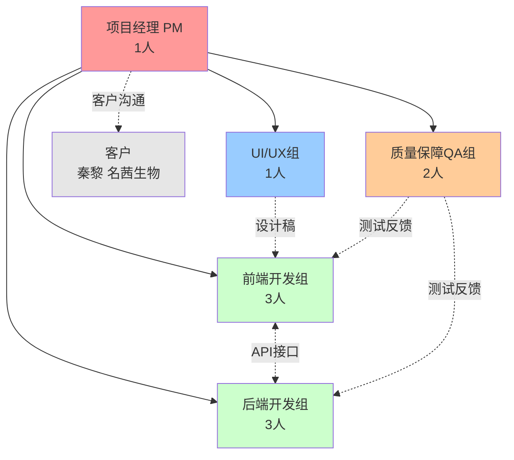

# 医疗器械标准数据库与应用系统 - 人员分配与沟通计划

**文档版本：** v1.0

**编制日期：** 2025-10-19（v1.0） 

**编制团队：** 软件项目管理-第四组

## 1. 引言

### 1.1 编写目的

本文档旨在为“医疗器械标准内容信息化数据库及运用系统”项目制定清晰的人员分配方案和高效的项目沟通计划。目的是确保团队每位成员职责明确、信息传递畅通，从而高效、高质量地完成《需求规格说明书》中定义的项目目标。

### 1.2 项目背景

本项目旨在将医疗器械标准内容结构化入库，建立一个集数据管理、多场景数据输出和智能辅助编辑于一体的B/S架构应用系统。项目团队由10名学生组成，包含一名项目经理（PM）和九名团队成员。

### 1.3 参考资料

- 《医疗器械标准内容信息化数据库及运用系统——需求规格说明书 v4.0 .md》
- 《项目管理PPT（6.ppt, 7.ppt）》

## 2. 人员分配

根据项目需求规格说明书（SRS）4.1章节的功能划分，本项目是一个功能全面的Web应用，涉及前端、后端、数据库、UI设计和软件测试。为高效协作，我们将9名成员分为4个核心小组：前端组、后端组、UI/UX组和质量保障(QA)组。

### 2.1 团队角色定义

| **角色**           | **人数** | **主要职责**                                                 |
| ------------------ | -------- | ------------------------------------------------------------ |
| **项目经理 (PM)**  | 1        | (已指定) 负责项目总协调、进度跟踪、风险管理、资源调配及与客户沟通。 |
| **UI/UX组**        | 1        | 负责系统的用户界面（UI）和用户体验（UX）设计。根据SRS 6.1节的要求，设计所有界面原型、视觉风格和交互流程。 |
| **前端开发组**     | 3        | 负责实现所有客户端界面。根据UI设计稿，开发Web前端页面，包括标准浏览、数据导入、表格导出、产品技术要求编辑器（富文本）等功能。 |
| **后端开发组**     | 3        | 负责服务器端逻辑、API接口和数据库。实现用户管理、数据管理（Excel/Word导入解析）、设备管理、错误报告、数据导出逻辑等。 |
| **质量保障(QA)组** | 2        | 负责软件测试。编写测试用例，执行功能测试、性能测试、兼容性测试，并跟踪Bug修复。 |

### 2.2 团队组织结构图



### 2.3 责任分配矩阵 (Responsibility Assignment Matrix - RAM)

#### 2.3.1 APRIS模型说明

为了明确各项任务的负责人，我们采用APRIS模型：

- **A (Accountable - 负责人):** 对任务结果最终负责的人。
- **P (Performer - 执行者):** 实际动手完成任务的人。
- **R (Reviewer - 审查者):** 审查产出物质量的人。
- **I (Input - 输入者):** 在任务开始前提供必要信息或资源的人。
- **S (Sign-off - 批准者):** 对最终产出物有最终批准权的人。

#### 2.3.2 按功能模块的责任分配

##### **模块A：项目管理与基础设施**

| **任务/活动** | **项目经理(PM)** | **UI/UX组** | **前端组** | **后端组** | **QA组** |
| ------------- | ---------------- | ----------- | ---------- | ---------- | -------- |
| **A.1 项目规划与管理** | A/P/S | I | I | I | I |
| **A.2 需求分析与确认** | A/S | I | I | I | I |
| **A.3 系统架构设计** | A/S | I | I | P | R |
| **A.4 数据库设计与实现** | A/S | - | I | P | R |
| **A.5 UI/UX整体设计** | A/S | P | R | I | R |

##### **模块B：用户管理功能**

| **任务/活动** | **项目经理(PM)** | **UI/UX组** | **前端组** | **后端组** | **QA组** |
| ------------- | ---------------- | ----------- | ---------- | ---------- | -------- |
| **B.1 用户管理UI设计** | S | P | R | I | I |
| **B.2 用户登录/注册前端开发** | S | I | P | I | R |
| **B.3 用户认证授权后端开发** | S | I | I | P | R |
| **B.4 用户管理功能测试** | A | I | I | I | P |
| **B.5 用户管理功能部署** | A/S | - | I | P | R |

##### **模块C：标准数据管理功能**

| **任务/活动** | **项目经理(PM)** | **UI/UX组** | **前端组** | **后端组** | **QA组** |
| ------------- | ---------------- | ----------- | ---------- | ---------- | -------- |
| **C.1 标准数据管理UI设计** | S | P | R | I | I |
| **C.2 标准浏览与检索前端开发** | S | I | P | I | R |
| **C.3 Excel/Word导入解析后端开发** | S | I | I | P | R |
| **C.4 标准数据存储与查询后端开发** | S | I | I | P | R |
| **C.5 标准数据管理功能测试** | A | I | I | I | P |
| **C.6 标准数据管理功能部署** | A/S | - | I | P | R |

##### **模块D：设备管理功能**

| **任务/活动** | **项目经理(PM)** | **UI/UX组** | **前端组** | **后端组** | **QA组** |
| ------------- | ---------------- | ----------- | ---------- | ---------- | -------- |
| **D.1 设备管理UI设计** | S | P | R | I | I |
| **D.2 设备管理前端开发** | S | I | P | I | R |
| **D.3 设备管理后端开发** | S | I | I | P | R |
| **D.4 设备管理功能测试** | A | I | I | I | P |
| **D.5 设备管理功能部署** | A/S | - | I | P | R |

##### **模块E：错误报告功能**

| **任务/活动** | **项目经理(PM)** | **UI/UX组** | **前端组** | **后端组** | **QA组** |
| ------------- | ---------------- | ----------- | ---------- | ---------- | -------- |
| **E.1 错误报告UI设计** | S | P | R | I | I |
| **E.2 错误报告前端开发** | S | I | P | I | R |
| **E.3 错误报告后端开发** | S | I | I | P | R |
| **E.4 错误报告功能测试** | A | I | I | I | P |
| **E.5 错误报告功能部署** | A/S | - | I | P | R |

##### **模块F：数据导出功能**

| **任务/活动** | **项目经理(PM)** | **UI/UX组** | **前端组** | **后端组** | **QA组** |
| ------------- | ---------------- | ----------- | ---------- | ---------- | -------- |
| **F.1 数据导出UI设计** | S | P | R | I | I |
| **F.2 导出配置界面前端开发** | S | I | P | I | R |
| **F.3 表1/表2/表3导出后端开发** | S | I | I | P | R |
| **F.4 自定义导出后端开发** | S | I | I | P | R |
| **F.5 数据导出功能测试** | A | I | I | I | P |
| **F.6 数据导出功能部署** | A/S | - | I | P | R |

##### **模块G：产品技术要求编辑功能**

| **任务/活动** | **项目经理(PM)** | **UI/UX组** | **前端组** | **后端组** | **QA组** |
| ------------- | ---------------- | ----------- | ---------- | ---------- | -------- |
| **G.1 PTR编辑器UI设计** | S | P | R | I | I |
| **G.2 富文本编辑器前端开发** | S | I | P | I | R |
| **G.3 智能辅助编辑前端开发** | S | I | P | I | R |
| **G.4 PTR存储与Word生成后端开发** | S | I | I | P | R |
| **G.5 PTR编辑功能测试** | A | I | I | I | P |
| **G.6 PTR编辑功能部署** | A/S | - | I | P | R |

##### **模块H：系统测试与交付**

| **任务/活动** | **项目经理(PM)** | **UI/UX组** | **前端组** | **后端组** | **QA组** |
| ------------- | ---------------- | ----------- | ---------- | ---------- | -------- |
| **H.1 系统集成测试** | A/S | I | I | I | P |
| **H.2 性能与安全测试** | A/S | I | I | I | P |
| **H.3 用户验收测试(UAT)** | A/S | I | P | P | P |
| **H.4 系统整体部署** | A/S | - | I | P | R |
| **H.5 项目验收与收尾** | A/P/S | I | I | I | I |

## 3. 项目沟通计划

沟通计划旨在确定**谁需要信息**、**需要什么信息**、**何时需要信息**，以及**如何将信息分发给他们**。

### 3.1 沟通需求分析

#### 3.1.1 干系人识别

| **干系人** | **角色**   | **信息需求**                               |
| ---------- | ---------- | ------------------------------------------ |
| 客户       | 项目委托方 | 项目进展、阶段成果、需求确认、验收         |
| 项目经理   | 项目管理者 | 全面项目信息、团队进度、风险问题、资源需求 |
| UI/UX组    | 设计人员   | 需求文档、用户反馈、设计评审结果           |
| 前端开发组 | 开发人员   | 设计稿、API接口文档、需求变更、Bug报告     |
| 后端开发组 | 开发人员   | 需求文档、数据库设计、API接口规范、Bug报告 |
| QA组       | 测试人员   | 需求文档、设计文档、测试环境、缺陷修复进度 |
| 指导老师   | 项目监督者 | 项目进展、阶段报告、问题汇报               |

### 3.2 沟通内容

根据项目需求，明确各类沟通的具体内容：

| **沟通内容类型**   | **具体内容**                                | **接收者**               |
| ------------------ | ------------------------------------------- | ------------------------ |
| **项目进度信息**   | 任务完成情况、里程碑达成、进度偏差          | PM、客户、指导老师       |
| **技术信息**       | 技术方案、API接口文档、数据库设计、架构设计 | 前端组、后端组、QA组     |
| **设计信息**       | UI设计、交互原型、设计规范                  | 前端组、PM、客户         |
| **质量信息**       | 测试报告、缺陷统计、代码评审结果            | PM、前端组、后端组、QA组 |
| **需求变更信息**   | 需求变更申请、变更影响分析、变更批准        | 全体成员、客户           |
| **风险与问题信息** | 风险识别、问题描述、影响分析、解决方案      | PM、相关责任人、客户     |
| **会议纪要**       | 会议决策、行动计划、责任人、完成时间        | 全体成员                 |

### 3.3 沟通方法

#### 3.3.1 定期会议

| **会议类型**   | **参与人员**             | **频率**           | **时长** | **沟通渠道**    | **主要议题**                                    |
| -------------- | ------------------------ | ------------------ | -------- | --------------- | ----------------------------------------------- |
| **日常站会**   | 全体团队成员 (10人)      | 每隔几天           | 15分钟   | 线下/即时通讯群 | 近日工作、下一步计划、遇到的问题                |
| **团队周会**   | 全体团队成员 (10人)      | 每周周末           | 30分钟   | 线下            | 本周进度回顾、功能演示、下周任务规划            |
| **技术评审会** | PM、前端组、后端组、QA组 | 按需（模块开发前） | 1-2小时  | 线下            | 技术方案评审、API接口设计、数据库设计、测试用例 |
| **设计评审会** | PM、UI/UX组、前端组      | 按需（设计完成后） | 1小时    | 线下            | UI设计、交互流程确认、设计修改意见              |

#### 3.3.2 定期报告

| **报告类型** | **提交人** | **接收人**           | **频率**     | **提交时间** | **报告内容**                       |
| ------------ | ---------- | -------------------- | ------------ | ------------ | ---------------------------------- |
| **项目周报** | 项目经理   | 客户、指导老师       | 每周         | 每周周末     | 项目进展                           |
| **阶段报告** | 项目经理   | 客户、指导老师、全体 | 每阶段结束后 | 阶段结束后   | 阶段目标达成、交付物清单、问题总结 |

#### 3.3.3 即时沟通

| **沟通场景**       | **参与人员**      | **沟通渠道** | **响应时间** | **适用情况**                     |
| ------------------ | ----------------- | ------------ | ------------ | -------------------------------- |
| **技术问题讨论**   | 相关技术人员      | QQ群         | 当天内       | 技术难题、实现方案讨论、代码问题 |
| **日常协作沟通**   | 相关组员          | QQ群         | 当天内       | 任务协调、信息同步、文档共享     |
| **紧急问题**       | 问题发现者 → PM   | QQ + 电话    | 尽快响应     | 严重缺陷、进度延误               |

#### 3.3.4 沟通工具

| **用途**     | **工具**        | **使用场景**             |
| ------------ | --------------- | ------------------------ |
| **即时通讯** | QQ群            | 日常沟通、快速响应、通知 |
| **线上会议** | 腾讯会议        | 远程讨论                 |
| **代码管理** | Gitee / GitHub  | 代码提交、版本管理       |
| **文档协作** | 腾讯文档 / 语雀 | 文档编写、会议记录       |
| **任务跟踪** | QQ群 + 腾讯文档 | 任务分配、进度跟踪       |
| **设计协作** | Figma / 墨刀    | UI设计、原型设计         |

### 3.4 沟通职责

明确各角色在沟通中的职责：

| **角色**       | **沟通职责**                                                 |
| -------------- | ------------------------------------------------------------ |
| **项目经理**   | • 组织和主持项目会议<br>• 编制和发送项目周报<br>• 与客户保持定期沟通<br>• 向指导老师汇报项目进展 |
| **UI/UX组**    | • 提供设计和原型<br>• 参与设计评审会<br>• 解答前端组的设计问题<br>• 收集反馈并优化设计 |
| **前端组组长** | • 组织前端组内部沟通<br>• 与后端组协调API接口<br>• 向PM汇报前端进度<br>• 参与技术评审会 |
| **后端组组长** | • 组织后端组内部沟通<br>• 与前端组协调API接口<br>• 向PM汇报后端进度<br>• 参与技术评审会 |
| **QA组组长**   | • 组织QA组内部沟通<br>• 编制和发送测试报告<br>• 向PM和开发组反馈缺陷<br>• 参与评审会议 |
| **各组成员**   | • 参与日常站会<br>• 及时反馈问题和风险<br>• 响应即时沟通请求 |

### 3.5 沟通进度

项目沟通按以下时间表执行：

| **时间**     | **沟通活动**                                                 |
| ------------ | ------------------------------------------------------------ |
| **每隔几天** | • 线下碰头或QQ群同步（15分钟）：近日工作、下一步计划、遇到的问题 |
| **每周**     | • 周末团队会议（30分钟-1小时）：本周进度回顾、下周任务规划<br>• 周末：本周进度总结 |
| **按需**     | • 技术评审会（模块开发前，线下或线上）<br>• 设计评审会（设计完成后，线下或线上）<br>• 客户沟通（阶段性成果完成后） |
| **日常**     | • QQ群随时沟通（课余时间回复）<br>• 紧急问题随时联系PM       |

### 3.6 沟通计划维护

#### 3.6.1 沟通效果评估

定期评估沟通效果，确保信息传递准确、及时：

| **评估指标**       | **目标**     | **评估方法**         |
| ------------------ | ------------ | -------------------- |
| 会议参与率         | 尽量全员参加 | 会议记录             |
| 信息传递准确性     | 减少误解     | 需求变更次数         |
| 团队协作顺畅度     | 良好         | 团队反馈             |

#### 3.6.2 沟通计划更新

沟通计划将根据项目实际情况灵活调整：

- **团队成员变动**：更新干系人列表和沟通职责
- **项目阶段转换**：根据需要调整沟通频率
- **课程冲突**：灵活调整会议时间，优先使用QQ群异步沟通
- **客户需求变化**：及时与客户沟通，更新计划

#### 3.6.3 沟通规范

为确保沟通效率和质量，制定以下简单规范：

| **规范类型**   | **具体要求**                                                 |
| -------------- | ------------------------------------------------------------ |
| **会议规范**   | • 提前通知会议时间和地点<br>• 尽量准时参会<br>• 重要会议做简单记录 |
| **QQ群规范**   | • 课余时间及时查看消息<br>• 紧急问题尽快响应<br>• 重要决策在群里确认 |
| **文档规范**   | • 文档命名清晰（如：需求文档_v1.0）<br>• 使用Git管理代码和文档<br>• 重要文档及时备份 |
| **任务反馈**   | • 遇到问题及时在群里反馈<br>• 完成任务后在群里通知<br>• 进度延误提前说明 |

---

## 4. 附录

### 4.1 会议纪要模板

```
会议名称：[会议名称]
会议时间：[日期] [时间]
会议地点：[地点/线上]
主持人：[姓名]
记录人：[姓名]
参会人员：[姓名列表]

一、会议议程
1. [议程1]
2. [议程2]

二、会议内容与决策
1. [议题1]
   - 讨论内容：...
   - 决策结果：...
   - 责任人：...
   - 完成时间：...

三、行动计划
| 序号 | 行动项 | 责任人 | 完成时间 | 状态 |
|------|--------|--------|---------|------|
| 1    | ...    | ...    | ...     | 待办 |

四、下次会议安排
时间：[日期] [时间]
地点：[地点/线上]
议题：[议题列表]
```

### 4.2 团队成员具体分配

| **组别**         | **人数** | **成员姓名**           | **负责模块**                                                                 |
| ---------------- | -------- | ---------------------- | ---------------------------------------------------------------------------- |
| 项目经理(PM)     | 1人      | [姓名]                 | 项目总协调、进度跟踪、风险管理、客户沟通、资源调配                           |
| UI/UX组          | 1人      | [姓名]                 | 全系统UI/UX设计、界面原型、视觉风格、交互流程                                |
| 前端开发组       | 3人      | [姓名1]、[姓名2]、[姓名3] | 标准数据管理、PTR编辑器、用户管理、设备管理、错误报告、数据导出等前端功能开发 |
| 后端开发组       | 3人      | [姓名1]、[姓名2]、[姓名3] | 数据库设计、标准数据管理、用户管理、设备管理、错误报告、数据导出、PTR存储与生成等后端功能开发 |
| 质量保障(QA)组   | 2人      | [姓名1]、[姓名2]        | 测试计划、测试用例设计、功能测试、性能测试、兼容性测试、用户验收测试、缺陷跟踪 |

**外部干系人：**
- **客户**：秦黎（名茜生物）
- **指导老师**：[姓名]

---

## 文档变更记录

| **版本** | **日期**   | **修订人** | **修订内容** |
| -------- | ---------- | ---------- | ------------ |
| v1.0     | 2025-10-19 | 项目经理   | 初始版本     |

---

