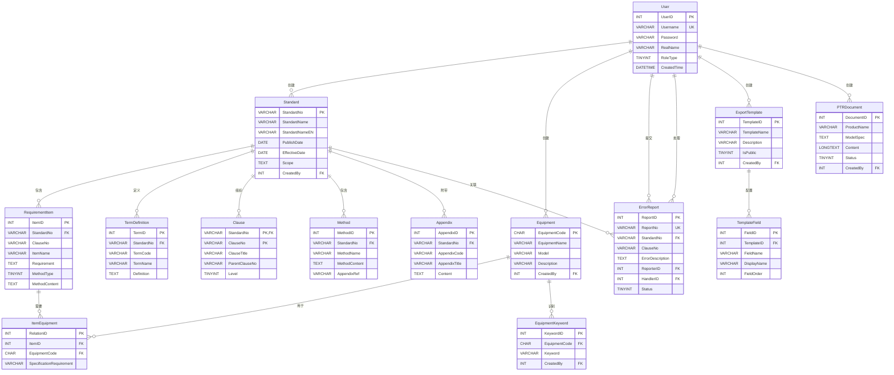
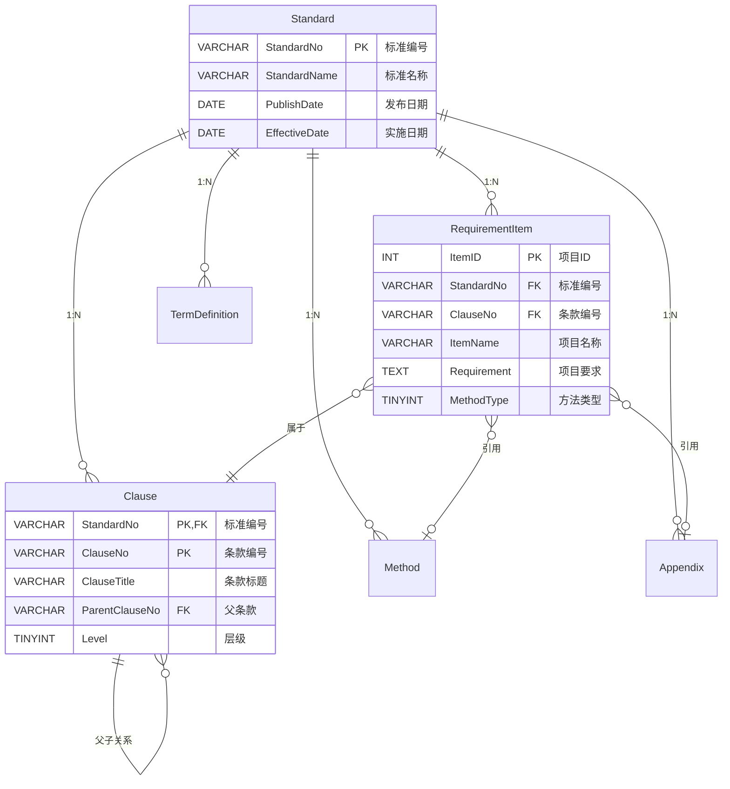
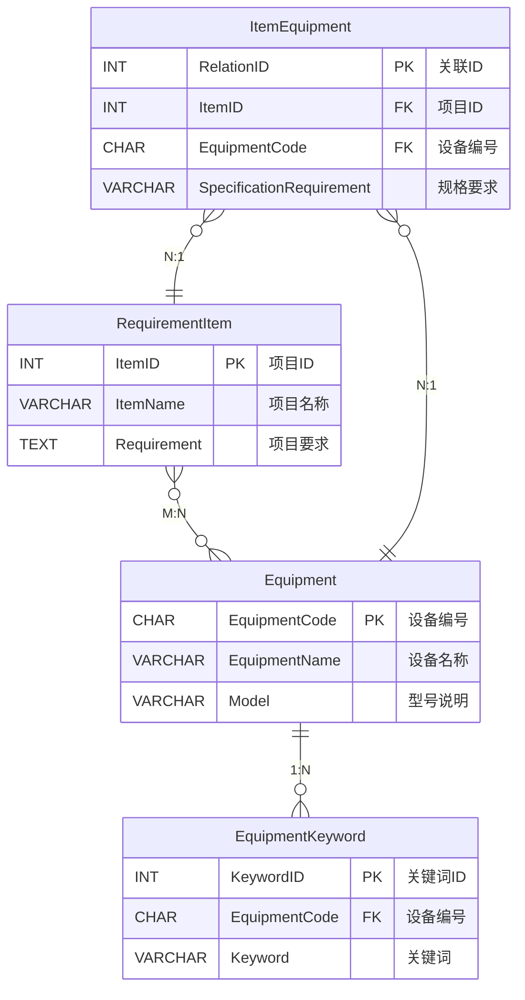
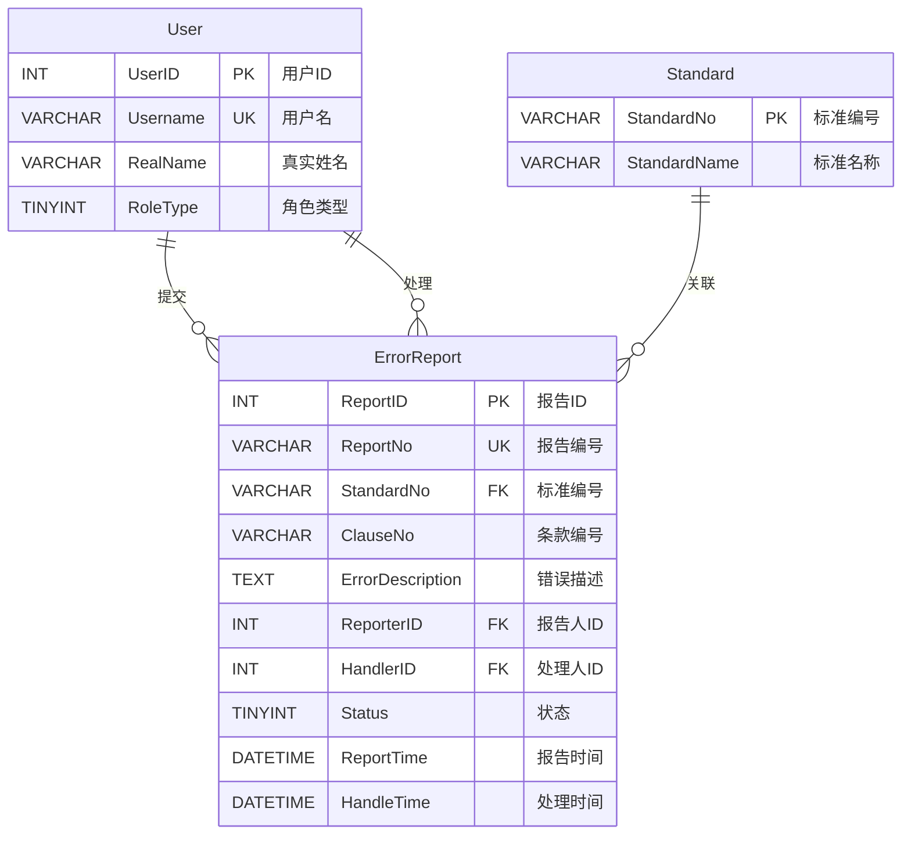

# 医疗器械标准内容信息化数据库及运用系统——数据库设计文档

**文档版本：** v2.0
**编制日期：** 2025-11-14
**文档状态：** 正式版（基于实际项目配置更新）
**数据库版本：** MySQL 8.0+
**ORM框架：** MyBatis-Plus 3.5.9（Spring Boot 3.x兼容版本）

---

## 目录

[1. 引言](#1-引言)  
&nbsp;&nbsp;[1.1 编写目的](#11-编写目的)  
&nbsp;&nbsp;[1.2 项目背景](#12-项目背景)  
&nbsp;&nbsp;[1.3 定义](#13-定义)  
&nbsp;&nbsp;[1.4 参考资料](#14-参考资料)  

[2. 数据库概述](#2-数据库概述)  
&nbsp;&nbsp;[2.1 数据库选型](#21-数据库选型)  
&nbsp;&nbsp;[2.2 设计原则](#22-设计原则)  
&nbsp;&nbsp;[2.3 命名规范](#23-命名规范)  

[3. 数据库架构](#3-数据库架构)  
&nbsp;&nbsp;[3.1 逻辑架构](#31-逻辑架构)  
&nbsp;&nbsp;[3.2 物理架构](#32-物理架构)  

[4. 数据模型设计](#4-数据模型设计)  
&nbsp;&nbsp;[4.1 概念模型（E-R图）](#41-概念模型er图)  
&nbsp;&nbsp;[4.2 逻辑模型](#42-逻辑模型)  
&nbsp;&nbsp;[4.3 物理模型](#43-物理模型)  

[5. 数据表设计](#5-数据表设计)  
&nbsp;&nbsp;[5.1 用户管理相关表](#51-用户管理相关表)  
&nbsp;&nbsp;&nbsp;&nbsp;[5.1.1 用户表（users）](#511-用户表users)  
&nbsp;&nbsp;&nbsp;&nbsp;[5.1.2 角色表（roles）](#512-角色表roles)  
&nbsp;&nbsp;&nbsp;&nbsp;[5.1.3 权限表（permissions）](#513-权限表permissions)  
&nbsp;&nbsp;&nbsp;&nbsp;[5.1.4 用户角色关联表（user_roles）](#514-用户角色关联表user_roles)  
&nbsp;&nbsp;[5.2 标准数据相关表](#52-标准数据相关表)  
&nbsp;&nbsp;&nbsp;&nbsp;[5.2.1 标准基本信息表（standards）](#521-标准基本信息表standards)  
&nbsp;&nbsp;&nbsp;&nbsp;[5.2.2 检验项目表（inspection_items）](#522-检验项目表inspection_items)  
&nbsp;&nbsp;&nbsp;&nbsp;[5.2.3 检验方法表（inspection_methods）](#523-检验方法表inspection_methods)  
&nbsp;&nbsp;&nbsp;&nbsp;[5.2.4 标准附录表（standard_appendices）](#524-标准附录表standard_appendices)  
&nbsp;&nbsp;[5.3 设备管理相关表](#53-设备管理相关表)  
&nbsp;&nbsp;&nbsp;&nbsp;[5.3.1 设备目录表（equipment_catalog）](#531-设备目录表equipment_catalog)  
&nbsp;&nbsp;&nbsp;&nbsp;[5.3.2 项目设备关联表（item_equipment）](#532-项目设备关联表item_equipment)  
&nbsp;&nbsp;[5.4 错误报告相关表](#54-错误报告相关表)  
&nbsp;&nbsp;&nbsp;&nbsp;[5.4.1 错误报告表（error_reports）](#541-错误报告表error_reports)  
&nbsp;&nbsp;&nbsp;&nbsp;[5.4.2 错误处理记录表（error_handling_records）](#542-错误处理记录表error_handling_records)  
&nbsp;&nbsp;[5.5 导出模板相关表](#55-导出模板相关表)  
&nbsp;&nbsp;&nbsp;&nbsp;[5.5.1 导出模板表（export_templates）](#551-导出模板表export_templates)  
&nbsp;&nbsp;&nbsp;&nbsp;[5.5.2 导出历史表（export_history）](#552-导出历史表export_history)  
&nbsp;&nbsp;[5.6 系统管理相关表](#56-系统管理相关表)  
&nbsp;&nbsp;&nbsp;&nbsp;[5.6.1 操作日志表（operation_logs）](#561-操作日志表operation_logs)  
&nbsp;&nbsp;&nbsp;&nbsp;[5.6.2 系统配置表（system_config）](#562-系统配置表system_config)  

[6. 索引设计](#6-索引设计)  
&nbsp;&nbsp;[6.1 主键索引](#61-主键索引)  
&nbsp;&nbsp;[6.2 唯一索引](#62-唯一索引)  
&nbsp;&nbsp;[6.3 普通索引](#63-普通索引)  
&nbsp;&nbsp;[6.4 全文索引](#64-全文索引)  

[7. 视图设计](#7-视图设计)  

[8. 存储过程设计](#8-存储过程设计)  

[9. 触发器设计](#9-触发器设计)  

[10. 数据字典](#10-数据字典)  
&nbsp;&nbsp;[10.1 枚举类型定义](#101-枚举类型定义)  
&nbsp;&nbsp;[10.2 状态码定义](#102-状态码定义)  

[11. 数据安全设计](#11-数据安全设计)  
&nbsp;&nbsp;[11.1 数据加密](#111-数据加密)  
&nbsp;&nbsp;[11.2 备份策略](#112-备份策略)  
&nbsp;&nbsp;[11.3 权限控制](#113-权限控制)  

[12. 性能优化](#12-性能优化)  
&nbsp;&nbsp;[12.1 分区策略](#121-分区策略)  
&nbsp;&nbsp;[12.2 缓存策略](#122-缓存策略)  
&nbsp;&nbsp;[12.3 查询优化](#123-查询优化)  

---

## 1. 引言

### 1.1 编写目的

本文档是医疗器械标准内容信息化数据库及运用系统的数据库设计文档，详细描述系统的数据库结构设计。

本文档的目的是：
- 定义数据库的逻辑结构和物理结构
- 详细说明各数据表的字段、类型、约束等信息
- 为数据库开发和维护提供依据
- 为应用程序开发提供数据接口规范

本文档供数据库管理员、后端开发人员、测试人员参考。

### 1.2 项目背景

（参考需求规格说明书）

### 1.3 定义

| 术语 | 定义 |
|------|------|
| PK | Primary Key，主键 |
| FK | Foreign Key，外键 |
| UK | Unique Key，唯一键 |
| NOT NULL | 非空约束 |
| DEFAULT | 默认值 |
| INDEX | 索引 |
| VARCHAR | 可变长度字符串 |
| TEXT | 长文本类型 |
| TIMESTAMP | 时间戳类型 |

### 1.4 参考资料

- 《需求规格说明书-医疗器械标准数据库与应用系统 v4.0》
- 《系统设计说明书-医疗器械标准数据库与应用系统 v1.0》
- 《WBS-工作分解结构 v3.0》

---

## 2. 数据库概述

### 2.1 数据库选型

**数据库管理系统：** MySQL 8.0

**选型理由：**
- 开源免费，成本低
- 性能优异，支持高并发访问
- 跨平台支持（Windows、Linux、macOS）
- 生态成熟，社区活跃
- 支持完整的事务处理（ACID）
- 丰富的数据类型和索引类型
- 良好的备份恢复机制

**备选方案：** SQL Server 2016+（如客户环境已有SQL Server授权）

### 2.2 设计原则

1. **规范化设计**
   - 遵循第三范式（3NF），减少数据冗余
   - 合理使用外键约束，保证数据完整性
   - 对于频繁查询的场景，适度反规范化以提升性能

2. **可扩展性**
   - 预留扩展字段，便于未来功能升级
   - 使用枚举类型字段支持状态扩展
   - 表结构设计考虑数据量增长

3. **性能优化**
   - 合理设计索引，平衡查询性能和写入性能
   - 大文本字段使用TEXT类型，避免影响行存储
   - 对高频查询字段建立索引

4. **数据安全**
   - 敏感数据（如密码）加密存储
   - 关键操作记录审计日志
   - 使用外键约束防止数据不一致

5. **易维护性**
   - 统一的命名规范
   - 完整的字段注释
   - 清晰的表间关系

### 2.3 命名规范

**表命名规范：**
- 使用帕斯卡命名法（PascalCase）
- 表名使用单数形式，如`Standard`而非`Standards`
- 关联表使用两个表名组合，如`ItemEquipment`

**字段命名规范：**
- 使用帕斯卡命名法（PascalCase）
- 主键统一命名为`表名+ID`，如`UserID`、`ItemID`
- 外键字段名与引用表的主键名保持一致
- 布尔类型字段使用`Is`前缀，如`IsPublic`
- 时间字段使用明确的后缀，如`CreatedTime`、`UpdatedTime`

**索引命名规范：**
- 主键索引：`PK_表名`
- 唯一索引：`UK_表名_字段名`
- 普通索引：`IDX_表名_字段名`
- 外键索引：`FK_表名_引用表名`

**约束命名规范：**
- 默认值约束：`DF_表名_字段名`
- 检查约束：`CK_表名_字段名`

---

## 3. 数据库架构

### 3.1 逻辑架构

系统数据库按功能模块划分为以下逻辑分组：

**1. 用户权限模块**
- User（用户表）

**2. 标准数据模块**
- Standard（标准信息表）
- RequirementItem（检验项目表）
- TermDefinition（术语定义表）
- Clause（条款信息表）
- Method（检验方法表）
- Appendix（附录表）

**3. 设备管理模块**
- Equipment（设备信息表）
- ItemEquipment（项目设备关联表）
- EquipmentKeyword（设备关键词表）

**4. 错误报告模块**
- ErrorReport（错误报告表）

**5. 导出模板模块**
- ExportTemplate（自定义输出模板表）
- TemplateField（模板字段配置表）

**6. 文档管理模块**
- PTRDocument（产品技术要求表）

**7. 系统管理模块**
- OperationLog（操作日志表）
- SystemConfig（系统配置表）

### 3.2 物理架构

**数据库名称：** `medical_device_standards`

**字符集：** `utf8mb4`（支持完整的Unicode字符，包括emoji等特殊字符）

**排序规则：** `utf8mb4_unicode_ci`（不区分大小写，支持多语言排序）

**存储引擎：** InnoDB（支持事务、外键约束、行级锁）

**数据文件组织：**
- 数据文件：`medical_device_standards.ibd`
- 日志文件：`ib_logfile0`、`ib_logfile1`
- 二进制日志：用于数据恢复和主从复制

**表空间设计：**
- 使用独立表空间（innodb_file_per_table=ON）
- 每个表对应独立的.ibd文件，便于管理和备份

---

## 4. 数据模型设计

### 4.1 概念模型（E-R图）

#### 4.1.1 整体E-R图

以下E-R图展示了系统的核心实体及其关系：



#### 4.1.2 核心业务E-R图

**标准数据管理核心关系：**



**设备管理核心关系：**



**错误报告流程关系：**



### 4.2 逻辑模型

#### 4.2.1 范式分析

本数据库设计严格遵循**第三范式（3NF）**：

**第一范式（1NF）：**
- ✅ 所有字段均为原子性，不可再分
- ✅ 每个字段只包含单一值
- ✅ 示例：EquipmentName不包含型号信息，型号单独存储在Model字段

**第二范式（2NF）：**
- ✅ 满足1NF
- ✅ 所有非主属性完全依赖于主键
- ✅ 消除部分依赖
- ✅ 示例：RequirementItem表中，ItemName、Requirement等字段完全依赖于ItemID，不存在部分依赖

**第三范式（3NF）：**
- ✅ 满足2NF
- ✅ 消除传递依赖
- ✅ 非主属性不依赖于其他非主属性
- ✅ 示例：
  - Standard表中，StandardName不依赖于CreatedBy
  - RequirementItem表中，ItemName不依赖于StandardNo（虽然有外键关系）
  - 用户信息（RealName）不冗余存储在OperationLog中，仅存储UserID

#### 4.2.2 关键关系说明

**1. 一对多关系（1:N）**

| 主表 | 从表 | 关系说明 | 外键字段 | 级联规则 |
|------|------|----------|----------|----------|
| Standard | RequirementItem | 一个标准包含多个检验项目 | StandardNo | CASCADE |
| Standard | TermDefinition | 一个标准包含多个术语定义 | StandardNo | CASCADE |
| Standard | Appendix | 一个标准包含多个附录 | StandardNo | CASCADE |
| User | Standard | 一个用户可创建多个标准 | CreatedBy | - |
| Equipment | EquipmentKeyword | 一个设备有多个识别关键词 | EquipmentCode | CASCADE |

**2. 多对多关系（M:N）**

| 实体A | 实体B | 关联表 | 关系说明 |
|-------|-------|--------|----------|
| RequirementItem | Equipment | ItemEquipment | 一个项目需要多个设备，一个设备用于多个项目 |

**3. 自关联关系**

| 表名 | 关系类型 | 关系说明 | 关键字段 |
|------|----------|----------|----------|
| Clause | 父子关系（树形结构） | ParentClauseNo指向同表的ClauseNo | ParentClauseNo |

**4. 冗余字段设计（性能优化）**

| 表名 | 冗余字段 | 原因 | 说明 |
|------|----------|------|------|
| OperationLog | Username | 性能优化 | 避免每次查询日志都关联User表，日志表查询频繁 |

#### 4.2.3 数据完整性约束

**实体完整性：**
- ✅ 所有表都有主键约束
- ✅ 主键字段NOT NULL
- ✅ 主键选择：业务主键（StandardNo）或自增主键（ItemID）

**参照完整性：**
- ✅ 所有外键都建立FOREIGN KEY约束
- ✅ 级联删除：ON DELETE CASCADE（如Standard删除时级联删除RequirementItem）
- ✅ 级联更新：ON UPDATE CASCADE
- ✅ 示例：删除标准时，自动删除其下所有检验项目、术语、附录等

**域完整性：**
- ✅ 使用CHECK约束（MySQL 8.0支持）
- ✅ 枚举类型使用TINYINT + 应用层验证
- ✅ 日期字段使用DATE/DATETIME类型
- ✅ 字符串长度限制（VARCHAR长度定义）

**用户定义完整性：**
- ✅ 唯一约束：Username、StandardNo、ReportNo
- ✅ 默认值：CreatedTime默认CURRENT_TIMESTAMP
- ✅ 非空约束：关键业务字段NOT NULL
- ✅ 复合唯一约束：ItemEquipment表的(ItemID, EquipmentCode)

### 4.3 物理模型

#### 4.3.1 存储引擎选择

**InnoDB引擎特性：**
- ✅ 支持事务（ACID）
- ✅ 支持外键约束
- ✅ 行级锁定（高并发性能）
- ✅ 崩溃恢复能力
- ✅ 支持MVCC（多版本并发控制）

**适用场景：**
- 所有业务表使用InnoDB
- 操作日志表使用InnoDB（支持事务一致性）

#### 4.3.2 字符集和排序规则

**字符集：** utf8mb4
- 支持完整Unicode字符集
- 支持emoji和特殊符号
- 每个字符最多4字节

**排序规则：** utf8mb4_unicode_ci
- 不区分大小写（ci = case insensitive）
- 支持多语言排序
- 性能优于utf8mb4_general_ci

**配置示例：**
```sql
CREATE DATABASE medical_device_standards
DEFAULT CHARACTER SET utf8mb4
DEFAULT COLLATE utf8mb4_unicode_ci;
```

#### 4.3.3 索引物理设计

**B+Tree索引（默认）：**
- 主键索引：聚簇索引，数据按主键顺序存储
- 二级索引：非聚簇索引，叶子节点存储主键值

**全文索引（FULLTEXT）：**
- 使用ngram解析器（中文分词）
- ngram_token_size=2（配置文件设置）
- 适用于StandardName、ItemName等字段

**索引选择性分析：**

| 索引字段 | 选择性 | 索引类型 | 说明 |
|----------|--------|----------|------|
| StandardNo | 高（唯一） | PRIMARY KEY | 聚簇索引 |
| Username | 高（唯一） | UNIQUE | B+Tree |
| StandardName | 中 | NORMAL + FULLTEXT | 支持模糊查询和全文搜索 |
| RoleType | 低（6个值） | NORMAL | 适合等值查询 |
| Status | 低（2-3个值） | NORMAL | 适合等值查询 |
| Keyword | 中高 | NORMAL | **关键：设备识别匹配** |

#### 4.3.4 分区设计

**OperationLog表分区策略：**

```sql
-- 按月分区（RANGE分区）
ALTER TABLE OperationLog
PARTITION BY RANGE (YEAR(OperationTime) * 100 + MONTH(OperationTime)) (
    PARTITION p202501 VALUES LESS THAN (202502),
    PARTITION p202502 VALUES LESS THAN (202503),
    -- ... 继续添加分区
    PARTITION p_future VALUES LESS THAN MAXVALUE
);
```

**优势：**
- 查询性能提升（分区裁剪）
- 便于历史数据归档
- 简化数据维护

#### 4.3.5 表空间设计

**独立表空间（innodb_file_per_table=ON）：**
- 每个表使用独立的.ibd文件
- 便于备份和恢复单个表
- 支持表压缩

**大表优化：**
- OperationLog：启用压缩（ROW_FORMAT=COMPRESSED）
- PTRDocument：LONGTEXT字段使用动态行格式（ROW_FORMAT=DYNAMIC）

**存储估算：**

| 表名 | 预估记录数 | 平均行大小 | 预估空间 |
|------|-----------|-----------|----------|
| Standard | 1,000 | 2KB | 2MB |
| RequirementItem | 50,000 | 1KB | 50MB |
| Equipment | 500 | 500B | 250KB |
| ItemEquipment | 100,000 | 200B | 20MB |
| OperationLog | 1,000,000/年 | 500B | 500MB/年 |

---

## 5. 数据表设计

### 5.1 用户管理相关表

#### 5.1.1 用户表（User）

**表说明：** 存储系统用户基本信息，角色通过用户名格式自动识别

| 字段名 | 数据类型 | 长度 | 约束 | 默认值 | 说明 |
|--------|----------|------|------|--------|------|
| UserID | INT | - | PK, AUTO_INCREMENT | - | 用户ID |
| Username | VARCHAR | 50 | NOT NULL, UNIQUE | - | 用户名（格式决定角色） |
| Password | VARCHAR | 200 | NOT NULL | - | 密码（加密存储，建议使用bcrypt） |
| RealName | VARCHAR | 50 | NOT NULL | - | 真实姓名 |
| Phone | VARCHAR | 20 | - | NULL | 联系电话 |
| Email | VARCHAR | 100 | - | NULL | 邮箱 |
| Department | VARCHAR | 100 | - | NULL | 所属部门 |
| RoleType | TINYINT | - | NOT NULL | - | 角色类型（1-6，根据Username自动识别） |
| CreatedBy | INT | - | NOT NULL | - | 创建人ID |
| CreatedTime | DATETIME | - | NOT NULL | CURRENT_TIMESTAMP | 创建时间 |
| UpdatedBy | INT | - | - | NULL | 更新人ID |
| UpdatedTime | DATETIME | - | - | NULL | 更新时间 |
| LastLoginTime | DATETIME | - | - | NULL | 最后登录时间 |

**字段说明：**

**RoleType（角色类型）枚举值：**
- 1：数据输入员（Username = `dataadmin`）
- 2：系统管理员（Username = `sysadmin`）
- 3：业务人员（Username格式：`yw###`）
- 4：质量管理人员（Username格式：`zl###`）
- 5：设备管理人员（Username格式：`sb###`）
- 6：实验室人员（Username格式：`sy###`）

**索引设计：**
```sql
PRIMARY KEY (UserID)
UNIQUE KEY UK_User_Username (Username)
INDEX IDX_User_RoleType (RoleType)
INDEX IDX_User_CreatedTime (CreatedTime)
```

**约束说明：**
- Username必须唯一，系统根据格式自动识别角色
- Password字段存储加密后的密码（推荐使用bcrypt算法）
- RoleType一经设置不可修改
- 账号数量限制：dataadmin和sysadmin各1个，其他角色总计不超过20个

### 5.2 标准数据相关表

#### 5.2.1 标准基本信息表（Standard）

**表说明：** 存储医疗器械标准的基本信息

| 字段名 | 数据类型 | 长度 | 约束 | 默认值 | 说明 |
|--------|----------|------|------|--------|------|
| StandardNo | VARCHAR | 50 | PK | - | 标准编号（含年代号），如"GB 15810-2019" |
| StandardName | VARCHAR | 200 | NOT NULL | - | 标准名称（中文） |
| StandardNameEN | VARCHAR | 200 | - | NULL | 标准名称（英文） |
| ISOReference | VARCHAR | 200 | - | NULL | 国际标准引用型式 |
| PublishDate | DATE | - | - | NULL | 发布日期 |
| EffectiveDate | DATE | - | - | NULL | 实施日期 |
| Scope | TEXT | - | - | NULL | 适用范围 |
| References | TEXT | - | - | NULL | 规范性引用文件 |
| Foreword | TEXT | - | - | NULL | 前言 |
| Introduction | TEXT | - | - | NULL | 引言 |
| CreatedBy | INT | - | NOT NULL | - | 创建人ID |
| CreatedTime | DATETIME | - | NOT NULL | CURRENT_TIMESTAMP | 创建时间 |
| UpdatedBy | INT | - | - | NULL | 更新人ID |
| UpdatedTime | DATETIME | - | - | NULL | 更新时间 |

**索引设计：**
```sql
PRIMARY KEY (StandardNo)
INDEX IDX_Standard_Name (StandardName)  -- 支持标准名称模糊查询
INDEX IDX_Standard_PublishDate (PublishDate)
INDEX IDX_Standard_CreatedTime (CreatedTime)
FULLTEXT INDEX FT_Standard_Name (StandardName)  -- 全文索引支持中文搜索
```

**约束说明：**
- StandardNo为主键，必须包含年代号，格式如"GB 15810-2019"
- StandardName支持模糊查询，建立普通索引和全文索引
- TEXT类型字段用于存储大段文本内容

#### 5.2.2 检验项目表（RequirementItem）

**表说明：** 存储标准中的检验项目及要求

| 字段名 | 数据类型 | 长度 | 约束 | 默认值 | 说明 |
|--------|----------|------|------|--------|------|
| ItemID | INT | - | PK, AUTO_INCREMENT | - | 项目ID |
| StandardNo | VARCHAR | 50 | NOT NULL | - | 标准编号（外键） |
| ClauseNo | VARCHAR | 50 | NOT NULL | - | 项目条款，如"5.7.1" |
| ItemName | VARCHAR | 200 | NOT NULL | - | 项目名称 |
| Requirement | TEXT | - | NOT NULL | - | 项目要求 |
| MethodRef | VARCHAR | 500 | - | NULL | 项目方法引用，如"附录B" |
| MethodContent | TEXT | - | - | NULL | 项目方法完整内容 |
| MethodType | TINYINT | - | NOT NULL | - | 方法类型：1-无独立方法，2-引用附录，3-完整方法内容 |
| Notes | TEXT | - | - | NULL | 注意事项 |
| SortOrder | INT | - | - | NULL | 排序号 |
| CreatedTime | DATETIME | - | NOT NULL | CURRENT_TIMESTAMP | 创建时间 |
| UpdatedTime | DATETIME | - | - | NULL | 更新时间 |

**字段说明：**

**MethodType（方法类型）枚举值：**
- 1：无独立方法（项目要求中已包含方法说明）
- 2：引用附录（方法以附录形式单独表达，MethodRef存储附录编号）
- 3：完整方法内容（MethodContent存储完整方法描述）

**索引设计：**
```sql
PRIMARY KEY (ItemID)
INDEX IDX_RequirementItem_StandardNo (StandardNo)  -- 外键索引
INDEX IDX_RequirementItem_ItemName (ItemName)  -- 支持项目名称模糊查询
INDEX IDX_RequirementItem_ClauseNo (ClauseNo)
INDEX IDX_RequirementItem_SortOrder (SortOrder)
FULLTEXT INDEX FT_RequirementItem_Name (ItemName)  -- 全文索引
FOREIGN KEY FK_RequirementItem_Standard (StandardNo) REFERENCES Standard(StandardNo) ON DELETE CASCADE
```

**约束说明：**
- ItemName支持模糊查询，建立普通索引
- 外键关联到Standard表，级联删除
- SortOrder用于控制项目显示顺序

#### 5.2.3 术语定义表（TermDefinition）

**表说明：** 存储标准中的术语和定义

| 字段名 | 数据类型 | 长度 | 约束 | 默认值 | 说明 |
|--------|----------|------|------|--------|------|
| TermID | INT | - | PK, AUTO_INCREMENT | - | 术语ID |
| StandardNo | VARCHAR | 50 | NOT NULL | - | 标准编号（外键） |
| TermCode | VARCHAR | 20 | NOT NULL | - | 术语编号，如"3.1"、"3.2" |
| TermName | VARCHAR | 200 | NOT NULL | - | 术语名称 |
| TermNameEN | VARCHAR | 200 | - | NULL | 英文术语 |
| Definition | TEXT | - | NOT NULL | - | 术语定义 |
| Example | TEXT | - | - | NULL | 示例 |
| SortOrder | INT | - | - | NULL | 排序号 |
| CreatedTime | DATETIME | - | NOT NULL | CURRENT_TIMESTAMP | 创建时间 |

**索引设计：**
```sql
PRIMARY KEY (TermID)
INDEX IDX_TermDefinition_StandardNo (StandardNo)
INDEX IDX_TermDefinition_TermName (TermName)
FOREIGN KEY FK_TermDefinition_Standard (StandardNo) REFERENCES Standard(StandardNo) ON DELETE CASCADE
```

#### 5.2.4 条款信息表（Clause）

**表说明：** 存储标准的条款结构（支持多级层次）

| 字段名 | 数据类型 | 长度 | 约束 | 默认值 | 说明 |
|--------|----------|------|------|--------|------|
| StandardNo | VARCHAR | 50 | PK | - | 标准编号 |
| ClauseNo | VARCHAR | 50 | PK | - | 条款编号，如"5"、"5.7"、"5.7.1" |
| ClauseTitle | VARCHAR | 200 | NOT NULL | - | 条款标题 |
| ParentClauseNo | VARCHAR | 50 | - | NULL | 父条款编号（用于层级结构） |
| Level | TINYINT | - | NOT NULL | - | 层级，如1、2、3 |
| Content | TEXT | - | - | NULL | 条款内容 |
| SortOrder | INT | - | - | NULL | 排序号 |
| CreatedTime | DATETIME | - | NOT NULL | CURRENT_TIMESTAMP | 创建时间 |

**索引设计：**
```sql
PRIMARY KEY (StandardNo, ClauseNo)
INDEX IDX_Clause_ParentClauseNo (ParentClauseNo)
INDEX IDX_Clause_Level (Level)
FOREIGN KEY FK_Clause_Standard (StandardNo) REFERENCES Standard(StandardNo) ON DELETE CASCADE
```

#### 5.2.5 检验方法表（Method）

**表说明：** 存储独立的检验方法

| 字段名 | 数据类型 | 长度 | 约束 | 默认值 | 说明 |
|--------|----------|------|------|--------|------|
| MethodID | INT | - | PK, AUTO_INCREMENT | - | 方法ID |
| StandardNo | VARCHAR | 50 | NOT NULL | - | 标准编号（外键） |
| MethodCode | VARCHAR | 20 | - | NULL | 方法编号 |
| MethodName | VARCHAR | 200 | NOT NULL | - | 方法名称 |
| MethodContent | TEXT | - | NOT NULL | - | 方法内容 |
| AppendixRef | VARCHAR | 20 | - | NULL | 附录引用，如"附录B" |
| SortOrder | INT | - | - | NULL | 排序号 |
| CreatedTime | DATETIME | - | NOT NULL | CURRENT_TIMESTAMP | 创建时间 |
| UpdatedTime | DATETIME | - | - | NULL | 更新时间 |

**索引设计：**
```sql
PRIMARY KEY (MethodID)
INDEX IDX_Method_StandardNo (StandardNo)
INDEX IDX_Method_AppendixRef (AppendixRef)
FOREIGN KEY FK_Method_Standard (StandardNo) REFERENCES Standard(StandardNo) ON DELETE CASCADE
```

#### 5.2.6 附录表（Appendix）

**表说明：** 存储标准的附录内容

| 字段名 | 数据类型 | 长度 | 约束 | 默认值 | 说明 |
|--------|----------|------|------|--------|------|
| AppendixID | INT | - | PK, AUTO_INCREMENT | - | 附录ID |
| StandardNo | VARCHAR | 50 | NOT NULL | - | 标准编号（外键） |
| AppendixCode | VARCHAR | 20 | NOT NULL | - | 附录编号，如"A"、"B"、"C" |
| AppendixTitle | VARCHAR | 200 | NOT NULL | - | 附录标题 |
| AppendixType | VARCHAR | 20 | - | NULL | 附录类型（规范性/资料性） |
| Content | TEXT | - | NOT NULL | - | 附录内容 |
| SortOrder | INT | - | - | NULL | 排序号 |
| CreatedTime | DATETIME | - | NOT NULL | CURRENT_TIMESTAMP | 创建时间 |
| UpdatedTime | DATETIME | - | - | NULL | 更新时间 |

**索引设计：**
```sql
PRIMARY KEY (AppendixID)
INDEX IDX_Appendix_StandardNo (StandardNo)
INDEX IDX_Appendix_Code (AppendixCode)
FOREIGN KEY FK_Appendix_Standard (StandardNo) REFERENCES Standard(StandardNo) ON DELETE CASCADE
```

### 5.3 设备管理相关表

#### 5.3.1 设备信息表（Equipment）

**表说明：** 存储设备目录信息（同类设备只创建一条记录）

| 字段名 | 数据类型 | 长度 | 约束 | 默认值 | 说明 |
|--------|----------|------|------|--------|------|
| EquipmentCode | CHAR | 4 | PK | - | 设备编号，格式："[A-Z][0-9]{3}" |
| EquipmentName | VARCHAR | 200 | NOT NULL | - | 设备名称 |
| Model | VARCHAR | 100 | - | NULL | 通用描述或说明 |
| Description | VARCHAR | 500 | - | NULL | 用途说明 |
| CreatedBy | INT | - | NOT NULL | - | 创建人ID |
| CreatedTime | DATETIME | - | NOT NULL | CURRENT_TIMESTAMP | 创建时间 |

**索引设计：**
```sql
PRIMARY KEY (EquipmentCode)
INDEX IDX_Equipment_Name (EquipmentName)
INDEX IDX_Equipment_CreatedTime (CreatedTime)
```

**约束说明：**
- EquipmentCode格式：大写字母+3位数字（如A001、B002）
- 同一类型设备只创建一条记录
- 具体规格要求记录在ItemEquipment关联表中

#### 5.3.2 项目设备关联表（ItemEquipment）

**表说明：** 记录检验项目与设备的关联关系及规格要求

| 字段名 | 数据类型 | 长度 | 约束 | 默认值 | 说明 |
|--------|----------|------|------|--------|------|
| RelationID | INT | - | PK, AUTO_INCREMENT | - | 关联ID |
| ItemID | INT | - | NOT NULL | - | 项目ID（外键） |
| EquipmentCode | CHAR | 4 | NOT NULL | - | 设备编号（外键） |
| SpecificationRequirement | VARCHAR | 200 | - | NULL | 规格要求 |
| CreatedTime | DATETIME | - | NOT NULL | CURRENT_TIMESTAMP | 创建时间 |

**索引设计：**
```sql
PRIMARY KEY (RelationID)
INDEX IDX_ItemEquipment_ItemID (ItemID)
INDEX IDX_ItemEquipment_EquipmentCode (EquipmentCode)
UNIQUE KEY UK_ItemEquipment_Item_Equipment (ItemID, EquipmentCode)  -- 防止重复关联
FOREIGN KEY FK_ItemEquipment_Item (ItemID) REFERENCES RequirementItem(ItemID) ON DELETE CASCADE
FOREIGN KEY FK_ItemEquipment_Equipment (EquipmentCode) REFERENCES Equipment(EquipmentCode) ON DELETE CASCADE
```

**约束说明：**
- 同一项目可关联多个设备（一对多）
- 同一设备可被多个项目关联（多对一）
- 唯一索引防止同一项目重复关联同一设备

#### 5.3.3 设备关键词表（EquipmentKeyword）

**表说明：** 存储设备识别关键词库，用于导入时智能识别设备

| 字段名 | 数据类型 | 长度 | 约束 | 默认值 | 说明 |
|--------|----------|------|------|--------|------|
| KeywordID | INT | - | PK, AUTO_INCREMENT | - | 关键词ID |
| EquipmentCode | CHAR | 4 | NOT NULL | - | 设备编号（外键） |
| Keyword | VARCHAR | 100 | NOT NULL | - | 关键词 |
| CreatedBy | INT | - | NOT NULL | - | 创建人ID |
| CreatedTime | DATETIME | - | NOT NULL | CURRENT_TIMESTAMP | 创建时间 |

**索引设计：**
```sql
PRIMARY KEY (KeywordID)
INDEX IDX_EquipmentKeyword_Code (EquipmentCode)  -- 外键索引
INDEX IDX_EquipmentKeyword_Keyword (Keyword)  -- 关键词匹配索引（重要）
UNIQUE KEY UK_EquipmentKeyword_Code_Keyword (EquipmentCode, Keyword)  -- 防止重复关键词
FOREIGN KEY FK_EquipmentKeyword_Equipment (EquipmentCode) REFERENCES Equipment(EquipmentCode) ON DELETE CASCADE
```

**约束说明：**
- Keyword字段建立索引以支持快速匹配
- 一个设备可以有多个关键词
- 关键词匹配不区分大小写
- 示例：设备"A001-电子天平"可有关键词"电子天平"、"天平"、"分析天平"

### 5.4 错误报告相关表

#### 5.4.1 错误报告表（ErrorReport）

**表说明：** 存储用户提交的标准内容错误报告

| 字段名 | 数据类型 | 长度 | 约束 | 默认值 | 说明 |
|--------|----------|------|------|--------|------|
| ReportID | INT | - | PK, AUTO_INCREMENT | - | 报告ID |
| ReportNo | VARCHAR | 50 | NOT NULL, UNIQUE | - | 报告编号 |
| StandardNo | VARCHAR | 50 | NOT NULL | - | 标准编号（外键） |
| ClauseNo | VARCHAR | 50 | - | NULL | 条款编号 |
| ErrorDescription | TEXT | - | NOT NULL | - | 错误描述 |
| Evidence | VARCHAR | 500 | - | NULL | 证据材料路径 |
| ReporterID | INT | - | NOT NULL | - | 报告人ID（外键） |
| ReportTime | DATETIME | - | NOT NULL | CURRENT_TIMESTAMP | 报告时间 |
| Status | TINYINT | - | NOT NULL | 0 | 状态：0-待处理，1-已修正，2-已驳回 |
| HandlerID | INT | - | - | NULL | 处理人ID（外键） |
| HandleTime | DATETIME | - | - | NULL | 处理时间 |
| HandleRemark | TEXT | - | - | NULL | 处理备注 |

**索引设计：**
```sql
PRIMARY KEY (ReportID)
UNIQUE KEY UK_ErrorReport_ReportNo (ReportNo)
INDEX IDX_ErrorReport_StandardNo (StandardNo)
INDEX IDX_ErrorReport_ReporterID (ReporterID)
INDEX IDX_ErrorReport_Status (Status)
INDEX IDX_ErrorReport_ReportTime (ReportTime)
FOREIGN KEY FK_ErrorReport_Standard (StandardNo) REFERENCES Standard(StandardNo) ON DELETE CASCADE
FOREIGN KEY FK_ErrorReport_Reporter (ReporterID) REFERENCES User(UserID)
FOREIGN KEY FK_ErrorReport_Handler (HandlerID) REFERENCES User(UserID)
```

### 5.5 导出模板相关表

#### 5.5.1 自定义输出模板表（ExportTemplate）

**表说明：** 存储用户自定义的导出模板配置

| 字段名 | 数据类型 | 长度 | 约束 | 默认值 | 说明 |
|--------|----------|------|------|--------|------|
| TemplateID | INT | - | PK, AUTO_INCREMENT | - | 模板ID |
| TemplateName | VARCHAR | 100 | NOT NULL | - | 模板名称 |
| Description | VARCHAR | 500 | - | NULL | 模板说明 |
| IsPublic | TINYINT | - | NOT NULL | 0 | 是否公开：1-公开，0-私有 |
| CreatedBy | INT | - | NOT NULL | - | 创建人ID（外键） |
| CreatedTime | DATETIME | - | NOT NULL | CURRENT_TIMESTAMP | 创建时间 |
| UpdatedBy | INT | - | - | NULL | 更新人ID |
| UpdatedTime | DATETIME | - | - | NULL | 更新时间 |
| UseCount | INT | - | NOT NULL | 0 | 使用次数 |

**索引设计：**
```sql
PRIMARY KEY (TemplateID)
INDEX IDX_ExportTemplate_CreatedBy (CreatedBy)
INDEX IDX_ExportTemplate_IsPublic (IsPublic)
INDEX IDX_ExportTemplate_Name (TemplateName)
FOREIGN KEY FK_ExportTemplate_Creator (CreatedBy) REFERENCES User(UserID)
```

#### 5.5.2 模板字段配置表（TemplateField）

**表说明：** 存储导出模板的字段配置

| 字段名 | 数据类型 | 长度 | 约束 | 默认值 | 说明 |
|--------|----------|------|------|--------|------|
| FieldID | INT | - | PK, AUTO_INCREMENT | - | 字段配置ID |
| TemplateID | INT | - | NOT NULL | - | 模板ID（外键） |
| FieldName | VARCHAR | 50 | NOT NULL | - | 字段名称（数据库字段名） |
| DisplayName | VARCHAR | 100 | NOT NULL | - | 显示名称（列名） |
| FieldOrder | INT | - | NOT NULL | - | 显示顺序 |
| FieldWidth | INT | - | - | 0 | 字段宽度（像素，0表示自动） |
| Separator | VARCHAR | 10 | - | NULL | 多值分隔符（如"；"） |
| IsCustom | TINYINT | - | NOT NULL | 0 | 是否自定义组合字段：1-是，0-否 |
| CustomExpression | VARCHAR | 500 | - | NULL | 自定义字段表达式 |

**索引设计：**
```sql
PRIMARY KEY (FieldID)
INDEX IDX_TemplateField_TemplateID (TemplateID)
INDEX IDX_TemplateField_Order (FieldOrder)
FOREIGN KEY FK_TemplateField_Template (TemplateID) REFERENCES ExportTemplate(TemplateID) ON DELETE CASCADE
```

### 5.6 文档管理相关表

#### 5.6.1 产品技术要求表（PTRDocument）

**表说明：** 存储产品技术要求文档

| 字段名 | 数据类型 | 长度 | 约束 | 默认值 | 说明 |
|--------|----------|------|------|--------|------|
| DocumentID | INT | - | PK, AUTO_INCREMENT | - | 文档ID |
| ProductName | VARCHAR | 200 | NOT NULL | - | 产品名称 |
| ModelSpec | TEXT | - | NOT NULL | - | 产品型号/规格及其划分说明 |
| Content | LONGTEXT | - | NOT NULL | - | 完整文档内容（富文本） |
| Status | TINYINT | - | NOT NULL | 0 | 状态：0-草稿，1-已发布 |
| CreatedBy | INT | - | NOT NULL | - | 创建人ID（外键） |
| CreatedTime | DATETIME | - | NOT NULL | CURRENT_TIMESTAMP | 创建时间 |
| UpdatedBy | INT | - | - | NULL | 更新人ID |
| UpdatedTime | DATETIME | - | - | NULL | 更新时间 |

**索引设计：**
```sql
PRIMARY KEY (DocumentID)
INDEX IDX_PTRDocument_ProductName (ProductName)
INDEX IDX_PTRDocument_CreatedBy (CreatedBy)
INDEX IDX_PTRDocument_Status (Status)
INDEX IDX_PTRDocument_CreatedTime (CreatedTime)
FOREIGN KEY FK_PTRDocument_Creator (CreatedBy) REFERENCES User(UserID)
```

### 5.7 系统管理相关表

#### 5.7.1 操作日志表（OperationLog）

**表说明：** 记录系统关键操作的审计日志

| 字段名 | 数据类型 | 长度 | 约束 | 默认值 | 说明 |
|--------|----------|------|------|--------|------|
| LogID | BIGINT | - | PK, AUTO_INCREMENT | - | 日志ID |
| UserID | INT | - | NOT NULL | - | 操作人ID |
| Username | VARCHAR | 50 | NOT NULL | - | 操作人用户名（冗余字段） |
| OperationType | VARCHAR | 50 | NOT NULL | - | 操作类型（如：登录、导入、导出、修改） |
| OperationModule | VARCHAR | 50 | NOT NULL | - | 操作模块（如：标准管理、设备管理） |
| OperationDetail | TEXT | - | - | NULL | 操作详情 |
| IPAddress | VARCHAR | 50 | - | NULL | IP地址 |
| OperationTime | DATETIME | - | NOT NULL | CURRENT_TIMESTAMP | 操作时间 |
| ExecutionTime | INT | - | - | NULL | 执行耗时（毫秒） |
| Status | TINYINT | - | NOT NULL | 1 | 状态：1-成功，0-失败 |
| ErrorMessage | TEXT | - | - | NULL | 错误信息 |

**索引设计：**
```sql
PRIMARY KEY (LogID)
INDEX IDX_OperationLog_UserID (UserID)
INDEX IDX_OperationLog_OperationType (OperationType)
INDEX IDX_OperationLog_OperationTime (OperationTime)
INDEX IDX_OperationLog_Module (OperationModule)
```

**约束说明：**
- 日志表数据量大，使用BIGINT作为主键
- 按时间分区存储，便于归档和查询
- 不建立外键约束，避免影响性能

#### 5.7.2 系统配置表（SystemConfig）

**表说明：** 存储系统配置参数

| 字段名 | 数据类型 | 长度 | 约束 | 默认值 | 说明 |
|--------|----------|------|------|--------|------|
| ConfigID | INT | - | PK, AUTO_INCREMENT | - | 配置ID |
| ConfigKey | VARCHAR | 100 | NOT NULL, UNIQUE | - | 配置键 |
| ConfigValue | TEXT | - | - | NULL | 配置值 |
| ConfigType | VARCHAR | 20 | NOT NULL | - | 配置类型（string/int/bool/json） |
| Description | VARCHAR | 500 | - | NULL | 配置说明 |
| IsEditable | TINYINT | - | NOT NULL | 1 | 是否可编辑：1-是，0-否 |
| UpdatedBy | INT | - | - | NULL | 更新人ID |
| UpdatedTime | DATETIME | - | - | NULL | 更新时间 |

**索引设计：**
```sql
PRIMARY KEY (ConfigID)
UNIQUE KEY UK_SystemConfig_Key (ConfigKey)
INDEX IDX_SystemConfig_Type (ConfigType)
```

---

## 6. 索引设计

### 6.1 主键索引

所有表均使用主键索引，主键选择原则：
- 业务主键：如Standard表使用StandardNo作为主键
- 自增主键：大部分表使用自增INT/BIGINT作为主键
- 复合主键：如Clause表使用(StandardNo, ClauseNo)作为复合主键

### 6.2 唯一索引

**关键唯一索引列表：**

| 表名 | 字段 | 索引名 | 说明 |
|------|------|--------|------|
| User | Username | UK_User_Username | 用户名唯一 |
| Standard | StandardNo | PK（主键） | 标准编号唯一 |
| ErrorReport | ReportNo | UK_ErrorReport_ReportNo | 报告编号唯一 |
| SystemConfig | ConfigKey | UK_SystemConfig_Key | 配置键唯一 |
| ItemEquipment | ItemID, EquipmentCode | UK_ItemEquipment_Item_Equipment | 防止重复关联 |
| EquipmentKeyword | EquipmentCode, Keyword | UK_EquipmentKeyword_Code_Keyword | 防止重复关键词 |

### 6.3 普通索引

**重要普通索引列表：**

| 表名 | 字段 | 索引名 | 用途 |
|------|------|--------|------|
| Standard | StandardName | IDX_Standard_Name | 支持标准名称模糊查询 |
| RequirementItem | ItemName | IDX_RequirementItem_ItemName | 支持项目名称模糊查询 |
| Equipment | EquipmentName | IDX_Equipment_Name | 支持设备名称查询 |
| EquipmentKeyword | Keyword | IDX_EquipmentKeyword_Keyword | **关键：支持设备识别匹配** |
| ErrorReport | Status | IDX_ErrorReport_Status | 按状态筛选 |
| OperationLog | OperationTime | IDX_OperationLog_OperationTime | 按时间查询日志 |

**外键索引：**
所有外键字段均建立索引，提升关联查询性能。

### 6.4 全文索引

**全文索引配置：**

```sql
-- 标准名称全文索引（支持中文搜索）
ALTER TABLE Standard ADD FULLTEXT INDEX FT_Standard_Name (StandardName) WITH PARSER ngram;

-- 项目名称全文索引
ALTER TABLE RequirementItem ADD FULLTEXT INDEX FT_RequirementItem_Name (ItemName) WITH PARSER ngram;
```

**说明：**
- 使用ngram解析器支持中文全文搜索
- ngram_token_size建议设置为2（在my.cnf中配置）
- 全文索引适用于复杂的关键词搜索场景

---

## 7. 视图设计

### 7.1 标准详情视图（V_StandardDetail）

**用途：** 整合标准基本信息和统计数据，便于列表查询

```sql
CREATE VIEW V_StandardDetail AS
SELECT
    s.StandardNo,
    s.StandardName,
    s.StandardNameEN,
    s.PublishDate,
    s.EffectiveDate,
    COUNT(DISTINCT ri.ItemID) AS ItemCount,
    COUNT(DISTINCT a.AppendixID) AS AppendixCount,
    s.CreatedTime,
    u.RealName AS CreatorName
FROM Standard s
LEFT JOIN RequirementItem ri ON s.StandardNo = ri.StandardNo
LEFT JOIN Appendix a ON s.StandardNo = a.StandardNo
LEFT JOIN User u ON s.CreatedBy = u.UserID
GROUP BY s.StandardNo;
```

### 7.2 项目设备关联视图（V_ItemEquipmentDetail）

**用途：** 查询项目关联的设备详细信息

```sql
CREATE VIEW V_ItemEquipmentDetail AS
SELECT
    ie.RelationID,
    ie.ItemID,
    ri.ItemName,
    ri.StandardNo,
    s.StandardName,
    ie.EquipmentCode,
    e.EquipmentName,
    ie.SpecificationRequirement
FROM ItemEquipment ie
INNER JOIN RequirementItem ri ON ie.ItemID = ri.ItemID
INNER JOIN Standard s ON ri.StandardNo = s.StandardNo
INNER JOIN Equipment e ON ie.EquipmentCode = e.EquipmentCode;
```

### 7.3 错误报告详情视图（V_ErrorReportDetail）

**用途：** 查询错误报告及相关人员信息

```sql
CREATE VIEW V_ErrorReportDetail AS
SELECT
    er.ReportID,
    er.ReportNo,
    er.StandardNo,
    s.StandardName,
    er.ClauseNo,
    er.ErrorDescription,
    er.Status,
    er.ReportTime,
    u1.RealName AS ReporterName,
    u1.Username AS ReporterUsername,
    er.HandleTime,
    u2.RealName AS HandlerName,
    er.HandleRemark
FROM ErrorReport er
INNER JOIN Standard s ON er.StandardNo = s.StandardNo
INNER JOIN User u1 ON er.ReporterID = u1.UserID
LEFT JOIN User u2 ON er.HandlerID = u2.UserID;
```

---

## 8. 存储过程设计

### 8.1 自动生成设备编号（SP_GenerateEquipmentCode）

**用途：** 根据字母前缀自动生成设备编号

```sql
DELIMITER $$

CREATE PROCEDURE SP_GenerateEquipmentCode(
    IN p_prefix CHAR(1),
    OUT p_equipment_code CHAR(4)
)
BEGIN
    DECLARE v_max_number INT;

    -- 获取该字母前缀下的最大编号
    SELECT IFNULL(MAX(CAST(SUBSTRING(EquipmentCode, 2) AS UNSIGNED)), 0)
    INTO v_max_number
    FROM Equipment
    WHERE LEFT(EquipmentCode, 1) = p_prefix;

    -- 生成新编号
    SET v_max_number = v_max_number + 1;
    SET p_equipment_code = CONCAT(p_prefix, LPAD(v_max_number, 3, '0'));
END$$

DELIMITER ;
```

### 8.2 批量导入标准数据（SP_ImportStandard）

**用途：** 批量导入标准及其检验项目

```sql
DELIMITER $$

CREATE PROCEDURE SP_ImportStandard(
    IN p_standard_no VARCHAR(50),
    IN p_standard_name VARCHAR(200),
    IN p_created_by INT,
    OUT p_result INT,
    OUT p_message VARCHAR(500)
)
BEGIN
    DECLARE EXIT HANDLER FOR SQLEXCEPTION
    BEGIN
        ROLLBACK;
        SET p_result = 0;
        SET p_message = '导入失败，事务已回滚';
    END;

    START TRANSACTION;

    -- 检查标准是否已存在
    IF EXISTS (SELECT 1 FROM Standard WHERE StandardNo = p_standard_no) THEN
        SET p_result = 0;
        SET p_message = '标准编号已存在';
        ROLLBACK;
    ELSE
        -- 插入标准基本信息
        INSERT INTO Standard (StandardNo, StandardName, CreatedBy, CreatedTime)
        VALUES (p_standard_no, p_standard_name, p_created_by, NOW());

        SET p_result = 1;
        SET p_message = '导入成功';
        COMMIT;
    END IF;
END$$

DELIMITER ;
```

---

## 9. 触发器设计

### 9.1 用户角色自动识别触发器（TRG_User_BeforeInsert）

**用途：** 根据用户名格式自动设置RoleType

```sql
DELIMITER $$

CREATE TRIGGER TRG_User_BeforeInsert
BEFORE INSERT ON User
FOR EACH ROW
BEGIN
    -- 根据Username格式自动识别角色
    IF NEW.Username = 'dataadmin' THEN
        SET NEW.RoleType = 1;
    ELSEIF NEW.Username = 'sysadmin' THEN
        SET NEW.RoleType = 2;
    ELSEIF NEW.Username REGEXP '^yw[0-9]{3}$' THEN
        SET NEW.RoleType = 3;
    ELSEIF NEW.Username REGEXP '^zl[0-9]{3}$' THEN
        SET NEW.RoleType = 4;
    ELSEIF NEW.Username REGEXP '^sb[0-9]{3}$' THEN
        SET NEW.RoleType = 5;
    ELSEIF NEW.Username REGEXP '^sy[0-9]{3}$' THEN
        SET NEW.RoleType = 6;
    ELSE
        SIGNAL SQLSTATE '45000'
        SET MESSAGE_TEXT = '用户名格式不符合规范';
    END IF;
END$$

DELIMITER ;
```

### 9.2 操作日志自动记录触发器（TRG_Standard_AfterUpdate）

**用途：** 标准更新时自动记录日志

```sql
DELIMITER $$

CREATE TRIGGER TRG_Standard_AfterUpdate
AFTER UPDATE ON Standard
FOR EACH ROW
BEGIN
    INSERT INTO OperationLog (
        UserID,
        Username,
        OperationType,
        OperationModule,
        OperationDetail,
        OperationTime,
        Status
    )
    VALUES (
        NEW.UpdatedBy,
        (SELECT Username FROM User WHERE UserID = NEW.UpdatedBy),
        '修改',
        '标准管理',
        CONCAT('修改标准：', NEW.StandardNo, ' - ', NEW.StandardName),
        NOW(),
        1
    );
END$$

DELIMITER ;
```

---

## 10. 数据字典

### 10.1 枚举类型定义

#### 10.1.1 用户角色类型（RoleType）

| 值 | 名称 | 账号格式 | 说明 |
|----|------|----------|------|
| 1 | 数据输入员 | dataadmin | 导入标准数据、维护内容、处理错误报告 |
| 2 | 系统管理员 | sysadmin | 用户管理 |
| 3 | 业务人员 | yw### | 浏览标准、编辑产品技术要求、自定义导出 |
| 4 | 质量管理人员 | zl### | 浏览标准、导出表1、自定义导出 |
| 5 | 设备管理人员 | sb### | 浏览标准、维护设备、导出表2、自定义导出 |
| 6 | 实验室人员 | sy### | 浏览标准、导出表3、自定义导出 |

#### 10.1.2 方法类型（MethodType）

| 值 | 名称 | 说明 |
|----|------|------|
| 1 | 无独立方法 | 项目要求中已包含方法说明 |
| 2 | 引用附录 | 方法以附录形式单独表达，MethodRef存储附录编号 |
| 3 | 完整方法内容 | MethodContent存储完整方法描述 |

#### 10.1.3 错误报告状态（ErrorReport.Status）

| 值 | 名称 | 说明 |
|----|------|------|
| 0 | 待处理 | 错误报告已提交，等待数据输入员处理 |
| 1 | 已修正 | 错误已确认并修正 |
| 2 | 已驳回 | 错误报告不成立或无需修改 |

#### 10.1.4 文档状态（PTRDocument.Status）

| 值 | 名称 | 说明 |
|----|------|------|
| 0 | 草稿 | 文档编辑中 |
| 1 | 已发布 | 文档已完成并发布 |

#### 10.1.5 模板公开状态（ExportTemplate.IsPublic）

| 值 | 名称 | 说明 |
|----|------|------|
| 0 | 私有 | 仅创建者可见 |
| 1 | 公开 | 所有用户可见 |

#### 10.1.6 操作日志状态（OperationLog.Status）

| 值 | 名称 | 说明 |
|----|------|------|
| 0 | 失败 | 操作执行失败 |
| 1 | 成功 | 操作执行成功 |

### 10.2 状态码定义

#### 10.2.1 操作类型（OperationLog.OperationType）

| 操作类型 | 说明 |
|----------|------|
| 登录 | 用户登录系统 |
| 登出 | 用户登出系统 |
| 导入 | 导入标准数据 |
| 导出 | 导出数据 |
| 新增 | 新增记录 |
| 修改 | 修改记录 |
| 删除 | 删除记录 |
| 查询 | 查询数据 |

#### 10.2.2 操作模块（OperationLog.OperationModule）

| 模块名称 | 说明 |
|----------|------|
| 用户管理 | 用户相关操作 |
| 标准管理 | 标准数据相关操作 |
| 设备管理 | 设备信息相关操作 |
| 错误报告 | 错误报告相关操作 |
| 数据导出 | 数据导出相关操作 |
| PTR编辑 | 产品技术要求编辑相关操作 |
| 系统配置 | 系统配置相关操作 |

---

## 11. 数据安全设计

### 11.1 数据加密

#### 11.1.1 密码加密

**加密算法：** bcrypt

**实现方式：**
- 用户密码使用bcrypt算法加密存储
- 加密强度：cost factor = 10
- 每个密码使用独立的salt
- 密码字段长度：VARCHAR(200)

**示例代码（伪代码）：**
```python
import bcrypt

# 加密
hashed = bcrypt.hashpw(password.encode('utf-8'), bcrypt.gensalt())

# 验证
if bcrypt.checkpw(password.encode('utf-8'), hashed):
    # 密码正确
```

#### 11.1.2 敏感数据加密

**加密字段：**
- User.Phone（可选）
- User.Email（可选）

**加密方式：** AES-256加密（如需要）

### 11.2 备份策略

#### 11.2.1 全量备份

**频率：** 每周一次（周日凌晨2:00）

**方式：** mysqldump全库备份

**保留策略：** 保留最近4周的备份

**备份命令：**
```bash
mysqldump -u root -p --single-transaction --routines --triggers \
  --databases medical_device_standards > backup_$(date +%Y%m%d).sql
```

#### 11.2.2 增量备份

**频率：** 每天一次（凌晨3:00）

**方式：** 二进制日志（binlog）

**保留策略：** 保留最近7天的binlog

**配置：**
```ini
[mysqld]
log-bin=mysql-bin
expire_logs_days=7
binlog_format=ROW
```

#### 11.2.3 备份验证

**频率：** 每月一次

**方式：** 恢复备份到测试环境，验证数据完整性

### 11.3 权限控制

#### 11.3.1 数据库用户权限

**应用程序用户（app_user）：**
```sql
CREATE USER 'app_user'@'localhost' IDENTIFIED BY 'strong_password';
GRANT SELECT, INSERT, UPDATE, DELETE ON medical_device_standards.* TO 'app_user'@'localhost';
GRANT EXECUTE ON medical_device_standards.* TO 'app_user'@'localhost';
```

**只读用户（readonly_user）：**
```sql
CREATE USER 'readonly_user'@'localhost' IDENTIFIED BY 'strong_password';
GRANT SELECT ON medical_device_standards.* TO 'readonly_user'@'localhost';
```

**备份用户（backup_user）：**
```sql
CREATE USER 'backup_user'@'localhost' IDENTIFIED BY 'strong_password';
GRANT SELECT, LOCK TABLES, SHOW VIEW, EVENT, TRIGGER ON medical_device_standards.* TO 'backup_user'@'localhost';
```

#### 11.3.2 应用层权限控制

**权限矩阵：**

| 功能模块 | 数据输入员 | 系统管理员 | 业务人员 | 质量管理 | 设备管理 | 实验室人员 |
|----------|-----------|-----------|---------|---------|---------|-----------|
| 用户管理 | - | ✓ | - | - | - | - |
| 标准导入 | ✓ | - | - | - | - | - |
| 标准浏览 | ✓ | - | ✓ | ✓ | ✓ | ✓ |
| 标准修改 | ✓ | - | - | - | - | - |
| 设备管理 | ✓ | - | - | - | ✓ | - |
| 错误报告提交 | ✓ | ✓ | ✓ | ✓ | ✓ | ✓ |
| 错误报告处理 | ✓ | - | - | - | - | - |
| 导出表1 | - | - | - | ✓ | - | - |
| 导出表2 | - | - | - | - | ✓ | - |
| 导出表3 | - | - | - | - | - | ✓ |
| PTR编辑 | - | - | ✓ | - | - | - |
| 自定义导出 | - | - | ✓ | ✓ | ✓ | ✓ |

---

## 12. 性能优化

### 12.1 分区策略

#### 12.1.1 操作日志表分区

**分区类型：** RANGE分区（按时间）

**分区方案：** 按月分区

**实现：**
```sql
ALTER TABLE OperationLog
PARTITION BY RANGE (YEAR(OperationTime) * 100 + MONTH(OperationTime)) (
    PARTITION p202501 VALUES LESS THAN (202502),
    PARTITION p202502 VALUES LESS THAN (202503),
    PARTITION p202503 VALUES LESS THAN (202504),
    -- ... 继续添加分区
    PARTITION p_future VALUES LESS THAN MAXVALUE
);
```

**维护策略：**
- 每月自动创建下月分区
- 保留最近12个月的分区
- 超过12个月的分区归档后删除

### 12.2 缓存策略

#### 12.2.1 查询缓存

**MySQL查询缓存配置：**
```ini
[mysqld]
query_cache_type=1
query_cache_size=64M
query_cache_limit=2M
```

**注意：** MySQL 8.0已移除查询缓存，建议使用应用层缓存（Redis）

#### 12.2.2 应用层缓存

**缓存对象：**
- 标准列表（缓存5分钟）
- 标准详情（缓存10分钟）
- 设备目录（缓存30分钟）
- 系统配置（缓存1小时）

**缓存失效策略：**
- 数据更新时主动清除相关缓存
- 设置合理的过期时间
- 使用版本号机制防止缓存穿透

### 12.3 查询优化

#### 12.3.1 慢查询日志

**配置：**
```ini
[mysqld]
slow_query_log=1
slow_query_log_file=/var/log/mysql/slow-query.log
long_query_time=2
log_queries_not_using_indexes=1
```

#### 12.3.2 索引优化建议

**关键索引：**
1. **StandardName索引**：支持模糊查询，使用全文索引
2. **ItemName索引**：支持模糊查询，使用全文索引
3. **EquipmentKeyword.Keyword索引**：关键性能点，支持设备识别
4. **外键索引**：所有外键字段必须建立索引

**索引监控：**
```sql
-- 查看未使用的索引
SELECT * FROM sys.schema_unused_indexes WHERE object_schema = 'medical_device_standards';

-- 查看索引使用情况
SELECT * FROM sys.schema_index_statistics WHERE table_schema = 'medical_device_standards';
```

#### 12.3.3 SQL优化建议

**避免全表扫描：**
- 查询条件使用索引字段
- 避免在WHERE子句中使用函数
- 使用LIMIT限制返回行数

**优化JOIN查询：**
- 小表驱动大表
- 使用INNER JOIN代替子查询
- 确保JOIN字段有索引

**批量操作优化：**
- 使用批量INSERT代替单条INSERT
- 使用事务包装批量操作
- 适当调整batch size

---

## 附录

### 附录A：数据库初始化脚本

#### A.1 创建数据库

```sql
-- 创建数据库
CREATE DATABASE IF NOT EXISTS medical_device_standards
DEFAULT CHARACTER SET utf8mb4
DEFAULT COLLATE utf8mb4_unicode_ci;

USE medical_device_standards;
```

#### A.2 核心表建表脚本

**A.2.1 用户表（User）**

```sql
CREATE TABLE User (
    UserID INT AUTO_INCREMENT COMMENT '用户ID',
    Username VARCHAR(50) NOT NULL COMMENT '用户名（格式决定角色）',
    Password VARCHAR(200) NOT NULL COMMENT '密码（bcrypt加密）',
    RealName VARCHAR(50) NOT NULL COMMENT '真实姓名',
    Phone VARCHAR(20) DEFAULT NULL COMMENT '联系电话',
    Email VARCHAR(100) DEFAULT NULL COMMENT '邮箱',
    Department VARCHAR(100) DEFAULT NULL COMMENT '所属部门',
    RoleType TINYINT NOT NULL COMMENT '角色类型：1-数据输入员，2-系统管理员，3-业务人员，4-质量管理，5-设备管理，6-实验室人员',
    CreatedBy INT NOT NULL COMMENT '创建人ID',
    CreatedTime DATETIME NOT NULL DEFAULT CURRENT_TIMESTAMP COMMENT '创建时间',
    UpdatedBy INT DEFAULT NULL COMMENT '更新人ID',
    UpdatedTime DATETIME DEFAULT NULL ON UPDATE CURRENT_TIMESTAMP COMMENT '更新时间',
    LastLoginTime DATETIME DEFAULT NULL COMMENT '最后登录时间',
    PRIMARY KEY (UserID),
    UNIQUE KEY UK_User_Username (Username),
    INDEX IDX_User_RoleType (RoleType),
    INDEX IDX_User_CreatedTime (CreatedTime)
) ENGINE=InnoDB DEFAULT CHARSET=utf8mb4 COLLATE=utf8mb4_unicode_ci COMMENT='用户表';
```

**A.2.2 标准基本信息表（Standard）**

```sql
CREATE TABLE Standard (
    StandardNo VARCHAR(50) NOT NULL COMMENT '标准编号（含年代号），如"GB 15810-2019"',
    StandardName VARCHAR(200) NOT NULL COMMENT '标准名称（中文）',
    StandardNameEN VARCHAR(200) DEFAULT NULL COMMENT '标准名称（英文）',
    ISOReference VARCHAR(200) DEFAULT NULL COMMENT '国际标准引用型式',
    PublishDate DATE DEFAULT NULL COMMENT '发布日期',
    EffectiveDate DATE DEFAULT NULL COMMENT '实施日期',
    Scope TEXT DEFAULT NULL COMMENT '适用范围',
    `References` TEXT DEFAULT NULL COMMENT '规范性引用文件',
    Foreword TEXT DEFAULT NULL COMMENT '前言',
    Introduction TEXT DEFAULT NULL COMMENT '引言',
    CreatedBy INT NOT NULL COMMENT '创建人ID',
    CreatedTime DATETIME NOT NULL DEFAULT CURRENT_TIMESTAMP COMMENT '创建时间',
    UpdatedBy INT DEFAULT NULL COMMENT '更新人ID',
    UpdatedTime DATETIME DEFAULT NULL ON UPDATE CURRENT_TIMESTAMP COMMENT '更新时间',
    PRIMARY KEY (StandardNo),
    INDEX IDX_Standard_Name (StandardName),
    INDEX IDX_Standard_PublishDate (PublishDate),
    INDEX IDX_Standard_CreatedTime (CreatedTime),
    FULLTEXT INDEX FT_Standard_Name (StandardName) WITH PARSER ngram
) ENGINE=InnoDB DEFAULT CHARSET=utf8mb4 COLLATE=utf8mb4_unicode_ci COMMENT='标准基本信息表';
```

**A.2.3 检验项目表（RequirementItem）**

```sql
CREATE TABLE RequirementItem (
    ItemID INT AUTO_INCREMENT COMMENT '项目ID',
    StandardNo VARCHAR(50) NOT NULL COMMENT '标准编号（外键）',
    ClauseNo VARCHAR(50) NOT NULL COMMENT '项目条款，如"5.7.1"',
    ItemName VARCHAR(200) NOT NULL COMMENT '项目名称',
    Requirement TEXT NOT NULL COMMENT '项目要求',
    MethodRef VARCHAR(500) DEFAULT NULL COMMENT '项目方法引用，如"附录B"',
    MethodContent TEXT DEFAULT NULL COMMENT '项目方法完整内容',
    MethodType TINYINT NOT NULL COMMENT '方法类型：1-无独立方法，2-引用附录，3-完整方法内容',
    Notes TEXT DEFAULT NULL COMMENT '注意事项',
    SortOrder INT DEFAULT NULL COMMENT '排序号',
    CreatedTime DATETIME NOT NULL DEFAULT CURRENT_TIMESTAMP COMMENT '创建时间',
    UpdatedTime DATETIME DEFAULT NULL ON UPDATE CURRENT_TIMESTAMP COMMENT '更新时间',
    PRIMARY KEY (ItemID),
    INDEX IDX_RequirementItem_StandardNo (StandardNo),
    INDEX IDX_RequirementItem_ItemName (ItemName),
    INDEX IDX_RequirementItem_ClauseNo (ClauseNo),
    INDEX IDX_RequirementItem_SortOrder (SortOrder),
    FULLTEXT INDEX FT_RequirementItem_Name (ItemName) WITH PARSER ngram,
    CONSTRAINT FK_RequirementItem_Standard FOREIGN KEY (StandardNo)
        REFERENCES Standard(StandardNo) ON DELETE CASCADE ON UPDATE CASCADE
) ENGINE=InnoDB DEFAULT CHARSET=utf8mb4 COLLATE=utf8mb4_unicode_ci COMMENT='检验项目表';
```

**A.2.4 设备信息表（Equipment）**

```sql
CREATE TABLE Equipment (
    EquipmentCode CHAR(4) NOT NULL COMMENT '设备编号，格式："[A-Z][0-9]{3}"',
    EquipmentName VARCHAR(200) NOT NULL COMMENT '设备名称',
    Model VARCHAR(100) DEFAULT NULL COMMENT '通用描述或说明',
    Description VARCHAR(500) DEFAULT NULL COMMENT '用途说明',
    CreatedBy INT NOT NULL COMMENT '创建人ID',
    CreatedTime DATETIME NOT NULL DEFAULT CURRENT_TIMESTAMP COMMENT '创建时间',
    PRIMARY KEY (EquipmentCode),
    INDEX IDX_Equipment_Name (EquipmentName),
    INDEX IDX_Equipment_CreatedTime (CreatedTime)
) ENGINE=InnoDB DEFAULT CHARSET=utf8mb4 COLLATE=utf8mb4_unicode_ci COMMENT='设备信息表';
```

**A.2.5 项目设备关联表（ItemEquipment）**

```sql
CREATE TABLE ItemEquipment (
    RelationID INT AUTO_INCREMENT COMMENT '关联ID',
    ItemID INT NOT NULL COMMENT '项目ID（外键）',
    EquipmentCode CHAR(4) NOT NULL COMMENT '设备编号（外键）',
    SpecificationRequirement VARCHAR(200) DEFAULT NULL COMMENT '规格要求',
    CreatedTime DATETIME NOT NULL DEFAULT CURRENT_TIMESTAMP COMMENT '创建时间',
    PRIMARY KEY (RelationID),
    INDEX IDX_ItemEquipment_ItemID (ItemID),
    INDEX IDX_ItemEquipment_EquipmentCode (EquipmentCode),
    UNIQUE KEY UK_ItemEquipment_Item_Equipment (ItemID, EquipmentCode),
    CONSTRAINT FK_ItemEquipment_Item FOREIGN KEY (ItemID)
        REFERENCES RequirementItem(ItemID) ON DELETE CASCADE ON UPDATE CASCADE,
    CONSTRAINT FK_ItemEquipment_Equipment FOREIGN KEY (EquipmentCode)
        REFERENCES Equipment(EquipmentCode) ON DELETE CASCADE ON UPDATE CASCADE
) ENGINE=InnoDB DEFAULT CHARSET=utf8mb4 COLLATE=utf8mb4_unicode_ci COMMENT='项目设备关联表';
```

**A.2.6 设备关键词表（EquipmentKeyword）**

```sql
CREATE TABLE EquipmentKeyword (
    KeywordID INT AUTO_INCREMENT COMMENT '关键词ID',
    EquipmentCode CHAR(4) NOT NULL COMMENT '设备编号（外键）',
    Keyword VARCHAR(100) NOT NULL COMMENT '关键词',
    CreatedBy INT NOT NULL COMMENT '创建人ID',
    CreatedTime DATETIME NOT NULL DEFAULT CURRENT_TIMESTAMP COMMENT '创建时间',
    PRIMARY KEY (KeywordID),
    INDEX IDX_EquipmentKeyword_Code (EquipmentCode),
    INDEX IDX_EquipmentKeyword_Keyword (Keyword),
    UNIQUE KEY UK_EquipmentKeyword_Code_Keyword (EquipmentCode, Keyword),
    CONSTRAINT FK_EquipmentKeyword_Equipment FOREIGN KEY (EquipmentCode)
        REFERENCES Equipment(EquipmentCode) ON DELETE CASCADE ON UPDATE CASCADE
) ENGINE=InnoDB DEFAULT CHARSET=utf8mb4 COLLATE=utf8mb4_unicode_ci COMMENT='设备关键词表';
```

**A.2.7 错误报告表（ErrorReport）**

```sql
CREATE TABLE ErrorReport (
    ReportID INT AUTO_INCREMENT COMMENT '报告ID',
    ReportNo VARCHAR(50) NOT NULL COMMENT '报告编号',
    StandardNo VARCHAR(50) NOT NULL COMMENT '标准编号（外键）',
    ClauseNo VARCHAR(50) DEFAULT NULL COMMENT '条款编号',
    ErrorDescription TEXT NOT NULL COMMENT '错误描述',
    Evidence VARCHAR(500) DEFAULT NULL COMMENT '证据材料路径',
    ReporterID INT NOT NULL COMMENT '报告人ID（外键）',
    ReportTime DATETIME NOT NULL DEFAULT CURRENT_TIMESTAMP COMMENT '报告时间',
    Status TINYINT NOT NULL DEFAULT 0 COMMENT '状态：0-待处理，1-已修正，2-已驳回',
    HandlerID INT DEFAULT NULL COMMENT '处理人ID（外键）',
    HandleTime DATETIME DEFAULT NULL COMMENT '处理时间',
    HandleRemark TEXT DEFAULT NULL COMMENT '处理备注',
    PRIMARY KEY (ReportID),
    UNIQUE KEY UK_ErrorReport_ReportNo (ReportNo),
    INDEX IDX_ErrorReport_StandardNo (StandardNo),
    INDEX IDX_ErrorReport_ReporterID (ReporterID),
    INDEX IDX_ErrorReport_Status (Status),
    INDEX IDX_ErrorReport_ReportTime (ReportTime),
    CONSTRAINT FK_ErrorReport_Standard FOREIGN KEY (StandardNo)
        REFERENCES Standard(StandardNo) ON DELETE CASCADE ON UPDATE CASCADE,
    CONSTRAINT FK_ErrorReport_Reporter FOREIGN KEY (ReporterID)
        REFERENCES User(UserID) ON UPDATE CASCADE,
    CONSTRAINT FK_ErrorReport_Handler FOREIGN KEY (HandlerID)
        REFERENCES User(UserID) ON UPDATE CASCADE
) ENGINE=InnoDB DEFAULT CHARSET=utf8mb4 COLLATE=utf8mb4_unicode_ci COMMENT='错误报告表';
```

**A.2.8 操作日志表（OperationLog）**

```sql
CREATE TABLE OperationLog (
    LogID BIGINT AUTO_INCREMENT COMMENT '日志ID',
    UserID INT NOT NULL COMMENT '操作人ID',
    Username VARCHAR(50) NOT NULL COMMENT '操作人用户名',
    OperationType VARCHAR(50) NOT NULL COMMENT '操作类型',
    OperationModule VARCHAR(50) NOT NULL COMMENT '操作模块',
    OperationDetail TEXT DEFAULT NULL COMMENT '操作详情',
    IPAddress VARCHAR(50) DEFAULT NULL COMMENT 'IP地址',
    OperationTime DATETIME NOT NULL DEFAULT CURRENT_TIMESTAMP COMMENT '操作时间',
    ExecutionTime INT DEFAULT NULL COMMENT '执行耗时（毫秒）',
    Status TINYINT NOT NULL DEFAULT 1 COMMENT '状态：1-成功，0-失败',
    ErrorMessage TEXT DEFAULT NULL COMMENT '错误信息',
    PRIMARY KEY (LogID),
    INDEX IDX_OperationLog_UserID (UserID),
    INDEX IDX_OperationLog_OperationType (OperationType),
    INDEX IDX_OperationLog_OperationTime (OperationTime),
    INDEX IDX_OperationLog_Module (OperationModule)
) ENGINE=InnoDB DEFAULT CHARSET=utf8mb4 COLLATE=utf8mb4_unicode_ci COMMENT='操作日志表';
```

#### A.3 初始化数据

```sql
-- 插入系统管理员账号（密码：admin123，需使用bcrypt加密）
INSERT INTO User (UserID, Username, Password, RealName, RoleType, CreatedBy, CreatedTime)
VALUES (1, 'sysadmin', '$2b$10$encrypted_password_here', '系统管理员', 2, 1, NOW());

-- 插入数据输入员账号（密码：data123，需使用bcrypt加密）
INSERT INTO User (UserID, Username, Password, RealName, RoleType, CreatedBy, CreatedTime)
VALUES (2, 'dataadmin', '$2b$10$encrypted_password_here', '数据输入员', 1, 1, NOW());

-- 插入系统配置
INSERT INTO SystemConfig (ConfigKey, ConfigValue, ConfigType, Description, IsEditable) VALUES
('system.name', '医疗器械标准数据库与应用系统', 'string', '系统名称', 0),
('system.version', '1.0.0', 'string', '系统版本', 0),
('import.max_file_size', '10485760', 'int', '导入文件最大大小（字节）', 1),
('export.max_records', '10000', 'int', '单次导出最大记录数', 1),
('session.timeout', '3600', 'int', '会话超时时间（秒）', 1);
```

### 附录B：数据迁移方案

#### B.1 从Excel导入标准数据

**步骤：**
1. 解析Excel文件，读取各工作表数据
2. 验证标准编号格式（必须包含年代号）
3. 插入Standard表
4. 插入RequirementItem表
5. 解析方法内容，识别设备关键词
6. 创建ItemEquipment关联
7. 插入Appendix表（如有）

**注意事项：**
- 使用事务确保数据一致性
- 导入前备份数据库
- 记录导入日志

#### B.2 数据库版本升级

**版本控制：**
- 使用Flyway或Liquibase管理数据库版本
- 每次结构变更创建迁移脚本
- 迁移脚本命名：V{版本号}__{描述}.sql

**示例迁移脚本：**
```sql
-- V1.1__add_standard_category.sql
ALTER TABLE Standard ADD COLUMN Category VARCHAR(50) DEFAULT NULL COMMENT '标准分类';
CREATE INDEX IDX_Standard_Category ON Standard(Category);
```

---

## 文档修订历史

| 版本 | 日期 | 修订人 | 修订内容 | 审核人 |
|------|------|--------|----------|--------|
| v1.0 | 2025-11-12 | 数据库架构师 | 完成数据库设计文档，包含14个核心表结构、索引设计、存储过程、触发器及建表脚本 | - |
| v2.0 | 2025-11-14 | 数据库架构师 | 更新数据库版本说明（MySQL 8.0+）和ORM框架版本（MyBatis-Plus 3.5.9 Spring Boot 3.x兼容版本） | - |

