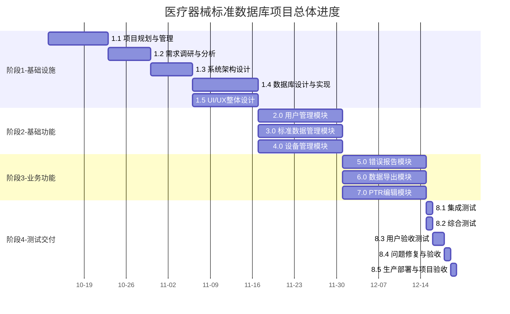
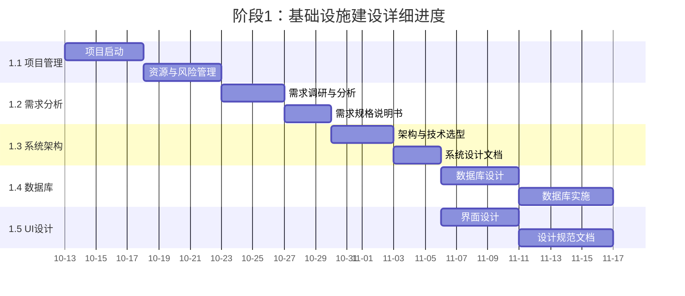
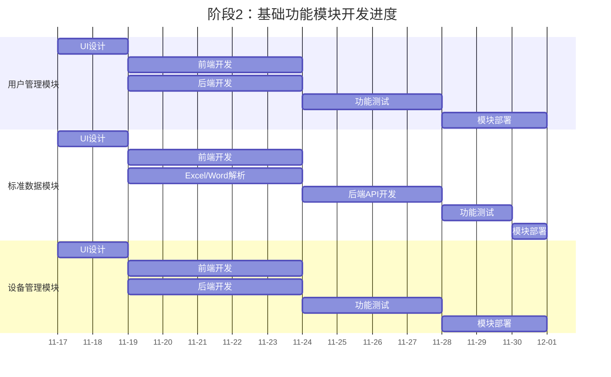
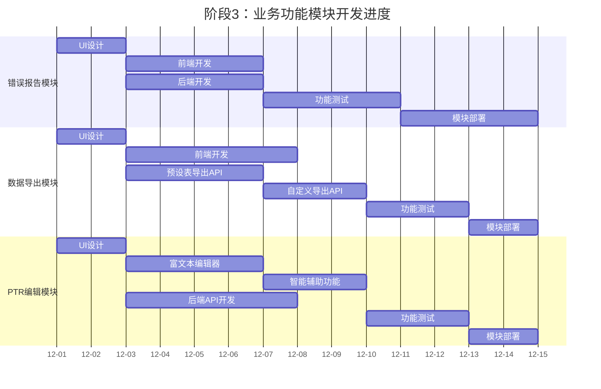
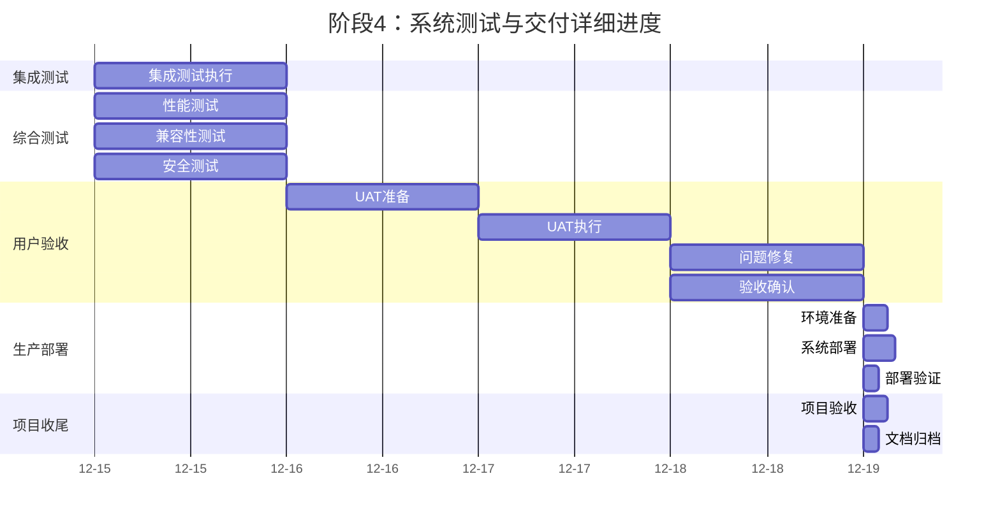

# 医疗器械标准数据库与应用系统 - 项目甘特图

**文档版本：** v1.0  
**编制日期：** 2025-11-01   
**编制团队：** 软件项目管理-第四组

---

## 1. 项目总体甘特图

**项目周期：** 2025年10月13日 - 2025年12月19日（共68天）

---

## 2. 阶段1：基础设施建设

**时间：** 2025年10月13日 - 2025年11月16日（35天）

---

## 3. 阶段2：基础功能模块

**时间：** 2025年11月17日 - 2025年11月30日（14天）

---

## 4. 阶段3：业务功能模块

**时间：** 2025年12月1日 - 2025年12月14日（14天）

---

## 5. 阶段4：系统测试与交付

**时间：** 2025年12月15日 - 2025年12月19日（5天）

---

**文档变更记录**

| 版本 | 日期 | 修订人 | 修订内容 |
|------|------|--------|---------|
| v1.0 | 2025-11-01 | 项目经理 | 初始版本 |

---
