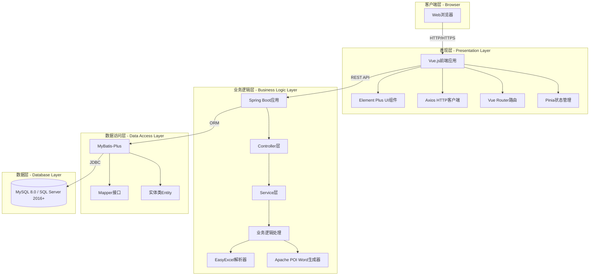
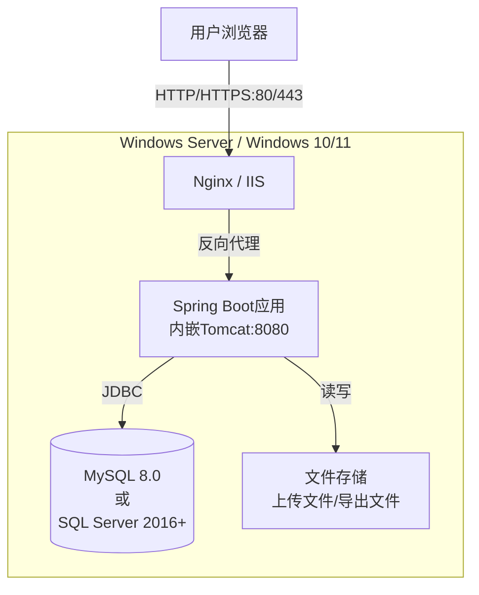
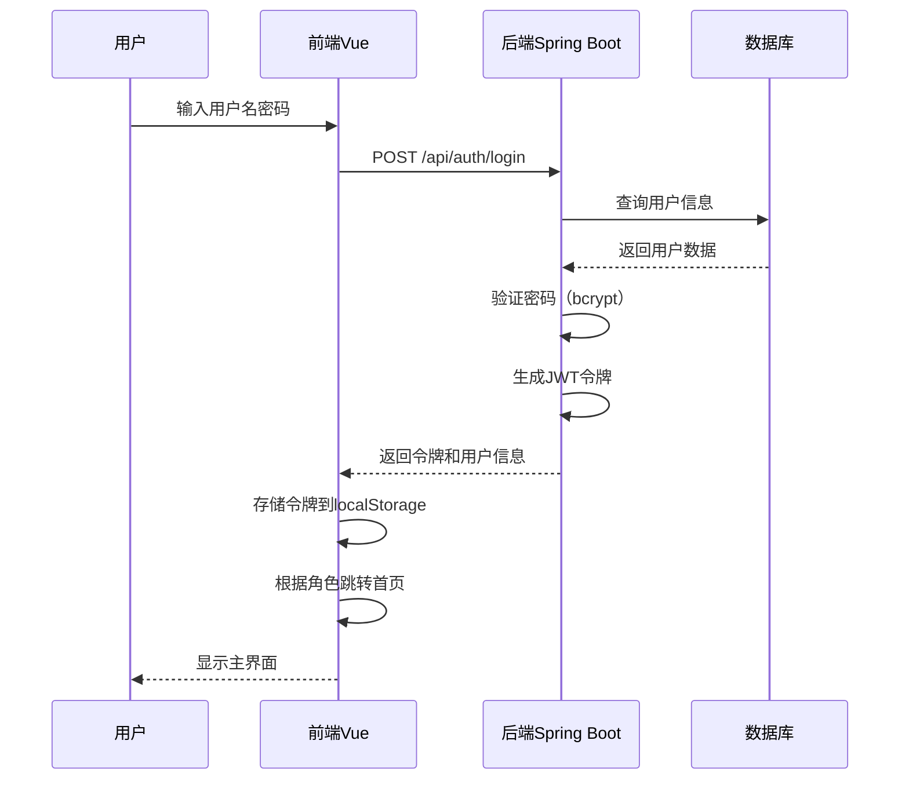
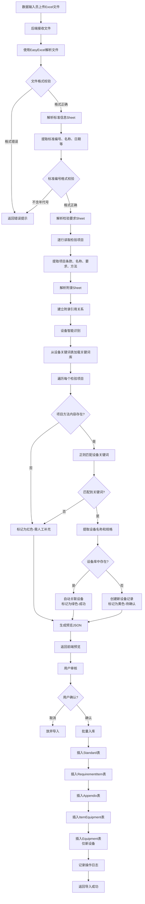
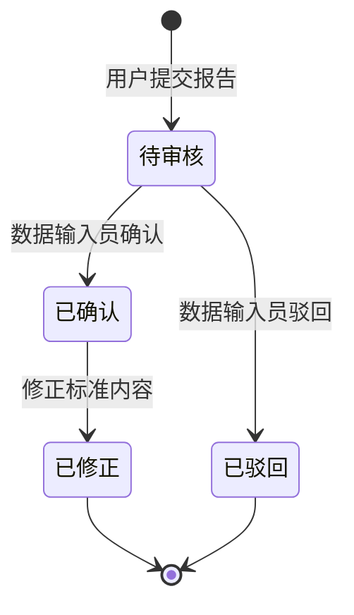
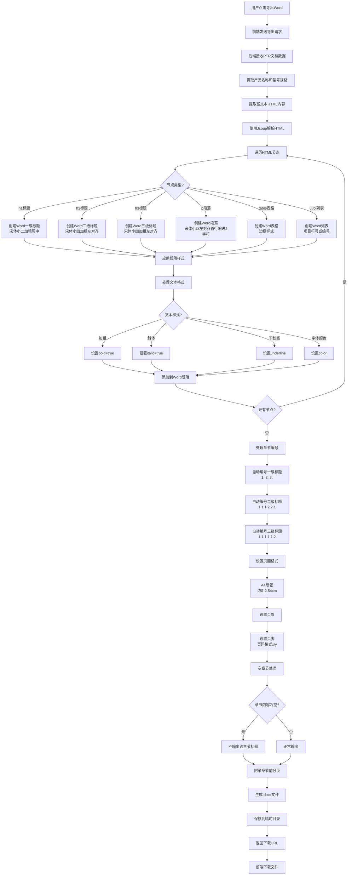

# 医疗器械标准内容信息化数据库及运用系统——系统设计说明书

**文档版本：** v2.0
**编制日期：** 2025-11-14
**文档状态：** 正式版（基于实际项目配置更新）

---

## 目录

[1. 引言](#1-引言)  
&nbsp;&nbsp;[1.1 编写目的](#11-编写目的)  
&nbsp;&nbsp;[1.2 项目背景](#12-项目背景)  
&nbsp;&nbsp;[1.3 定义](#13-定义)  
&nbsp;&nbsp;[1.4 参考资料](#14-参考资料)  

[2. 系统概述](#2-系统概述)  
&nbsp;&nbsp;[2.1 系统目标](#21-系统目标)  
&nbsp;&nbsp;[2.2 系统边界](#22-系统边界)  
&nbsp;&nbsp;[2.3 设计原则](#23-设计原则)  

[3. 系统架构设计](#3-系统架构设计)  
&nbsp;&nbsp;[3.1 总体架构](#31-总体架构)  
&nbsp;&nbsp;[3.2 技术架构](#32-技术架构)  
&nbsp;&nbsp;[3.3 部署架构](#33-部署架构)  
&nbsp;&nbsp;[3.4 网络架构](#34-网络架构)  

[4. 功能模块设计](#4-功能模块设计)  
&nbsp;&nbsp;[4.1 用户管理模块](#41-用户管理模块)  
&nbsp;&nbsp;[4.2 标准数据管理模块](#42-标准数据管理模块)  
&nbsp;&nbsp;[4.3 设备管理模块](#43-设备管理模块)  
&nbsp;&nbsp;[4.4 错误报告模块](#44-错误报告模块)  
&nbsp;&nbsp;[4.5 数据导出模块](#45-数据导出模块)  
&nbsp;&nbsp;[4.6 PTR编辑模块](#46-ptr编辑模块)  

[5. 数据库设计概要](#5-数据库设计概要)  
&nbsp;&nbsp;[5.1 数据库选型](#51-数据库选型)  
&nbsp;&nbsp;[5.2 数据库架构](#52-数据库架构)  
&nbsp;&nbsp;[5.3 核心表设计](#53-核心表设计)  

[6. 接口设计概要](#6-接口设计概要)  
&nbsp;&nbsp;[6.1 前后端接口](#61-前后端接口)  
&nbsp;&nbsp;[6.2 外部系统接口](#62-外部系统接口)  

[7. 安全设计](#7-安全设计)  
&nbsp;&nbsp;[7.1 身份认证](#71-身份认证)  
&nbsp;&nbsp;[7.2 权限控制](#72-权限控制)  
&nbsp;&nbsp;[7.3 数据安全](#73-数据安全)  
&nbsp;&nbsp;[7.4 日志审计](#74-日志审计)  

[8. 性能设计](#8-性能设计)  
&nbsp;&nbsp;[8.1 性能指标](#81-性能指标)  
&nbsp;&nbsp;[8.2 性能优化策略](#82-性能优化策略)  

[9. 可靠性设计](#9-可靠性设计)  
&nbsp;&nbsp;[9.1 容错设计](#91-容错设计)  
&nbsp;&nbsp;[9.2 备份恢复](#92-备份恢复)  
&nbsp;&nbsp;[9.3 高可用设计](#93-高可用设计)  

[10. 运维设计](#10-运维设计)  
&nbsp;&nbsp;[10.1 监控方案](#101-监控方案)  
&nbsp;&nbsp;[10.2 日志管理](#102-日志管理)  
&nbsp;&nbsp;[10.3 运维工具](#103-运维工具)  

---

## 1. 引言

### 1.1 编写目的

本文档是医疗器械标准内容信息化数据库及运用系统的系统设计说明书，用于指导系统的详细设计和开发实现。

本文档的目的是：
- 描述系统的总体架构和技术选型
- 详细说明各功能模块的设计方案
- 为开发人员提供设计依据和实现指导
- 为测试人员提供测试依据
- 为后续系统维护提供参考

本文档供项目经理、系统架构师、开发人员、测试人员参考。

### 1.2 项目背景

（参考需求规格说明书）

### 1.3 定义

| 术语 | 定义 |
|------|------|
| B/S架构 | Browser/Server（浏览器/服务器）架构 |
| REST API | 表述性状态传递应用程序接口 |
| ORM | 对象关系映射（Object-Relational Mapping） |
| JWT | JSON Web Token，用于身份认证的令牌 |
| RBAC | 基于角色的访问控制（Role-Based Access Control） |

### 1.4 参考资料

- 《需求规格说明书-医疗器械标准数据库与应用系统 v4.0》
- 《WBS-工作分解结构 v3.0》
- 《人员安排与项目沟通计划 v3.0》

---

## 2. 系统概述

### 2.1 系统目标

本系统旨在建立医疗器械标准内容的结构化数据库及应用平台，实现以下核心目标：

1. **标准内容结构化管理**
   - 通过半自动导入功能，将Excel格式的医疗器械标准内容批量录入系统
   - 系统自动解析附录引用、智能识别设备信息，减少人工复制粘贴工作
   - 数据输入员仅需"发起导入"和"微调审核"，大幅提升导入效率

2. **权限分级管理**
   - 支持6种用户角色：数据输入员、系统管理员、业务人员、质量管理人员、设备管理人员、实验室人员
   - 基于角色的访问控制（RBAC），通过用户名格式自动识别角色

3. **多场景数据输出**
   - 支持3种预定义表格导出（能力建设信息网站项目表、认可检验检测能力表、操作规程表）
   - 支持产品技术要求Word文档编辑和导出
   - 支持自定义导出模板配置

4. **智能辅助编辑**
   - 产品技术要求编辑时，支持关键词联想查找标准内容
   - 自动生成规范化语句，如"试验结果应符合XX的要求"

### 2.2 系统边界

**系统范围：**
- ✅ 标准内容的结构化存储和管理
- ✅ Excel格式标准的半自动导入
- ✅ 标准内容的浏览、检索和查询
- ✅ 设备信息管理和智能识别
- ✅ 错误报告提交和处理
- ✅ 多种格式的数据导出（Excel、Word）
- ✅ 产品技术要求的富文本编辑和Word导出
- ✅ 用户管理和权限控制
- ✅ 操作日志审计

**系统边界外：**
- ❌ 标准内容的版权管理
- ❌ 标准文档的在线协同编辑
- ❌ 与外部标准数据库的实时同步
- ❌ 移动端APP开发（仅支持Web浏览器访问）
- ❌ 图片、图表等非文本内容的处理

**用户规模：**
- 数据输入员：1人
- 系统管理员：1人
- 其他角色用户：共计不超过20人

### 2.3 设计原则

#### 2.3.1 架构设计原则

1. **分层架构**
   - 表现层、业务逻辑层、数据访问层分离
   - 各层职责清晰，降低耦合度

2. **模块化设计**
   - 功能模块独立，便于开发和维护
   - 模块间通过接口通信

3. **可扩展性**
   - 预留扩展接口，支持功能增强
   - 支持Word格式标准导入（附加功能）

4. **高内聚低耦合**
   - 模块内部功能高度相关
   - 模块间依赖最小化

#### 2.3.2 技术选型原则

1. **成熟稳定**
   - 选择成熟的开源框架和技术栈
   - 社区活跃，文档完善

2. **易于开发**
   - 降低学习成本
   - 提高开发效率

3. **性能优先**
   - 满足性能需求（页面加载≤2秒，Excel导入1000行≤60秒）
   - 支持并发访问（20+用户）

4. **安全可靠**
   - 数据安全加密
   - 完善的权限控制
   - 操作日志审计

#### 2.3.3 开发设计原则

1. **简洁明了**
   - 界面设计简洁，突出核心功能
   - 代码规范，注释完整

2. **用户友好**
   - 操作流程简化
   - 智能提示和错误提示
   - 关键操作二次确认

3. **可维护性**
   - 代码结构清晰
   - 配置与代码分离
   - 完善的文档

---

## 3. 系统架构设计

### 3.1 总体架构

系统采用经典的**B/S三层架构**，分为表现层、业务逻辑层和数据访问层。



**架构说明：**

1. **客户端层**：用户通过Web浏览器访问系统（Chrome 90+、Edge 90+、Firefox 88+）

2. **表现层**：Vue.js单页应用（SPA），负责用户界面展示和交互
   - Element Plus提供UI组件库
   - Axios处理HTTP请求
   - Vue Router管理路由
   - Pinia管理应用状态

3. **业务逻辑层**：Spring Boot应用，负责业务逻辑处理
   - Controller层：接收HTTP请求，返回JSON响应
   - Service层：实现核心业务逻辑
   - EasyExcel：处理Excel文件解析和生成
   - Apache POI (XWPF)：处理Word文档生成

4. **数据访问层**：MyBatis-Plus ORM框架，负责数据库操作
   - Mapper接口：定义数据库操作方法
   - Entity实体类：映射数据库表

5. **数据层**：MySQL 8.0或SQL Server 2016+数据库

### 3.2 技术架构

#### 3.2.1 前端技术栈

**核心框架：**
- **Vue.js 3.3.4**（Composition API）
  - 渐进式JavaScript框架
  - 响应式数据绑定
  - 组件化开发
  - 虚拟DOM提升性能
  - 使用`<script setup>`语法

**UI组件库：**
- **Element Plus 2.4.2**
  - 基于Vue 3的组件库
  - 提供丰富的UI组件（表格、表单、对话框等）
  - 响应式布局支持
  - 图标库：@element-plus/icons-vue 2.1.0

**HTTP客户端：**
- **Axios**（实际开发需安装）
  - 基于Promise的HTTP库
  - 支持请求/响应拦截器
  - 自动转换JSON数据
  - 支持请求取消

**路由管理：**
- **Vue Router 4.2.4**
  - 官方路由管理器
  - 支持嵌套路由
  - 路由守卫（权限控制）
  - 基于角色的路由控制

**状态管理：**
- **Pinia 2.1.6**
  - Vue 3官方推荐状态管理库
  - 类型安全
  - 模块化设计
  - 支持localStorage持久化

**富文本编辑器：**
- **@vueup/vue-quill**（实际开发需安装）
  - 基于Quill的Vue 3组件
  - 支持富文本编辑
  - 支持格式设置、表格、图片插入
  - 输出HTML格式

**构建工具：**
- **Vite 4.4.9**
  - 快速的开发服务器
  - 高效的生产构建
  - 原生ES模块支持
  - 插件：@vitejs/plugin-vue 4.3.4

#### 3.2.2 后端技术栈

**核心框架：**
- **Java 17**（LTS长期支持版本）
  - 稳定的企业级开发语言
  - 丰富的生态系统
  - Spring Boot 3.x必须使用Java 17+

- **Spring Boot 3.5.7**（最新稳定版）
  - 简化Spring应用开发
  - 自动配置
  - 内嵌Tomcat服务器
  - 生产就绪特性（健康检查、监控）
  - 基于Jakarta EE（从javax.*迁移到jakarta.*）

**Web框架：**
- **Spring MVC**
  - RESTful API开发
  - 请求映射和参数绑定
  - 统一异常处理

**ORM框架：**
- **MyBatis-Plus 3.5.9**（Spring Boot 3.x兼容版本）
  - 基于MyBatis的增强工具
  - 代码生成器
  - 通用CRUD操作
  - 分页插件
  - 性能分析插件
  - ⚠️ 使用`mybatis-plus-spring-boot3-starter`（与2.x版本包名不同）

**Excel处理：**
- **EasyExcel 4.0.3**（最新版本，兼容Spring Boot 3.x）
  - 高性能Excel读写
  - 低内存占用（适合大文件）
  - 支持.xlsx格式
  - 注解驱动，简化开发
  - 支持自定义样式和格式

**Word文档生成：**
- **Apache POI 5.3.0 (XWPF)**（最新稳定版）
  - 处理.docx格式
  - 支持段落、表格、样式设置
  - 支持页眉页脚、页码
  - 支持章节编号

**安全框架：**
- **JWT (JSON Web Token) 0.12.6**（最新版本）
  - 无状态身份认证
  - 令牌加密和签名
  - 支持过期时间控制
  - 使用jjwt-api、jjwt-impl、jjwt-jackson三个依赖

**API文档：**
- **Knife4j 4.5.0**（Swagger增强，Spring Boot 3.x版本）
  - 自动生成API文档
  - 在线测试接口
  - 前后端协作
  - ⚠️ 使用`knife4j-openapi3-jakarta-spring-boot-starter`（Jakarta EE版本）

**工具库：**
- **Lombok**：简化Java代码（自动生成getter/setter）
- **Hutool 5.8.34**：Java工具类库（字符串、日期、加密等）
- **Jackson**：JSON序列化/反序列化（Spring Boot默认）

#### 3.2.3 数据库技术

**主数据库（二选一）：**

**方案1：MySQL 8.0**
- 开源关系型数据库
- 高性能、高可靠
- 支持事务（InnoDB引擎）
- 支持外键约束
- 支持全文索引（ngram解析器支持中文）
- utf8mb4字符集（支持完整Unicode）

**方案2：SQL Server 2016+**
- 微软商业数据库
- 企业级特性
- 强大的管理工具（SSMS）
- 支持T-SQL存储过程

**数据库连接池：**
- **HikariCP**（Spring Boot默认）
  - 高性能连接池
  - 低延迟
  - 稳定可靠

**数据库版本管理：**
- **Flyway** 或 **Liquibase**
  - 数据库迁移工具
  - 版本控制
  - 自动执行SQL脚本

#### 3.2.4 中间件与工具

**缓存中间件（可选）：**
- **Redis**
  - 缓存标准列表、设备目录
  - 缓存用户会话
  - 提升查询性能

**日志框架：**
- **Logback**（Spring Boot默认）
  - 日志分级（DEBUG、INFO、WARN、ERROR）
  - 日志文件滚动
  - 异步日志

**开发工具：**
- **IntelliJ IDEA 2023+**：Java开发IDE（Community版即可）
- **VS Code**：前端开发编辑器
- **Postman**：API测试工具
- **Git**：版本控制
- **Maven 3.6+**：Java项目构建工具
- **Node.js 16+**：前端开发环境
- **npm/yarn**：前端包管理器

### 3.3 部署架构

**部署模式：单机部署**



**部署组件：**

1. **Web服务器**：Nginx（推荐）或 IIS
   - 静态资源托管（Vue.js前端）
   - 反向代理（转发API请求到Spring Boot）
   - HTTPS配置（可选）

2. **应用服务器**：Spring Boot内嵌Tomcat
   - 端口：8080（内部）
   - JVM参数：-Xms512m -Xmx2048m

3. **数据库服务器**：MySQL 8.0 或 SQL Server 2016+
   - MySQL端口：3306
   - SQL Server端口：1433

4. **文件存储**：本地文件系统
   - 上传文件目录：`/data/uploads/`
   - 导出文件目录：`/data/exports/`
   - 定期清理临时文件

**系统要求：**
- 操作系统：Windows 10/11 或 Windows Server 2016+
- CPU：4核心及以上
- 内存：8GB及以上
- 硬盘：100GB及以上（SSD推荐）

### 3.4 网络架构

**网络拓扑：**

```
Internet
    |
    | (可选：公网访问)
    |
[防火墙]
    |
    | (内网)
    |
[路由器/交换机]
    |
    +--- [服务器] (192.168.1.100)
    |       |
    |       +--- Nginx:80/443
    |       +--- Spring Boot:8080
    |       +--- MySQL:3306 / SQL Server:1433
    |
    +--- [客户端1] (192.168.1.101)
    +--- [客户端2] (192.168.1.102)
    +--- ...
    +--- [客户端N] (192.168.1.120)
```

**网络配置：**
- 服务器IP：192.168.1.100（固定IP）
- 客户端：DHCP自动分配或固定IP
- 访问地址：http://192.168.1.100 或 http://medical-standards.local

**端口开放：**
- 80（HTTP）：对内网开放
- 443（HTTPS）：对内网开放（可选）
- 8080（Spring Boot）：仅本机访问
- 3306（MySQL）：仅本机访问
- 1433（SQL Server）：仅本机访问

**安全策略：**
- 数据库端口不对外开放
- 应用端口仅通过Nginx反向代理访问
- 防火墙规则限制访问来源

---

## 4. 功能模块设计

### 4.1 用户管理模块

#### 4.1.1 模块概述

用户管理模块负责系统用户的身份认证、权限控制和用户信息管理。

**核心功能：**
- 用户登录/登出
- 用户信息管理（系统管理员）
- 基于角色的访问控制（RBAC）
- 用户名格式自动识别角色

**角色定义：**

| 角色ID | 角色名称 | 账号格式 | 权限范围 |
|--------|----------|----------|----------|
| 1 | 数据输入员 | dataadmin | 导入标准、维护内容、处理错误报告 |
| 2 | 系统管理员 | sysadmin | 用户管理 |
| 3 | 业务人员 | yw### | 浏览标准、编辑PTR、自定义导出 |
| 4 | 质量管理人员 | zl### | 浏览标准、导出表1、自定义导出 |
| 5 | 设备管理人员 | sb### | 浏览标准、维护设备、导出表2、自定义导出 |
| 6 | 实验室人员 | sy### | 浏览标准、导出表3、自定义导出 |

#### 4.1.2 功能设计

**1. 用户登录**

- 输入用户名和密码
- 后端验证用户名和密码（bcrypt加密）
- 生成JWT令牌，返回给前端
- 前端存储令牌到localStorage
- 根据角色跳转到对应首页

**2. 角色自动识别**

```java
// 伪代码示例
public int identifyRole(String username) {
    if ("dataadmin".equals(username)) return 1;
    if ("sysadmin".equals(username)) return 2;
    if (username.matches("^yw\\d{3}$")) return 3;
    if (username.matches("^zl\\d{3}$")) return 4;
    if (username.matches("^sb\\d{3}$")) return 5;
    if (username.matches("^sy\\d{3}$")) return 6;
    throw new IllegalArgumentException("用户名格式不符合规范");
}
```

**3. 权限控制**

- 前端路由守卫：检查JWT令牌有效性
- 后端接口拦截器：验证令牌和角色权限
- 菜单动态渲染：根据角色显示可访问菜单

#### 4.1.3 流程设计

**用户登录流程：**



#### 4.1.4 接口设计

**登录接口：**
```
POST /api/auth/login
Request: { "username": "dataadmin", "password": "123456" }
Response: {
  "code": 200,
  "message": "登录成功",
  "data": {
    "token": "eyJhbGciOiJIUzI1NiIsInR5cCI6IkpXVCJ9...",
    "userInfo": {
      "userId": 1,
      "username": "dataadmin",
      "realName": "数据输入员",
      "roleType": 1
    }
  }
}
```

### 4.2 标准数据管理模块

#### 4.2.1 模块概述

标准数据管理模块是系统的核心模块，负责医疗器械标准内容的导入、存储、维护和查询。

**核心功能：**
- Excel半自动导入（重点）
- 标准内容浏览和检索
- 标准信息维护
- 附录智能链接

#### 4.2.2 功能设计

**1. Excel半自动导入流程（核心业务流程）**

这是系统最核心的业务流程，实现从Excel文件到结构化数据库的半自动转换。

**流程概述：**
```
上传Excel文件
  → 解析Sheet工作表
  → 提取标准信息和检验项目
  → 正则匹配设备关键词
  → 判定红/黄/绿状态
  → 返回JSON预览
  → 用户确认
  → 入库
```

**详细流程设计：**



**技术实现细节：**

**步骤1：文件上传和接收**

```java
@PostMapping("/api/standards/import/upload")
public Result uploadExcel(@RequestParam("file") MultipartFile file) {
    // 1. 文件格式校验
    if (!file.getOriginalFilename().endsWith(".xlsx")) {
        return Result.error("仅支持.xlsx格式文件");
    }

    // 2. 文件大小校验（限制10MB）
    if (file.getSize() > 10 * 1024 * 1024) {
        return Result.error("文件大小不能超过10MB");
    }

    // 3. 保存临时文件
    String tempFilePath = saveTempFile(file);

    // 4. 调用解析服务
    ImportPreviewDTO preview = standardImportService.parseExcel(tempFilePath);

    return Result.success(preview);
}
```

**步骤2：使用EasyExcel解析Sheet**

```java
public ImportPreviewDTO parseExcel(String filePath) {
    ImportPreviewDTO preview = new ImportPreviewDTO();

    // 1. 解析"标准信息"Sheet
    EasyExcel.read(filePath, StandardInfoDTO.class, new StandardInfoListener())
        .sheet("标准信息")
        .doRead();

    // 2. 解析"检验要求"Sheet
    List<RequirementItemDTO> items = new ArrayList<>();
    EasyExcel.read(filePath, RequirementItemDTO.class,
        new PageReadListener<RequirementItemDTO>(dataList -> {
            items.addAll(dataList);
        }))
        .sheet("检验要求")
        .doRead();

    // 3. 解析附录Sheet（附录A、附录B等）
    List<AppendixDTO> appendices = parseAppendices(filePath);

    // 4. 设备智能识别
    identifyEquipment(items);

    // 5. 组装预览数据
    preview.setStandardInfo(standardInfo);
    preview.setItems(items);
    preview.setAppendices(appendices);

    return preview;
}
```

**步骤3：正则匹配设备关键词**

```java
public void identifyEquipment(List<RequirementItemDTO> items) {
    // 1. 加载设备关键词库
    List<EquipmentKeyword> keywords = equipmentKeywordMapper.selectList(null);

    // 2. 构建关键词正则表达式
    Map<String, Equipment> keywordMap = new HashMap<>();
    for (EquipmentKeyword kw : keywords) {
        keywordMap.put(kw.getKeyword(), kw.getEquipment());
    }

    // 3. 遍历每个检验项目
    for (RequirementItemDTO item : items) {
        String methodContent = item.getMethodContent();

        if (StringUtils.isBlank(methodContent)) {
            // 无方法内容，标记为红色
            item.setStatus("error");
            item.setStatusColor("red");
            item.setStatusMessage("缺少方法内容，需人工补充");
            continue;
        }

        // 4. 正则匹配设备关键词
        boolean matched = false;
        for (Map.Entry<String, Equipment> entry : keywordMap.entrySet()) {
            String keyword = entry.getKey();
            Equipment equipment = entry.getValue();

            // 使用正则表达式匹配（不区分大小写）
            Pattern pattern = Pattern.compile(keyword, Pattern.CASE_INSENSITIVE);
            Matcher matcher = pattern.matcher(methodContent);

            if (matcher.find()) {
                matched = true;

                // 5. 提取规格要求（可选）
                String specification = extractSpecification(methodContent, keyword);

                // 6. 判断设备是否已存在
                if (equipment != null) {
                    // 设备已存在，自动关联，标记为绿色
                    item.setEquipmentCode(equipment.getEquipmentCode());
                    item.setEquipmentName(equipment.getEquipmentName());
                    item.setSpecification(specification);
                    item.setStatus("success");
                    item.setStatusColor("green");
                    item.setStatusMessage("自动识别成功");
                } else {
                    // 设备不存在，创建新设备，标记为黄色
                    item.setEquipmentName(keyword);
                    item.setSpecification(specification);
                    item.setStatus("warning");
                    item.setStatusColor("yellow");
                    item.setStatusMessage("新设备，需确认");
                }
                break;
            }
        }

        if (!matched) {
            // 未匹配到关键词，标记为红色
            item.setStatus("error");
            item.setStatusColor("red");
            item.setStatusMessage("未识别到设备，需人工补充");
        }
    }
}
```

**步骤4：提取规格要求（正则表达式）**

```java
private String extractSpecification(String methodContent, String keyword) {
    // 示例：从"使用分度值0.1mg的电子天平"中提取"分度值0.1mg"

    // 正则表达式：匹配"分度值"、"精度"、"量程"等关键词后的数值和单位
    String[] patterns = {
        "分度值\\s*([0-9.]+\\s*[a-zA-Z]+)",
        "精度\\s*([0-9.]+\\s*[%a-zA-Z]+)",
        "量程\\s*([0-9.]+\\s*[-~]\\s*[0-9.]+\\s*[a-zA-Z]+)"
    };

    for (String patternStr : patterns) {
        Pattern pattern = Pattern.compile(patternStr);
        Matcher matcher = pattern.matcher(methodContent);
        if (matcher.find()) {
            return matcher.group(1).trim();
        }
    }

    return null;
}
```

**步骤5：返回JSON预览**

```json
{
  "code": 200,
  "message": "解析成功",
  "data": {
    "standardInfo": {
      "standardNo": "GB 15810-2019",
      "standardName": "一次性使用无菌注射器",
      "publishDate": "2019-05-10",
      "effectiveDate": "2020-05-01"
    },
    "items": [
      {
        "itemId": null,
        "clauseNo": "5.7.1",
        "itemName": "残留容量",
        "requirement": "残留容量应不大于...",
        "methodContent": "使用分度值0.1mg的电子天平称量...",
        "equipmentCode": "A001",
        "equipmentName": "电子天平",
        "specification": "分度值0.1mg",
        "status": "success",
        "statusColor": "green",
        "statusMessage": "自动识别成功"
      },
      {
        "itemId": null,
        "clauseNo": "5.7.2",
        "itemName": "器身密合性",
        "requirement": "器身密合性应符合...",
        "methodContent": "使用高精度测量仪...",
        "equipmentCode": null,
        "equipmentName": "高精度测量仪",
        "specification": null,
        "status": "warning",
        "statusColor": "yellow",
        "statusMessage": "新设备，需确认"
      },
      {
        "itemId": null,
        "clauseNo": "5.7.3",
        "itemName": "滑动性能",
        "requirement": "滑动性能应符合...",
        "methodContent": "",
        "equipmentCode": null,
        "equipmentName": null,
        "specification": null,
        "status": "error",
        "statusColor": "red",
        "statusMessage": "缺少方法内容，需人工补充"
      }
    ],
    "statistics": {
      "total": 42,
      "success": 35,
      "warning": 5,
      "error": 2
    }
  }
}
```

**步骤6：用户确认和入库**

```java
@PostMapping("/api/standards/import/confirm")
@Transactional
public Result confirmImport(@RequestBody ImportConfirmDTO confirmDTO) {
    try {
        // 1. 插入标准基本信息
        Standard standard = new Standard();
        BeanUtils.copyProperties(confirmDTO.getStandardInfo(), standard);
        standardMapper.insert(standard);

        // 2. 插入检验项目
        for (RequirementItemDTO itemDTO : confirmDTO.getItems()) {
            RequirementItem item = new RequirementItem();
            BeanUtils.copyProperties(itemDTO, item);
            item.setStandardNo(standard.getStandardNo());
            requirementItemMapper.insert(item);

            // 3. 处理设备关联
            if (itemDTO.getStatus().equals("warning")) {
                // 新设备，先创建设备记录
                Equipment equipment = new Equipment();
                equipment.setEquipmentCode(generateEquipmentCode());
                equipment.setEquipmentName(itemDTO.getEquipmentName());
                equipmentMapper.insert(equipment);

                itemDTO.setEquipmentCode(equipment.getEquipmentCode());
            }

            if (StringUtils.isNotBlank(itemDTO.getEquipmentCode())) {
                // 创建项目设备关联
                ItemEquipment ie = new ItemEquipment();
                ie.setItemId(item.getItemId());
                ie.setEquipmentCode(itemDTO.getEquipmentCode());
                ie.setSpecificationRequirement(itemDTO.getSpecification());
                itemEquipmentMapper.insert(ie);
            }
        }

        // 4. 插入附录
        for (AppendixDTO appendixDTO : confirmDTO.getAppendices()) {
            Appendix appendix = new Appendix();
            BeanUtils.copyProperties(appendixDTO, appendix);
            appendix.setStandardNo(standard.getStandardNo());
            appendixMapper.insert(appendix);
        }

        // 5. 记录操作日志
        logOperation("导入标准", "成功导入标准：" + standard.getStandardNo());

        return Result.success("导入成功");
    } catch (Exception e) {
        log.error("导入失败", e);
        return Result.error("导入失败：" + e.getMessage());
    }
}
```

#### 4.2.3 流程设计

（见4.2.2中的详细流程图）

#### 4.2.4 接口设计

**Excel导入接口：**
```
POST /api/standards/import/upload
Content-Type: multipart/form-data
Request: file (Excel文件)
Response: ImportPreviewDTO (预览数据)
```

**确认导入接口：**
```
POST /api/standards/import/confirm
Request: ImportConfirmDTO (确认数据)
Response: { "code": 200, "message": "导入成功" }
```

### 4.3 设备管理模块

#### 4.3.1 模块概述

设备管理模块负责检验设备信息的维护和管理，支持设备目录浏览、设备关键词维护。

#### 4.3.2 功能设计

**核心功能：**
- 设备目录浏览（按类别分类）
- 设备信息维护（新增、编辑、删除）
- 设备关键词维护（用于导入时智能识别）
- 设备编号自动生成（格式：[A-Z][0-9]{3}）

**设计要点：**
- 一个设备类型一条记录（如"电子天平"）
- 具体规格存储在ItemEquipment关联表中
- 支持一个设备对应多个关键词（如"天平"、"电子天平"、"分析天平"）

#### 4.3.3 流程设计

**设备新增流程：**
1. 设备管理人员点击"新增设备"
2. 输入设备名称、类别、描述
3. 系统自动生成设备编号（如A001、B002）
4. 添加设备关键词（用于导入识别）
5. 保存到Equipment表和EquipmentKeyword表

#### 4.3.4 接口设计

```
GET /api/equipment/list - 获取设备列表
POST /api/equipment/add - 新增设备
PUT /api/equipment/update - 更新设备
DELETE /api/equipment/delete/{code} - 删除设备
POST /api/equipment/keyword/add - 添加关键词
```

### 4.4 错误报告模块

#### 4.4.1 模块概述

错误报告模块负责标准内容错误的提交、审核和处理流程。

#### 4.4.2 功能设计

**核心功能：**
- 错误报告提交（所有用户）
- 错误报告审核（数据输入员）
- 错误报告处理（数据输入员修正标准内容）
- 错误报告状态跟踪（待审核、已确认、已修正、已驳回）

**工作流程：**
```
用户发现错误 → 提交报告 → 数据输入员审核 → 确认错误 → 修正标准内容 → 关闭报告
```

#### 4.4.3 流程设计

**错误报告流程：**



#### 4.4.4 接口设计

```
POST /api/error-reports/submit - 提交错误报告
GET /api/error-reports/list - 获取报告列表
PUT /api/error-reports/review - 审核报告
PUT /api/error-reports/fix - 标记为已修正
```

### 4.5 数据导出模块

#### 4.5.1 模块概述

数据导出模块负责将标准数据按不同格式导出为Excel文件，支持3种预定义表格和自定义模板。

#### 4.5.2 功能设计

**预定义表格：**
1. **表1：能力建设信息网站项目表**
   - 字段：序号、项目名称、标准号、标准名称、设备名称、设备编号
   - 用户：质量管理人员

2. **表2：认可检验检测能力表**
   - 字段：序号、产品/项目/参数、依据的标准（方法）名称及编号、限制范围、说明
   - 用户：设备管理人员

3. **表3：操作规程表**
   - 字段：序号、项目名称、检验方法、设备名称、设备编号
   - 用户：实验室人员

**自定义导出：**
- 用户自定义选择字段
- 保存为模板供下次使用
- 支持筛选条件（标准编号、项目名称等）

#### 4.5.3 流程设计

**导出流程：**
1. 用户选择导出类型（表1/表2/表3/自定义）
2. 设置筛选条件（可选）
3. 后端查询数据库
4. 使用EasyExcel生成Excel文件
5. 返回下载链接

#### 4.5.4 接口设计

```
POST /api/export/table1 - 导出表1
POST /api/export/table2 - 导出表2
POST /api/export/table3 - 导出表3
POST /api/export/custom - 自定义导出
GET /api/export/templates - 获取自定义模板列表
POST /api/export/template/save - 保存自定义模板
```

### 4.6 PTR编辑模块

#### 4.6.1 模块概述

PTR（产品技术要求）编辑模块负责业务人员创建和编辑产品技术要求文档，并导出为符合规范的Word文档。

**核心功能：**
- 富文本编辑器（Quill/TinyMCE）
- 智能辅助编辑（模板插入、关键词联想）
- Word文档生成（Apache POI XWPF）
- HTML到Word格式转换

#### 4.6.2 功能设计

**1. 富文本编辑**

- 使用Quill或TinyMCE富文本编辑器
- 支持格式设置：字体、字号、加粗、斜体、下划线
- 支持插入表格、图片
- 支持章节编号
- 自动保存（每2分钟）

**2. 智能辅助功能**

- **模板插入**：一键插入标准语句模板（如"试验结果应符合XX的要求"）
- **关键词联想**：输入项目名称，右侧显示标准库匹配结果，点击即可插入

**3. Word文档生成（核心业务流程）**

这是PTR模块的核心功能，需要将前端富文本HTML解析并映射为符合规范的Word格式。

**流程概述：**
```
前端富文本HTML
  → 后端接收
  → 解析HTML结构
  → 映射Word段落和样式
  → 处理字体、页眉页脚、章节编号
  → 生成.docx文件
  → 返回下载链接
```

**详细流程设计：**



**技术实现细节：**

**步骤1：接收前端数据**

```java
@PostMapping("/api/ptr/export")
public Result exportWord(@RequestBody PTRExportDTO exportDTO) {
    try {
        // 1. 获取PTR文档数据
        PTRDocument document = ptrDocumentMapper.selectById(exportDTO.getDocumentId());

        // 2. 调用Word生成服务
        String filePath = ptrWordService.generateWord(document);

        // 3. 返回下载URL
        String downloadUrl = "/api/files/download?path=" + filePath;
        return Result.success(downloadUrl);
    } catch (Exception e) {
        log.error("导出Word失败", e);
        return Result.error("导出失败：" + e.getMessage());
    }
}
```

**步骤2：使用Apache POI XWPF生成Word**

```java
public String generateWord(PTRDocument document) throws Exception {
    // 1. 创建Word文档对象
    XWPFDocument wordDoc = new XWPFDocument();

    // 2. 设置页面格式
    CTSectPr sectPr = wordDoc.getDocument().getBody().addNewSectPr();
    CTPageSz pageSize = sectPr.addNewPgSz();
    pageSize.setW(BigInteger.valueOf(11906)); // A4宽度（1/20 point）
    pageSize.setH(BigInteger.valueOf(16838)); // A4高度

    CTPageMar pageMar = sectPr.addNewPgMar();
    pageMar.setLeft(BigInteger.valueOf(1440)); // 2.54cm = 1440 twips
    pageMar.setRight(BigInteger.valueOf(1440));
    pageMar.setTop(BigInteger.valueOf(1440));
    pageMar.setBottom(BigInteger.valueOf(1440));

    // 3. 设置页眉
    XWPFHeader header = wordDoc.createHeader(HeaderFooterType.DEFAULT);
    XWPFParagraph headerPara = header.createParagraph();
    headerPara.setAlignment(ParagraphAlignment.CENTER);
    XWPFRun headerRun = headerPara.createRun();
    headerRun.setText("产品技术要求");
    headerRun.setFontFamily("宋体");
    headerRun.setFontSize(10);

    // 4. 设置页脚（页码）
    XWPFFooter footer = wordDoc.createFooter(HeaderFooterType.DEFAULT);
    XWPFParagraph footerPara = footer.createParagraph();
    footerPara.setAlignment(ParagraphAlignment.CENTER);

    // 添加页码字段（格式：x/y）
    CTSimpleField pageNumber = footerPara.getCTP().addNewFldSimple();
    pageNumber.setInstr("PAGE \\* MERGEFORMAT");

    XWPFRun footerRun = footerPara.createRun();
    footerRun.setText("/");

    CTSimpleField totalPages = footerPara.getCTP().addNewFldSimple();
    totalPages.setInstr("NUMPAGES \\* MERGEFORMAT");

    // 5. 添加文档标题
    XWPFParagraph titlePara = wordDoc.createParagraph();
    titlePara.setAlignment(ParagraphAlignment.CENTER);
    XWPFRun titleRun = titlePara.createRun();
    titleRun.setText(document.getProductName());
    titleRun.setFontFamily("宋体");
    titleRun.setFontSize(22); // 小二
    titleRun.setBold(true);

    // 6. 解析HTML内容
    String htmlContent = document.getContent();
    parseHtmlToWord(wordDoc, htmlContent);

    // 7. 保存文件
    String fileName = "产品技术要求_" + document.getProductName() + "_"
        + LocalDate.now().format(DateTimeFormatter.BASIC_ISO_DATE) + ".docx";
    String filePath = tempDir + "/" + fileName;

    FileOutputStream out = new FileOutputStream(filePath);
    wordDoc.write(out);
    out.close();
    wordDoc.close();

    return filePath;
}
```

**步骤3：解析HTML并映射Word格式**

```java
private void parseHtmlToWord(XWPFDocument wordDoc, String htmlContent) {
    // 使用Jsoup解析HTML
    Document doc = Jsoup.parse(htmlContent);
    Elements elements = doc.body().children();

    int h1Counter = 0;
    int h2Counter = 0;
    int h3Counter = 0;

    for (Element element : elements) {
        String tagName = element.tagName();

        switch (tagName) {
            case "h1":
                // 一级标题：宋体小二加粗居中
                h1Counter++;
                h2Counter = 0;
                h3Counter = 0;

                XWPFParagraph h1Para = wordDoc.createParagraph();
                h1Para.setAlignment(ParagraphAlignment.CENTER);
                XWPFRun h1Run = h1Para.createRun();
                h1Run.setText(h1Counter + ". " + element.text());
                h1Run.setFontFamily("宋体");
                h1Run.setFontSize(22); // 小二
                h1Run.setBold(true);
                break;

            case "h2":
                // 二级标题：宋体小四加粗左对齐
                h2Counter++;
                h3Counter = 0;

                XWPFParagraph h2Para = wordDoc.createParagraph();
                h2Para.setAlignment(ParagraphAlignment.LEFT);
                XWPFRun h2Run = h2Para.createRun();
                h2Run.setText(h1Counter + "." + h2Counter + " " + element.text());
                h2Run.setFontFamily("宋体");
                h2Run.setFontSize(14); // 小四
                h2Run.setBold(true);
                break;

            case "h3":
                // 三级标题：宋体小四加粗左对齐
                h3Counter++;

                XWPFParagraph h3Para = wordDoc.createParagraph();
                h3Para.setAlignment(ParagraphAlignment.LEFT);
                XWPFRun h3Run = h3Para.createRun();
                h3Run.setText(h1Counter + "." + h2Counter + "." + h3Counter + " " + element.text());
                h3Run.setFontFamily("宋体");
                h3Run.setFontSize(14); // 小四
                h3Run.setBold(true);
                break;

            case "p":
                // 段落：宋体小四左对齐首行缩进2字符行距1.5倍
                if (StringUtils.isNotBlank(element.text())) {
                    XWPFParagraph para = wordDoc.createParagraph();
                    para.setAlignment(ParagraphAlignment.LEFT);
                    para.setIndentationFirstLine(420); // 首行缩进2字符（1字符=210 twips）
                    para.setSpacingLineRule(LineSpacingRule.AUTO);
                    para.setSpacingBetween(1.5);

                    // 处理段落内的格式化文本
                    parseInlineElements(para, element);
                }
                break;

            case "table":
                // 表格
                parseTableToWord(wordDoc, element);
                break;

            case "ul":
            case "ol":
                // 列表
                parseListToWord(wordDoc, element, tagName.equals("ol"));
                break;
        }
    }
}
```

**步骤4：处理文本格式（加粗、斜体、下划线）**

```java
private void parseInlineElements(XWPFParagraph para, Element element) {
    for (Node node : element.childNodes()) {
        if (node instanceof TextNode) {
            // 纯文本
            XWPFRun run = para.createRun();
            run.setText(((TextNode) node).text());
            run.setFontFamily("宋体");
            run.setFontSize(14); // 小四
        } else if (node instanceof Element) {
            Element childElement = (Element) node;
            XWPFRun run = para.createRun();
            run.setText(childElement.text());
            run.setFontFamily("宋体");
            run.setFontSize(14);

            // 应用格式
            if (childElement.tagName().equals("strong") || childElement.tagName().equals("b")) {
                run.setBold(true);
            }
            if (childElement.tagName().equals("em") || childElement.tagName().equals("i")) {
                run.setItalic(true);
            }
            if (childElement.tagName().equals("u")) {
                run.setUnderline(UnderlinePatterns.SINGLE);
            }

            // 处理字体颜色
            String color = childElement.attr("style");
            if (color.contains("color:")) {
                String colorValue = extractColor(color);
                run.setColor(colorValue);
            }
        }
    }
}
```

**步骤5：处理表格**

```java
private void parseTableToWord(XWPFDocument wordDoc, Element tableElement) {
    Elements rows = tableElement.select("tr");
    if (rows.isEmpty()) return;

    // 创建Word表格
    XWPFTable table = wordDoc.createTable(rows.size(), rows.get(0).select("th, td").size());
    table.setWidth("100%");

    // 设置表格边框
    table.setInsideHBorder(XWPFTable.XWPFBorderType.SINGLE, 4, 0, "000000");
    table.setInsideVBorder(XWPFTable.XWPFBorderType.SINGLE, 4, 0, "000000");

    // 填充表格内容
    for (int i = 0; i < rows.size(); i++) {
        Elements cells = rows.get(i).select("th, td");
        XWPFTableRow row = table.getRow(i);

        for (int j = 0; j < cells.size(); j++) {
            XWPFTableCell cell = row.getCell(j);
            cell.setText(cells.get(j).text());

            // 设置单元格样式
            XWPFParagraph cellPara = cell.getParagraphs().get(0);
            XWPFRun cellRun = cellPara.getRuns().get(0);
            cellRun.setFontFamily("宋体");
            cellRun.setFontSize(12);

            // 表头加粗
            if (cells.get(j).tagName().equals("th")) {
                cellRun.setBold(true);
            }
        }
    }
}
```

#### 4.6.3 流程设计

（见4.6.2中的详细流程图）

#### 4.6.4 接口设计

**创建PTR文档：**
```
POST /api/ptr/create
Request: { "productName": "一次性使用无菌注射器", "modelSpec": "1ml, 2ml, 5ml" }
Response: { "code": 200, "data": { "documentId": 1 } }
```

**保存PTR内容：**
```
POST /api/ptr/save
Request: { "documentId": 1, "content": "<h1>性能指标</h1><p>...</p>" }
Response: { "code": 200, "message": "保存成功" }
```

**导出Word：**
```
POST /api/ptr/export
Request: { "documentId": 1 }
Response: { "code": 200, "data": { "downloadUrl": "/api/files/download?path=..." } }
```

---

## 5. 数据库设计概要

### 5.1 数据库选型

### 5.2 数据库架构

### 5.3 核心表设计

（详细设计见《数据库设计文档》）

---

## 6. 接口设计概要

### 6.1 前后端接口

（详细设计见《接口文档》）

### 6.2 外部系统接口

---

## 7. 安全设计

### 7.1 身份认证

**认证方式：JWT（JSON Web Token）**

**认证流程：**
1. 用户登录时，后端验证用户名和密码
2. 验证成功后，生成JWT令牌（包含用户ID、角色、过期时间）
3. 前端存储令牌到localStorage
4. 后续请求在HTTP Header中携带令牌：`Authorization: Bearer <token>`
5. 后端拦截器验证令牌有效性和过期时间

**密码安全：**
- 使用bcrypt算法加密存储（cost factor=10）
- 密码强度要求：至少6位，包含字母和数字
- 登录失败5次后锁定账户30分钟

**令牌管理：**
- 令牌有效期：8小时
- 支持令牌刷新机制
- 登出时清除前端令牌

### 7.2 权限控制

**基于角色的访问控制（RBAC）：**

| 功能模块 | 数据输入员 | 系统管理员 | 业务人员 | 质量管理 | 设备管理 | 实验室 |
|---------|-----------|-----------|---------|---------|---------|--------|
| 用户管理 | ❌ | ✅ | ❌ | ❌ | ❌ | ❌ |
| 标准浏览 | ✅ | ✅ | ✅ | ✅ | ✅ | ✅ |
| 标准导入 | ✅ | ❌ | ❌ | ❌ | ❌ | ❌ |
| 标准维护 | ✅ | ❌ | ❌ | ❌ | ❌ | ❌ |
| 设备管理 | ✅ | ❌ | ❌ | ❌ | ✅ | ❌ |
| 错误报告提交 | ✅ | ✅ | ✅ | ✅ | ✅ | ✅ |
| 错误报告处理 | ✅ | ❌ | ❌ | ❌ | ❌ | ❌ |
| PTR编辑 | ❌ | ❌ | ✅ | ❌ | ❌ | ❌ |
| 导出表1 | ❌ | ❌ | ❌ | ✅ | ❌ | ❌ |
| 导出表2 | ❌ | ❌ | ❌ | ❌ | ✅ | ❌ |
| 导出表3 | ❌ | ❌ | ❌ | ❌ | ❌ | ✅ |
| 自定义导出 | ❌ | ❌ | ✅ | ✅ | ✅ | ✅ |

**权限实现：**
- 前端：路由守卫 + 菜单动态渲染
- 后端：Spring Security拦截器 + 注解式权限控制

```java
@PreAuthorize("hasRole('DATA_ADMIN')")
@PostMapping("/api/standards/import")
public Result importStandard(...) { ... }
```

### 7.3 数据安全

**数据加密：**
- 传输加密：HTTPS（可选，内网环境可使用HTTP）
- 密码加密：bcrypt算法
- 敏感字段加密：用户手机号、邮箱（AES-256）

**SQL注入防护：**
- 使用MyBatis-Plus参数化查询
- 禁止拼接SQL语句
- 输入参数校验和过滤

**XSS防护：**
- 前端输入过滤
- 后端输出转义
- Content-Security-Policy响应头

**CSRF防护：**
- JWT令牌验证
- SameSite Cookie属性

**文件上传安全：**
- 文件类型白名单（仅允许.xlsx、.docx）
- 文件大小限制（10MB）
- 文件名过滤（防止路径穿越）
- 病毒扫描（可选）

### 7.4 日志审计

**操作日志记录：**

记录以下操作：
- 用户登录/登出
- 标准导入/修改/删除
- 设备新增/修改/删除
- 错误报告提交/处理
- PTR文档创建/编辑/导出
- 数据导出

**日志内容：**
- 操作时间
- 操作用户
- 操作类型
- 操作对象
- 操作结果
- IP地址

**日志存储：**
- 数据库：OperationLog表
- 文件：日志文件（按日期滚动）
- 保留期限：1年

**日志查询：**
- 系统管理员可查询所有日志
- 支持按用户、时间、操作类型筛选

---

## 8. 性能设计

### 8.1 性能指标

**响应时间要求：**
- 页面加载时间：≤ 2秒
- 标准列表查询：≤ 1秒
- Excel导入（1000行）：≤ 60秒
- Word导出：≤ 5秒
- 数据导出（1000条）：≤ 10秒

**并发性能：**
- 支持20+用户同时在线
- 支持5个用户同时导入标准

**数据容量：**
- 标准数量：1000+
- 检验项目：50,000+
- 设备数量：500+
- 用户数量：20+

### 8.2 性能优化策略

**数据库优化：**
- 索引优化：为常用查询字段建立索引
  - StandardNo（主键索引）
  - StandardName（普通索引 + 全文索引）
  - ItemName（普通索引 + 全文索引）
  - EquipmentKeyword.Keyword（普通索引）
- 分页查询：使用MyBatis-Plus分页插件
- 连接池优化：HikariCP连接池配置
  - 最小连接数：5
  - 最大连接数：20
  - 连接超时：30秒

**应用层优化：**
- 缓存策略（可选）：
  - 标准列表缓存（Redis，过期时间5分钟）
  - 设备目录缓存（Redis，过期时间10分钟）
  - 用户信息缓存（Redis，过期时间30分钟）
- 异步处理：
  - Excel导入使用异步任务
  - 大批量数据导出使用异步任务
- 文件流式处理：
  - EasyExcel流式读取（降低内存占用）
  - 大文件分块上传

**前端优化：**
- 组件懒加载
- 图片懒加载
- 虚拟滚动（长列表）
- 防抖和节流（搜索框）
- Gzip压缩

### 8.3 缓存设计

**缓存层次：**

1. **浏览器缓存**：静态资源（JS、CSS、图片）
2. **应用缓存**：Redis（可选）
3. **数据库缓存**：MySQL查询缓存

**缓存策略：**

| 数据类型 | 缓存位置 | 过期时间 | 更新策略 |
|---------|---------|---------|---------|
| 标准列表 | Redis | 5分钟 | 标准更新时清除 |
| 设备目录 | Redis | 10分钟 | 设备更新时清除 |
| 用户信息 | Redis | 30分钟 | 用户信息更新时清除 |
| 系统配置 | Redis | 1小时 | 配置更新时清除 |

---

## 9. 可靠性设计

### 9.1 容错设计

**异常处理：**
- 全局异常处理器（@ControllerAdvice）
- 统一错误响应格式
- 友好的错误提示信息
- 错误日志记录

**数据校验：**
- 前端表单校验（Element Plus表单验证）
- 后端参数校验（@Valid注解 + Hibernate Validator）
- 业务逻辑校验

**事务管理：**
- 标准导入使用事务（@Transactional）
- 导入失败自动回滚
- 关键操作二次确认

**重试机制：**
- 网络请求失败自动重试（最多3次）
- 文件上传失败支持断点续传

### 9.2 备份恢复

**数据备份策略：**
- 全量备份：每周日凌晨2:00
- 增量备份：每天凌晨2:00
- 备份保留：最近4周的备份

**备份内容：**
- 数据库数据（mysqldump或SQL Server备份）
- 上传文件目录
- 系统配置文件

**恢复方案：**
- 数据库恢复：从备份文件恢复
- 文件恢复：从备份目录恢复
- 恢复测试：每月进行一次恢复演练

### 9.3 高可用设计

**单机部署方案：**
- 定期备份数据
- 监控系统运行状态
- 快速恢复机制

**未来扩展（可选）：**
- 数据库主从复制
- 应用服务器集群
- 负载均衡（Nginx）

---

## 10. 运维设计

### 10.1 监控方案

**监控指标：**
- 系统运行状态（CPU、内存、磁盘）
- 数据库连接数
- 应用响应时间
- 错误日志数量

**告警机制：**
- CPU使用率 > 80%：发送告警
- 内存使用率 > 85%：发送告警
- 磁盘使用率 > 90%：发送告警
- 应用无响应：发送告警

**监控工具（可选）：**
- Spring Boot Actuator（健康检查）
- Prometheus + Grafana（监控可视化）

### 10.2 日志管理

**日志分类：**
- 应用日志：业务逻辑日志
- 访问日志：HTTP请求日志
- 错误日志：异常和错误日志
- 操作日志：用户操作审计日志

**日志配置：**
- 日志级别：生产环境INFO，开发环境DEBUG
- 日志滚动：按日期滚动，单文件最大100MB
- 日志保留：最近30天

### 10.3 运维工具

**部署工具：**
- 手动部署（小规模）
- Shell脚本自动化部署

**数据库管理工具：**
- MySQL Workbench / Navicat
- SQL Server Management Studio (SSMS)

**版本管理：**
- Git（代码版本控制）
- Gitee / GitHub（代码托管）

**文档管理：**
- Markdown文档
- 腾讯文档 / 语雀（协作文档）

---

## 附录

### 附录A：技术选型对比

#### A.1 后端框架选型

| 框架 | 优点 | 缺点 | 选择 |
|------|------|------|------|
| **Spring Boot** | 成熟稳定、生态丰富、社区活跃、企业级应用首选 | 学习曲线较陡 | ✅ 选择 |
| Node.js (Express) | 轻量级、JavaScript全栈 | 不适合CPU密集型任务 | ❌ |
| Django (Python) | 快速开发、ORM强大 | 性能相对较低 | ❌ |

#### A.2 ORM框架选型

| 框架 | 优点 | 缺点 | 选择 |
|------|------|------|------|
| **MyBatis-Plus** | 灵活、性能高、代码生成器、通用CRUD | 需要手写复杂SQL | ✅ 选择 |
| JPA/Hibernate | 全自动ORM、对象化操作 | 性能较低、复杂查询困难 | ❌ |
| MyBatis | 灵活、性能高 | 代码量大、重复CRUD | ❌ |

#### A.3 Excel处理库选型

| 库 | 优点 | 缺点 | 选择 |
|------|------|------|------|
| **EasyExcel** | 高性能、低内存、阿里开源、适合大文件 | 功能相对简单 | ✅ 选择 |
| Apache POI | 功能强大、支持复杂格式 | 内存占用高、大文件易OOM | ❌ |
| JExcelApi | 轻量级 | 不支持.xlsx格式 | ❌ |

#### A.4 Word处理库选型

| 库 | 优点 | 缺点 | 选择 |
|------|------|------|------|
| **Apache POI (XWPF)** | 功能强大、支持.docx、社区活跃 | API复杂 | ✅ 选择 |
| Docx4j | 功能强大、支持模板 | 学习成本高 | ❌ |
| Aspose.Words | 功能最强大 | 商业收费 | ❌ |

#### A.5 前端框架选型

| 框架 | 优点 | 缺点 | 选择 |
|------|------|------|------|
| **Vue 3** | 渐进式、易学、生态丰富、Composition API | - | ✅ 选择 |
| React | 生态最丰富、灵活 | 学习曲线陡、需要额外状态管理 | ❌ |
| Angular | 企业级、功能完整 | 学习成本高、体积大 | ❌ |

#### A.6 数据库选型

| 数据库 | 优点 | 缺点 | 选择 |
|--------|------|------|------|
| **MySQL 8.0** | 开源免费、性能高、社区活跃、跨平台 | - | ✅ 推荐 |
| **SQL Server 2016+** | 企业级、管理工具强大、Windows集成好 | 商业收费（Express版免费但有限制） | ✅ 备选 |
| PostgreSQL | 功能强大、开源 | 学习成本高 | ❌ |
| SQLite | 轻量级、无需安装 | 不支持并发写入、功能有限 | ❌ |

### 附录B：设计决策记录

#### B.1 为什么选择B/S架构而非C/S架构？

**决策：** 采用B/S（浏览器/服务器）架构

**理由：**
1. **无需安装客户端**：用户通过浏览器访问，降低部署成本
2. **跨平台**：支持Windows、macOS、Linux等操作系统
3. **易于维护**：服务器端统一升级，无需逐个客户端更新
4. **适合内网环境**：医疗器械检测实验室通常在内网环境

#### B.2 为什么使用JWT而非Session？

**决策：** 使用JWT（JSON Web Token）进行身份认证

**理由：**
1. **无状态**：服务器不需要存储会话信息，降低服务器压力
2. **跨域支持**：适合前后端分离架构
3. **可扩展性**：便于未来扩展到多服务器部署
4. **安全性**：令牌包含签名，防止篡改

#### B.3 为什么选择EasyExcel而非Apache POI？

**决策：** 使用EasyExcel处理Excel文件

**理由：**
1. **性能优势**：流式读取，内存占用低，适合大文件（1000+行）
2. **简化开发**：注解驱动，代码量少
3. **阿里开源**：社区活跃，文档完善
4. **满足需求**：本系统Excel导入场景相对简单，EasyExcel足够

#### B.4 为什么设备库采用"一个类型一条记录"设计？

**决策：** Equipment表存储设备类型（如"电子天平"），具体规格存储在ItemEquipment关联表

**理由：**
1. **避免冗余**：同一类型设备（如电子天平）可能有多种规格（分度值0.1mg、0.01mg等）
2. **灵活性**：不同检验项目可能对同一设备有不同规格要求
3. **便于管理**：设备目录简洁，便于浏览和维护
4. **支持智能识别**：通过关键词匹配设备类型，再提取具体规格

#### B.5 为什么PTR导出使用Apache POI而非模板引擎？

**决策：** 使用Apache POI XWPF直接生成Word文档，而非使用模板引擎（如FreeMarker + Word模板）

**理由：**
1. **格式灵活**：用户编辑的富文本内容结构不固定，难以预设模板
2. **章节编号**：需要动态生成章节编号（1./2./3., 1.1/1.2），模板难以实现
3. **空章节处理**：需要根据内容动态决定是否输出章节，模板难以处理
4. **完全控制**：POI提供完全的格式控制能力，满足严格的格式要求

#### B.6 为什么不使用微服务架构？

**决策：** 采用单体应用架构（Monolithic）

**理由：**
1. **用户规模小**：20+用户，单体应用足够
2. **功能内聚**：6个功能模块高度相关，拆分微服务增加复杂度
3. **部署简单**：单机部署，降低运维成本
4. **开发效率**：团队规模小（10人），单体应用开发效率高
5. **未来可扩展**：如需扩展，可重构为微服务

---

## 文档修订历史

| 版本 | 日期 | 修订人 | 修订内容 | 审核人 |
|------|------|--------|----------|--------|
| v1.0 | 2025-11-12 | AI助手 | 创建文档，完成系统架构设计、核心业务流程设计、安全设计、性能设计等章节 | 待审核 |
| v2.0 | 2025-11-14 | AI助手 | 基于实际项目配置更新技术栈版本：Spring Boot 3.5.7、Java 17、MyBatis-Plus 3.5.9、EasyExcel 4.0.3、POI 5.3.0、JWT 0.12.6、Knife4j 4.5.0、Vue 3.3.4、Element Plus 2.4.2、Vite 4.4.9等 | 待审核 |

---

**文档结束**

