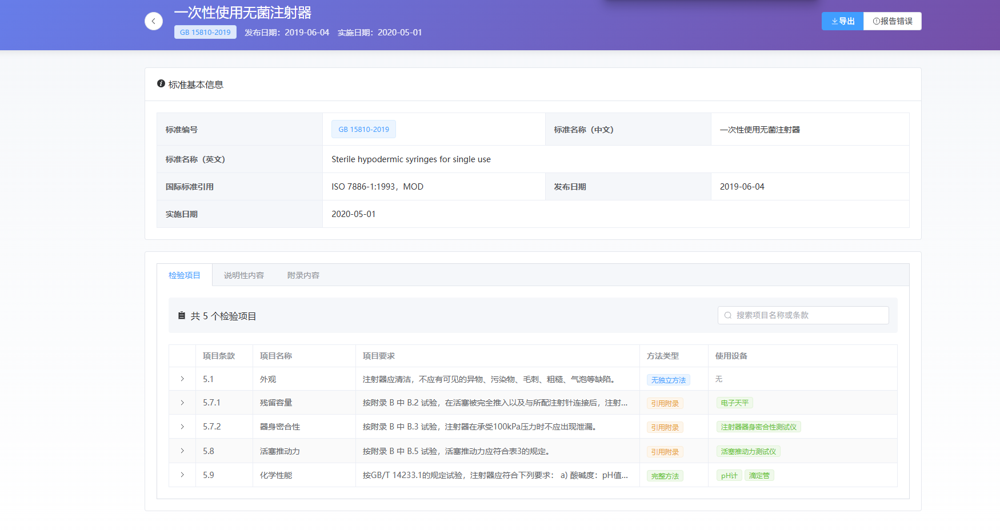
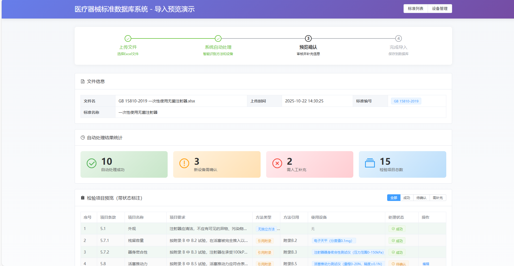
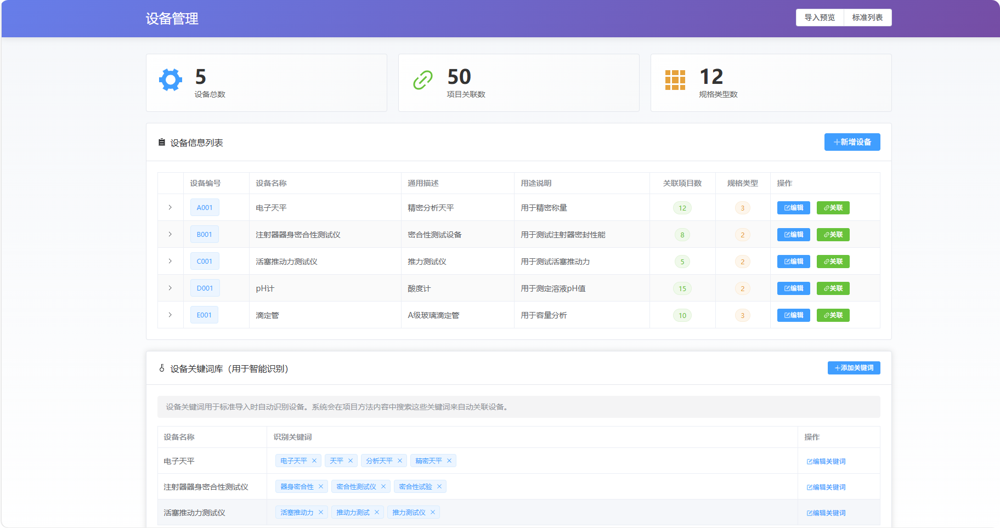
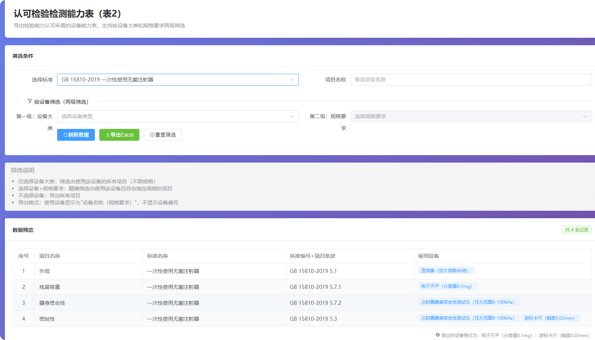

# 医疗器械标准内容信息化数据库及运用系统——需求规格说明书

**文档版本：** v4.0  
**编制日期：** 2025-10-22  
**文档状态：** 正式版

---

## 目录

[1．引言](#1引言)  
&nbsp;&nbsp;[1.1 编写目的](#11-编写目的)  
&nbsp;&nbsp;[1.2 项目背景](#12-项目背景)  
&nbsp;&nbsp;[1.3 定义](#13-定义)  
&nbsp;&nbsp;[1.4 参考资料](#14-参考资料)  

[2．任务概述](#2任务概述)  
&nbsp;&nbsp;[2.1 目标](#21-目标)  
&nbsp;&nbsp;[2.2 运行环境](#22-运行环境)  
&nbsp;&nbsp;[2.3 条件与限制](#23-条件与限制)  

[3．数据描述](#3数据描述)  
&nbsp;&nbsp;[3.1 静态数据](#31-静态数据)  
&nbsp;&nbsp;[3.2 动态数据](#32-动态数据)  
&nbsp;&nbsp;[3.3 数据库介绍](#33-数据库介绍)  
&nbsp;&nbsp;[3.4 数据词典](#34-数据词典)  
&nbsp;&nbsp;[3.5 数据采集](#35-数据采集)  

[4．功能需求](#4功能需求)  
&nbsp;&nbsp;[4.1 功能划分](#41-功能划分)  
&nbsp;&nbsp;[4.2 功能描述](#42-功能描述)  

[5．性能需求](#5性能需求)  
&nbsp;&nbsp;[5.1 响应时间](#51-响应时间)  
&nbsp;&nbsp;[5.2 数据准确性](#52-数据准确性)  
&nbsp;&nbsp;[5.3 并发性能](#53-并发性能)  
&nbsp;&nbsp;[5.4 可用性与扩展性](#54-可用性与扩展性)  

[6．运行需求](#6运行需求)  
&nbsp;&nbsp;[6.1 用户界面](#61-用户界面)  
&nbsp;&nbsp;[6.2 硬件接口](#62-硬件接口)  
&nbsp;&nbsp;[6.3 软件接口](#63-软件接口)  
&nbsp;&nbsp;[6.4 故障处理](#64-故障处理)  

[7．前端Demo演示](#7前端demo演示)  
&nbsp;&nbsp;[7.1 标准数据浏览与查询](#71-标准数据浏览与查询)  
&nbsp;&nbsp;[7.2 标准详情查看](#72-标准详情查看)  
&nbsp;&nbsp;[7.3 标准数据导入（半自动）](#73-标准数据导入半自动)  
&nbsp;&nbsp;[7.4 设备信息管理](#74-设备信息管理)  
&nbsp;&nbsp;[7.5 表格导出功能](#75-表格导出功能)  
&nbsp;&nbsp;[7.6 产品技术要求编辑](#76-产品技术要求编辑)  
&nbsp;&nbsp;[7.7 Demo演示总结](#77-demo演示总结)  

[8．其它需求](#8其它需求)  

---

# 1．引言

## 1.1 编写目的

为明确软件需求、安排项目规划与进度、组织软件开发与测试，撰写本文档。

本文档的目的是：
- 明确医疗器械标准内容信息化数据库及运用系统的功能需求和性能指标
- 为系统设计、开发、测试、验收提供依据
- 作为项目各方沟通和确认需求的基准文档

本文档供项目经理、设计人员、开发人员、测试人员、客户参考。

## 1.2 项目背景

**a. 项目的委托单位、开发单位和主管部门**

- 委托单位：秦黎 名茜生物
- 开发单位：软件项目管理-第四组
- 主管部门：无

**b. 该软件系统与其他系统的关系**

医疗器械行业标准是医疗器械检验工作的基础，其中的内容数据会运用到不同的场景，例如：
1. 实验室能力评审
2. 实验室操作规程编制
3. 产品技术要求编制

当前，标准内容主要以Word、PDF等文档形式存在，存在以下问题：
- 标准内容分散，查找困难
- 数据结构化程度低，难以重复利用
- 不同应用场景需要手工整理，效率低下
- 缺乏统一的数据管理和权限控制

本系统旨在将医疗器械标准内容结构化入库，建立统一的数据管理平台，支持多场景数据输出，提高工作效率。

## 1.3 定义

本文档中所用到的专门术语定义如下：

| 术语 | 定义 |
|------|------|
| 标准编号 | 医疗器械标准的唯一标识，格式为"标准代号+年代号"，例如"GB 15810-2019"。标准编号必须包含年代号。 |
| 项目条款 | 标准中的条款编号，例如"5.7.1"、"5.7.2"等。 |
| 项目名称 | 标准条款对应的检验项目名称，例如"残留容量"、"器身密合性"等。 |
| 项目要求 | 标准中对检验项目的具体技术要求描述。 |
| 项目方法 | 标准中规定的检验方法，通常引用标准附录。 |
| 标签 | 用于对标准内容进行分类标记的关键词。 |
| 产品技术要求（PTR） | Product Technical Requirements，医疗器械制造商根据相关标准自行制定的产品质量要求文档。 |
| 数据输入员 | 负责标准内容录入、维护和修正的系统用户角色，系统仅设1个数据输入员账号。账号格式：`dataadmin`。 |
| 系统管理员 | 负责用户管理的用户角色，系统仅设1个系统管理员账号。账号格式：`sysadmin`。 |
| 业务人员 | 使用系统浏览标准内容、导出产品技术要求的用户角色。账号格式：`yw###`（yw+3位数字）。 |
| 质量管理人员 | 负责质量管理工作，需要导出能力建设信息网站项目表的用户角色。账号格式：`zl###`（zl+3位数字）。 |
| 设备管理人员 | 负责设备管理工作，需要维护设备信息、导出认可检验检测能力表的用户角色。账号格式：`sb###`（sb+3位数字）。 |
| 实验室人员 | 负责实验室操作，需要导出操作规程表的用户角色。账号格式：`sy###`（sy+3位数字）。 |
| 设备编号 | 设备的唯一标识，格式为"大写字母+3位数字"，例如"A001"。 |
| 自定义输出模板 | 用户可自行配置字段和格式的导出模板，不局限于预设的三种表格格式。 |

## 1.4 参考资料

本文档编制参考的资料包括：

a. 项目相关文档
- 基于医疗器械标准内容的信息化数据库及运用.pptx（项目说明演示文稿）
- 基于医疗器械标准内容的信息化数据库及运用.docx（项目说明文档）

b. 标准内容示例
- 3GB 15810-2019 一次性使用无菌注射器.xlsx（标准内容结构化示例）

c. 输出格式规范
- 医疗器械产品技术要求格式.docx（产品技术要求格式模板）

d. 相关标准
- YY0469-2023《医用外科口罩》
- YYT0969-2023《一次性使用医用口罩》

---

# 2．任务概述

## 2.1 目标

本系统的主要目标是：

1. **标准内容结构化管理**
   - 通过半自动导入与链接功能，将Excel形式的医疗器械标准内容批量录入系统
   - 系统自动解析附录引用、智能识别设备信息，减少人工复制粘贴工作
   - 数据输入员仅需"发起导入"和"微调审核"，大幅提升导入效率
   - 按内容进行分解入库，建立结构化数据库
   - 支持标准编号（必须含年代号）的检索和浏览
2. **权限分级管理**
   - 数据输入员：拥有数据录入、修改权限
   - 系统管理员：负责用户管理
   - 业务人员、质量管理人员、设备管理人员、实验室人员：拥有浏览、查询、导出权限
   - 所有用户可提交错误报告，由数据输入员审核处理
3. **多场景数据输出**
   - 支持质量管理人员导出"能力建设信息网站项目表"（表1）
   - 支持设备管理人员导出"认可检验检测能力表"（表2）
   - 支持实验室人员导出"操作规程表"（表3）
   - 支持业务人员编制和导出产品技术要求Word文档
4. **智能辅助编辑**
   - 产品技术要求编辑时，支持关键词联想查找标准内容
   - 自动生成规范化语句，如"试验结果应符合XX的要求"
5. **扩展能力（附加目标）**
   - 支持Word形式标准的自动或半自动录入

## 2.2 运行环境

**服务器端：**
- 操作系统：Windows 10/11 或 Windows Server
- 数据库：SQL Server 2016及以上版本，或SQLite
- 应用环境：根据开发技术选择对应运行环境

**客户端要求：**
- 操作系统：Windows、macOS或Linux
- 浏览器：Chrome、Edge、Firefox等主流浏览器
- 屏幕分辨率：1366×768 或更高
- 网络：标准局域网或互联网连接

**文件存储：**
- 服务器本地磁盘

## 2.3 条件与限制

**条件：**
1. 标准内容已转换为Excel格式，每个标准对应一个Excel文件，文件内包含多个工作表（标准信息、检验要求、附录A-Z等）
2. 每个标准的Excel文件包含完整的工作表（标准信息、检验要求、相关附录）
3. 附录工作表包含章节编号、章节标题、章节内容等结构化字段
4. 产品技术要求模板格式已确定
5. 标准内容的版权使用已获得授权

**限制：**
1. 系统首期支持Excel格式（.xlsx）的批量标准内容导入
2. 一个标准对应一个Excel文件（文件内至少包含：标准信息、检验要求等工作表，以及相关附录工作表）
3. 智能链接功能依赖规范的附录引用格式（如"附录B"、"B.2"）
4. 设备信息在导入标准时从项目方法或附录中自动识别，识别基于设备关键词库，新设备需人工审核确认后添加到设备库
5. 标准编号必须包含年代号，格式校验严格
6. 设备编号格式为"大写字母+3位数字"，字母由管理人员选择，数字由系统自动递增
7. 同一类型设备只创建一条记录，具体规格要求记录在项目设备关联表中
8. 产品技术要求导出格式严格遵循规定模板
9. Word版本标准的自动录入功能为附加功能，准确性需人工校验
10. 导入的标准内容仅包含文字数据，不支持图片、图表等非文本内容
11. 界面设计遵循简洁明了原则，突出核心功能，便于用户快速上手和高效使用
12. 系统用户规模：数据输入员1人，系统管理员1人，其他角色用户共计不超过20人
13. 账号命名规则：
   - 数据输入员：`dataadmin`
   - 系统管理员：`sysadmin`
   - 业务人员：`yw001`至`yw999`
   - 质量管理人员：`zl001`至`zl999`
   - 设备管理人员：`sb001`至`sb999`
   - 实验室人员：`sy001`至`sy999`

---

# 3．数据描述

## 3.1 静态数据

### 3.1.1 定义说明

**静态数据**是指系统运行过程中**相对固定、变化频率较低**的基础配置数据和元数据。这类数据通常在系统初始化或配置阶段建立，后续仅需少量维护更新。

### 3.1.2 静态数据分类

**1. 用户与角色信息（简化设计）**

**数据描述：** 系统用户的账号、密码、基本信息和角色类型。

**数据内容：**

- **用户账号**（通过账号格式自动识别角色）：
  - `dataadmin`：数据输入员（仅1个账号）→ RoleType = 1
  - `sysadmin`：系统管理员（仅1个账号）→ RoleType = 2
  - `yw###`：业务人员（`yw001`-`yw999`）→ RoleType = 3
  - `zl###`：质量管理人员（`zl001`-`zl999`）→ RoleType = 4
  - `sb###`：设备管理人员（`sb001`-`sb999`）→ RoleType = 5
  - `sy###`：实验室人员（`sy001`-`sy999`）→ RoleType = 6
- **用户基本信息**：
  - 密码（加密存储）
  - 真实姓名
  - 联系电话（可选）
  - 邮箱（可选）
- **用户总数限制**：≤22人（1个dataadmin + 1个sysadmin + 最多20个其他用户）

**变化特点：** 用户账号创建后基本稳定，仅在人员入职/离职时增删，密码和基本信息偶尔修改。

**维护角色：** 系统管理员（sysadmin）

---

**2. 系统配置信息**

**数据描述：** 系统运行的参数配置和业务规则配置。

**数据内容：**
- **标签分类体系**：标签的分类结构（如"检验类别"、"设备类型"等）
- **导出模板配置**：表1、表2、表3的字段定义和格式规范
- **产品技术要求段落模板**：常用的标准语句模板（如"试验结果应符合XX的要求"）

**变化特点：** 系统上线后基本固定，仅在业务规则调整或系统优化时修改。

**维护角色：** 数据输入员（dataadmin）

---

**3. 标准基础信息（元数据）**

**数据描述：** 医疗器械标准的基本属性和元数据，不包括具体的检验项目内容。

**数据内容：**
- **标准编号**（含年代号，如"GB 15810-2019"）
- **标准名称**（中文、英文）
- **国际标准引用型式**（如"ISO 7886-1:1993，MOD"）
- **发布日期、实施日期**
- **适用范围**（标准适用的产品范围描述）
- **规范性引用文件**（标准引用的其他文件清单）
- **前言、引言**等说明性文本

**变化特点：** 标准一旦发布，其基本信息（编号、名称、日期等）基本不变。新版本标准发布时，会新增一条标准记录，旧版本标准的基础信息保持不变。

**维护角色：** 数据输入员（dataadmin）在导入标准时自动创建，后续仅需少量修正

---

**4. 设备信息**

**数据描述：** 实验室检验设备的基础信息库。同一类型设备（如"电子天平"）只创建一条记录，具体规格要求记录在项目设备关联关系中。

**数据内容：**
- **设备编号**（格式：大写字母+3位数字，如"A001"、"B023"）
  - 字母由管理人员选择（如A代表天平类，B代表测试仪类）
  - 数字由系统在该字母下自动递增（001、002、003...）
- **设备名称**（如"电子天平"、"注射器器身密合性测试仪"）
- **通用描述**（如"用于精密称量"、"用于测试器身密合性"）
- **设备用途说明**（补充说明）

**项目设备关联关系：**
- 记录检验项目使用哪些设备
- 记录该项目对设备的具体规格要求（如"分度值0.1mg"、"分度值1mg"）
- 示例：
  - 项目A → 关联设备A001（电子天平） + 规格要求"分度值0.1mg"
  - 项目B → 关联设备A001（电子天平） + 规格要求"分度值1mg"

**变化特点：** 设备信息在导入标准时，系统从项目方法或附录中自动识别提取，或由设备管理人员手动增加。设备录入后基本稳定，除非设备报废或更换，否则基本不变。

**维护角色：** 设备管理人员（sb###）、数据输入员（dataadmin）

## 3.2 动态数据

### 3.2.1 定义说明

**动态数据**是指系统运行过程中**频繁变化**的业务操作数据和输出数据。这类数据由用户的日常业务操作产生，随着业务开展不断增加和更新。

### 3.2.2 动态数据分类

动态数据分为**输入数据**和**输出数据**两大类。

---

## 3.2.3 输入数据

输入数据是用户通过各种方式输入到系统的业务数据。

**1. 标准内容数据**

**数据描述：** 医疗器械标准的具体检验项目、要求、方法等核心业务数据。

**来源方式：** Excel文件批量导入

**数据内容：**
- **项目条款**（如"5.7.1"、"5.7.2"）
- **项目名称**（如"残留容量"、"器身密合性"）
- **项目要求**（检验要求的完整描述）
- **项目方法**（检验方法的完整内容或附录引用）
- **关联附录**（附录A、附录B等详细方法内容）
- **术语定义**（标准中定义的专业术语）

**变化特点：** 
- 新标准不断导入，数据持续增长
- 标准内容更新时（如发现错误），需要修正数据
- 是系统中数据量最大、最核心的业务数据

**数据示例：**
```
标准编号：GB 15810-2019（静态）
项目条款：5.7.1（动态）
项目名称：残留容量（动态）
项目要求：按附录 B 中 B.2 试验，在活塞被完全推入...（动态）
```

**操作角色：** 数据输入员（dataadmin）

---

**2. 设备关联数据**

**数据描述：** 记录"哪个检验项目需要使用哪类设备"的对应关系。

**来源方式：** 
- 批量导入（通过Excel文件中的"使用设备"工作表）
- 界面手动关联
- 系统智能识别（从方法内容中自动提取设备关键词）

**数据内容：**
每条关联记录包含两个信息：
- **检验项目**（指明是哪个项目，如"GB 15810-2019的5.7.1条款"）
- **设备类型**（指明需要用什么设备，如"高低温试验箱"）

**业务举例：**
```
标准"GB 15810-2019"的"5.7.1条款"需要使用"高低温试验箱"
→ 系统记录：项目"GB 15810-2019-5.7.1" + 设备"高低温试验箱"
```

**说明：**
- 一个检验项目可能需要多种设备（如某项目需要"高低温试验箱"、"电子天平"、"游标卡尺"）
- 一种设备可以被多个项目共用（如"高低温试验箱"可用于多个标准的多个项目）
- 系统内部通过项目编号和设备编号进行关联，用户界面会显示标准编号、条款号、设备名称等完整信息

**变化特点：** 
- 每导入一个新标准，都需要建立项目与设备的关联
- 标准更新时，可能增加或删除某些设备要求
- 关联关系相对稳定，主要随标准内容变化而调整

**操作角色：** 数据输入员（dataadmin）

---

**3. 错误报告数据**

**数据描述：** 用户发现标准内容错误时提交的报告。

**来源方式：** 表单提交

**数据内容：**
- **报告编号**（系统自动生成）
- **报告人**（提交用户ID）
- **报告时间**
- **错误位置**（标准编号、项目条款）
- **错误描述**（文本描述）
- **处理状态**（待处理/已修正/已驳回）
- **处理人、处理时间、处理备注**

**变化特点：** 
- 用户使用系统过程中随时可能提交
- 数据量随用户活跃度增长
- 处理后状态会更新

**操作角色：** 
- 提交：所有用户
- 处理：数据输入员（dataadmin）

---

**4. 产品技术要求编辑数据**

**数据描述：** 业务人员编制的产品技术要求文档内容。

**来源方式：** 富文本编辑器编辑

**数据内容：**
- **产品名称**
- **产品型号/规格及其划分说明**
- **完整文档内容**（包含第2章性能指标、第3章检验方法、第4章术语、附录等所有章节，存储为富文本）
- **文档状态**（草稿/已发布）

**变化特点：** 
- 业务人员日常工作中频繁创建和编辑
- 内容随产品技术要求的制定和修订而变化

**操作角色：** 业务人员（yw###）

---

## 3.2.4 输出数据

输出数据是系统根据业务需求生成并导出的数据文件和记录。

**1. 表1：能力建设信息网站项目表**

**数据描述：** 质量管理人员导出的项目清单表格。

**输出格式：** Excel (.xlsx)

**表格内容：**
- 项目名称
- 标准编号
- 项目条款

**变化特点：** 每次导出都会生成新的文件和记录

**使用角色：** 质量管理人员（zl###）

---

**2. 表2：认可检验检测能力表**

**数据描述：** 设备管理人员导出的检验能力表格。支持按设备大类和规格要求进行两级筛选。

**输出格式：** Excel (.xlsx)

**表格内容：**
- 项目名称
- 标准名称
- 标准编号+空格+项目条款
- 使用设备（格式："设备名称（规格要求）"，如"电子天平（分度值0.1mg）"，不显示设备编号）

**筛选功能：**
- 第一级：选择设备大类（下拉框显示"A001 - 电子天平"等带编号的选项，方便识别）
- 第二级：选择规格要求（动态显示该设备关联的所有规格，如"分度值0.1mg"）
- 说明：设备编号仅用于筛选界面便于查找，导出表格中不显示编号

**变化特点：** 每次导出都会生成新的文件和记录

**使用角色：** 设备管理人员（sb###）

---

**3. 表3：操作规程表**

**数据描述：** 实验室人员导出的操作规程表格。

**输出格式：** Excel (.xlsx)

**表格内容：**
- 标准编号
- 标准名称
- 项目条款
- 项目名称
- 项目要求
- 使用设备（格式："设备名称（规格要求）"，如"电子天平（分度值0.1mg）"，不显示设备编号）
- 项目方法
- 注意事项

**变化特点：** 每次导出都会生成新的文件和记录

**使用角色：** 实验室人员（sy###）

---

**4. 产品技术要求文档**

**数据描述：** 业务人员导出的产品技术要求Word文档。

**输出格式：** Word (.docx)

**文档内容：**
- 产品名称
- 产品型号/规格及其划分说明
- 性能指标
- 检验方法
- 术语
- 附录

**变化特点：** 
- 每次编辑完成后导出

**使用角色：** 业务人员（yw###）

---

## 3.3 数据库介绍

本系统使用**关系型数据库**。

数据库名称：`MedicalDeviceStandardDB`

**主要数据表：**

1. **标准信息表（Standard）**
   - 存储标准的基本信息
   - 主键：标准编号（含年代号）

2. **条款信息表（Clause）**
   - 存储标准的条款结构
   - 主键：标准编号+条款编号
   - 外键：标准编号 → Standard

3. **检验项目表（RequirementItem）**
   - 存储具体的检验项目要求
   - 主键：项目ID
   - 外键：标准编号+条款编号 → Clause

4. **检验方法表（Method）**
   - 存储检验方法内容
   - 主键：方法ID
   - 外键：标准编号 → Standard

5. **附录表（Appendix）**
   - 存储标准附录内容
   - 主键：附录ID
   - 外键：标准编号 → Standard

6. **术语定义表（TermDefinition）**
   - 存储标准中的术语和定义
   - 主键：术语ID
   - 外键：标准编号 → Standard

7. **设备信息表（Equipment）**
   - 存储设备信息（同类型设备只创建一条记录）
   - 主键：设备编号
   - 说明：设备编号由管理人员选择字母，系统自动递增数字

8. **项目设备关联表（ItemEquipment）**
   - 关联检验项目与使用设备，记录具体规格要求
   - 主键：关联ID
   - 外键：项目ID → RequirementItem，设备编号 → Equipment
   - 说明：SpecificationRequirement字段存储该项目对设备的具体规格要求

9. **产品技术要求表（PTRDocument）**
   - 存储产品技术要求文档
   - 主键：文档ID
   - 说明：文档内容整体存储，不拆分章节表和引用表

10. **错误报告表（ErrorReport）**
    - 存储用户提交的错误报告
    - 主键：报告ID

11. **用户表（User）**
    - 存储用户账号信息和角色
    - 主键：用户ID
    - 说明：角色通过账号格式自动识别，不需要单独的角色表

12. **自定义输出模板表（ExportTemplate）**
    - 存储用户创建的导出模板
    - 主键：模板ID

13. **模板字段配置表（TemplateField）**
    - 存储模板的字段配置
    - 主键：字段配置ID
    - 外键：模板ID → ExportTemplate

14. **设备关键词表（EquipmentKeyword）**
    - 存储设备识别关键词库
    - 主键：关键词ID
    - 外键：设备编号 → Equipment

## 3.4 数据词典

### 3.4.1 标准信息表（Standard）

| 字段名 | 数据类型 | 长度 | 主键 | 非空 | 说明 |
|--------|----------|------|------|------|------|
| StandardNo | VARCHAR | 50 | √ | √ | 标准编号（含年代号），如"GB 15810-2019" |
| StandardName | NVARCHAR | 200 | | √ | 标准名称（中文） |
| StandardNameEN | NVARCHAR | 200 | | | 标准名称（英文） |
| ISOReference | NVARCHAR | 200 | | | 国际标准引用型式 |
| PublishDate | DATE | | | | 发布日期 |
| EffectiveDate | DATE | | | | 实施日期 |
| Scope | NTEXT | | | | 适用范围 |
| References | NTEXT | | | | 规范性引用文件 |
| Foreword | NTEXT | | | | 前言 |
| Introduction | NTEXT | | | | 引言 |
| CreatedBy | INT | | | √ | 创建人ID |
| CreatedTime | DATETIME | | | √ | 创建时间 |
| UpdatedBy | INT | | | | 更新人ID |
| UpdatedTime | DATETIME | | | | 更新时间 |

### 3.4.2 检验项目表（RequirementItem）

| 字段名 | 数据类型 | 长度 | 主键 | 非空 | 说明 |
|--------|----------|------|------|------|------|
| ItemID | INT | | √ | √ | 项目ID（自增） |
| StandardNo | VARCHAR | 50 | | √ | 标准编号 |
| ClauseNo | VARCHAR | 50 | | √ | 项目条款，如"5.7.1" |
| ItemName | NVARCHAR | 200 | | √ | 项目名称 |
| Requirement | NTEXT | | | √ | 项目要求 |
| MethodRef | NVARCHAR | 500 | | | 项目方法引用，如"附录B"（格式1：仅复杂方法有） |
| MethodContent | NTEXT | | | | 项目方法完整内容（格式2：与要求一一对应） |
| MethodType | TINYINT | | | √ | 方法类型：1-无独立方法，2-引用附录，3-完整方法内容 |
| Notes | NTEXT | | | | 注意事项 |
| SortOrder | INT | | | | 排序号 |
| CreatedTime | DATETIME | | | √ | 创建时间 |
| UpdatedTime | DATETIME | | | | 更新时间 |

**字段说明：**

**MethodType（方法类型）**：
- **1 - 无独立方法**：项目要求中已包含方法说明，无需单独方法字段（如GB 15810-2019的简单项目）
- **2 - 引用附录**：方法以附录形式单独表达，MethodRef字段存储附录编号（如"附录B"、"附录C"）
- **3 - 完整方法内容**：方法与要求一一对应，MethodContent字段存储完整方法描述（如YY 0469-2023口罩标准）

**标准格式差异支持：**

**格式1（如GB 15810-2019注射器标准）**：
- 简单项目：MethodType=1，MethodRef和MethodContent为空
- 复杂项目：MethodType=2，MethodRef="附录B"，MethodContent可存储附录内容摘要

**格式2（如YY 0469-2023口罩标准）**：
- 所有项目：MethodType=3，MethodContent存储完整方法，MethodRef可选择性引用附录（如"见附录A"）

### 3.4.3 术语定义表（TermDefinition）

| 字段名 | 数据类型 | 长度 | 主键 | 非空 | 说明 |
|--------|----------|------|------|------|------|
| TermID | INT | | √ | √ | 术语ID（自增） |
| StandardNo | VARCHAR | 50 | | √ | 标准编号 |
| TermCode | VARCHAR | 20 | | √ | 术语编号，如"3.1"、"3.2" |
| TermName | NVARCHAR | 200 | | √ | 术语名称，如"公称容量" |
| TermNameEN | NVARCHAR | 200 | | | 英文术语，如"nominal capacity" |
| Definition | NTEXT | | | √ | 术语定义 |
| Example | NTEXT | | | | 示例 |
| SortOrder | INT | | | | 排序号 |
| CreatedTime | DATETIME | | | √ | 创建时间 |

### 3.4.4 设备信息表（Equipment）

| 字段名 | 数据类型 | 长度 | 主键 | 非空 | 说明 |
|--------|----------|------|------|------|------|
| EquipmentCode | CHAR | 4 | √ | √ | 设备编号，格式："[A-Z][0-9]{3}" |
| EquipmentName | NVARCHAR | 200 | | √ | 设备名称 |
| Model | NVARCHAR | 100 | | | 通用描述或说明 |
| Description | NVARCHAR | 500 | | | 用途说明 |
| CreatedBy | INT | | | √ | 创建人ID |
| CreatedTime | DATETIME | | | √ | 创建时间 |

**设计说明：**
- 同一类型设备（如"电子天平"）在本表中只创建一条记录
- 设备编号中的字母由管理人员选择，数字部分由系统在该字母下自动递增
- Model字段存储通用描述（如"用于精密称量"），不记录具体规格型号
- 具体的规格要求（如"分度值0.1mg"）记录在ItemEquipment关联表中

### 3.4.5 项目设备关联表（ItemEquipment）

| 字段名 | 数据类型 | 长度 | 主键 | 非空 | 说明 |
|--------|----------|------|------|------|------|
| RelationID | INT | | √ | √ | 关联ID（自增） |
| ItemID | INT | | | √ | 项目ID，外键 → RequirementItem.ItemID |
| EquipmentCode | CHAR | 4 | | √ | 设备编号，外键 → Equipment.EquipmentCode |
| SpecificationRequirement | NVARCHAR | 200 | | | 规格要求 |
| CreatedTime | DATETIME | | | √ | 创建时间 |

**设计说明：**
- 本表记录检验项目与设备的关联关系
- SpecificationRequirement字段记录该项目对设备的具体规格要求
- 示例：
  - 项目A关联到"A001-电子天平"，规格要求为"分度值0.1mg"
  - 项目B关联到"A001-电子天平"，规格要求为"分度值1mg"
- 同一个项目可以关联多个设备（一对多）
- 同一个设备可以被多个项目关联（多对一）

### 3.4.6 条款信息表（Clause）

| 字段名 | 数据类型 | 长度 | 主键 | 非空 | 说明 |
|--------|----------|------|------|------|------|
| StandardNo | VARCHAR | 50 | √ | √ | 标准编号 |
| ClauseNo | VARCHAR | 50 | √ | √ | 条款编号，如"5"、"5.7"、"5.7.1" |
| ClauseTitle | NVARCHAR | 200 | | √ | 条款标题 |
| ParentClauseNo | VARCHAR | 50 | | | 父条款编号（用于层级结构） |
| Level | TINYINT | | | √ | 层级，如1、2、3 |
| Content | NTEXT | | | | 条款内容 |
| SortOrder | INT | | | | 排序号 |
| CreatedTime | DATETIME | | | √ | 创建时间 |

**设计说明：**
- 复合主键：StandardNo + ClauseNo
- 支持多级条款结构（如5 → 5.7 → 5.7.1）
- ParentClauseNo字段建立父子关系，实现树形结构

### 3.4.7 检验方法表（Method）

| 字段名 | 数据类型 | 长度 | 主键 | 非空 | 说明 |
|--------|----------|------|------|------|------|
| MethodID | INT | | √ | √ | 方法ID（自增） |
| StandardNo | VARCHAR | 50 | | √ | 标准编号 |
| MethodCode | VARCHAR | 20 | | | 方法编号（如有） |
| MethodName | NVARCHAR | 200 | | √ | 方法名称 |
| MethodContent | NTEXT | | | √ | 方法内容 |
| AppendixRef | VARCHAR | 20 | | | 附录引用，如"附录B" |
| SortOrder | INT | | | | 排序号 |
| CreatedTime | DATETIME | | | √ | 创建时间 |
| UpdatedTime | DATETIME | | | | 更新时间 |

**设计说明：**
- 存储独立的检验方法
- AppendixRef字段用于关联附录（如方法在附录B中详述）

### 3.4.8 附录表（Appendix）

| 字段名 | 数据类型 | 长度 | 主键 | 非空 | 说明 |
|--------|----------|------|------|------|------|
| AppendixID | INT | | √ | √ | 附录ID（自增） |
| StandardNo | VARCHAR | 50 | | √ | 标准编号 |
| AppendixCode | VARCHAR | 20 | | √ | 附录编号，如"A"、"B"、"C" |
| AppendixTitle | NVARCHAR | 200 | | √ | 附录标题 |
| AppendixType | VARCHAR | 20 | | | 附录类型（规范性/资料性） |
| Content | NTEXT | | | √ | 附录内容 |
| SortOrder | INT | | | | 排序号 |
| CreatedTime | DATETIME | | | √ | 创建时间 |
| UpdatedTime | DATETIME | | | | 更新时间 |

**设计说明：**
- 存储标准的附录内容（如附录A、附录B等）
- AppendixType标识附录是规范性还是资料性

### 3.4.9 产品技术要求表（PTRDocument）

| 字段名 | 数据类型 | 长度 | 主键 | 非空 | 说明 |
|--------|----------|------|------|------|------|
| DocumentID | INT | | √ | √ | 文档ID（自增） |
| ProductName | NVARCHAR | 200 | | √ | 产品名称 |
| ModelSpec | NTEXT | | | √ | 产品型号/规格及其划分说明 |
| Content | NTEXT | | | √ | 完整文档内容（富文本，包含所有章节） |
| Status | TINYINT | | | √ | 状态（0:草稿，1:已发布） |
| CreatedBy | INT | | | √ | 创建人ID |
| CreatedTime | DATETIME | | | √ | 创建时间 |
| UpdatedBy | INT | | | | 更新人ID |
| UpdatedTime | DATETIME | | | | 更新时间 |

**说明：**
- Content字段存储完整的文档内容，包含性能指标、检验方法、术语、附录等所有章节

### 3.4.10 错误报告表（ErrorReport）

| 字段名 | 数据类型 | 长度 | 主键 | 非空 | 说明 |
|--------|----------|------|------|------|------|
| ReportID | INT | | √ | √ | 报告ID（自增） |
| ReportNo | VARCHAR | 50 | | √ | 报告编号 |
| StandardNo | VARCHAR | 50 | | √ | 标准编号 |
| ClauseNo | VARCHAR | 50 | | | 条款编号 |
| ErrorDescription | NTEXT | | | √ | 错误描述 |
| Evidence | NVARCHAR | 500 | | | 证据材料路径 |
| ReporterID | INT | | | √ | 报告人ID |
| ReportTime | DATETIME | | | √ | 报告时间 |
| Status | TINYINT | | | √ | 状态（0:待处理，1:已修正，2:已驳回） |
| HandlerID | INT | | | | 处理人ID |
| HandleTime | DATETIME | | | | 处理时间 |
| HandleRemark | NTEXT | | | | 处理备注 |

### 3.4.11 用户表（User）

| 字段名 | 数据类型 | 长度 | 主键 | 非空 | 说明 |
|--------|----------|------|------|------|------|
| UserID | INT | | √ | √ | 用户ID（自增） |
| Username | VARCHAR | 50 | | √ | 用户名（唯一，格式决定角色） |
| Password | VARCHAR | 200 | | √ | 密码（加密存储） |
| RealName | NVARCHAR | 50 | | √ | 真实姓名 |
| Phone | VARCHAR | 20 | | | 联系电话 |
| Email | VARCHAR | 100 | | | 邮箱 |
| Department | NVARCHAR | 100 | | | 所属部门 |
| RoleType | TINYINT | | | √ | 角色类型（自动识别） |
| CreatedBy | INT | | | √ | 创建人ID |
| CreatedTime | DATETIME | | | √ | 创建时间 |
| UpdatedBy | INT | | | | 更新人ID |
| UpdatedTime | DATETIME | | | | 更新时间 |
| LastLoginTime | DATETIME | | | | 最后登录时间 |

**字段说明：**

**RoleType（角色类型）**：系统根据Username格式自动识别并设置
- **1 - 数据输入员**：Username = `dataadmin`
- **2 - 系统管理员**：Username = `sysadmin`
- **3 - 业务人员**：Username格式为 `yw###`（yw + 3位数字）
- **4 - 质量管理人员**：Username格式为 `zl###`（zl + 3位数字）
- **5 - 设备管理人员**：Username格式为 `sb###`（sb + 3位数字）
- **6 - 实验室人员**：Username格式为 `sy###`（sy + 3位数字）

**角色权限对应关系：**

| RoleType | 角色名称 | 账号格式 | 主要权限 |
|----------|---------|---------|---------|
| 1 | 数据输入员 | `dataadmin` | 导入标准数据、维护内容、处理错误报告 |
| 2 | 系统管理员 | `sysadmin` | 用户管理 |
| 3 | 业务人员 | `yw###` | 浏览标准、编辑产品技术要求、自定义导出 |
| 4 | 质量管理人员 | `zl###` | 浏览标准、导出表1、自定义导出 |
| 5 | 设备管理人员 | `sb###` | 浏览标准、维护设备、导出表2、自定义导出 |
| 6 | 实验室人员 | `sy###` | 浏览标准、导出表3、自定义导出 |

**用户创建流程：**
1. 系统管理员创建用户时输入Username
2. 系统根据Username格式正则匹配自动识别RoleType
3. RoleType一经设置后不可修改

**账号数量限制：**
- `dataadmin`：仅1个
- `sysadmin`：仅1个
- 其他角色：总计不超过20个

### 3.4.12 自定义输出模板表（ExportTemplate）

| 字段名 | 数据类型 | 长度 | 主键 | 非空 | 说明 |
|--------|----------|------|------|------|------|
| TemplateID | INT | | √ | √ | 模板ID（自增） |
| TemplateName | NVARCHAR | 100 | | √ | 模板名称 |
| Description | NVARCHAR | 500 | | | 模板说明 |
| IsPublic | BIT | | | √ | 是否公开（1:公开，0:私有） |
| CreatedBy | INT | | | √ | 创建人ID |
| CreatedTime | DATETIME | | | √ | 创建时间 |
| UpdatedBy | INT | | | | 更新人ID |
| UpdatedTime | DATETIME | | | | 更新时间 |
| UseCount | INT | | | √ | 使用次数（默认0） |

### 3.4.13 模板字段配置表（TemplateField）

| 字段名 | 数据类型 | 长度 | 主键 | 非空 | 说明 |
|--------|----------|------|------|------|------|
| FieldID | INT | | √ | √ | 字段配置ID（自增） |
| TemplateID | INT | | | √ | 模板ID |
| FieldName | VARCHAR | 50 | | √ | 字段名称（数据库字段名） |
| DisplayName | NVARCHAR | 100 | | √ | 显示名称（列名） |
| FieldOrder | INT | | | √ | 显示顺序 |
| FieldWidth | INT | | | | 字段宽度（像素，0表示自动） |
| Separator | NVARCHAR | 10 | | | 多值分隔符（如"；"） |
| IsCustom | BIT | | | √ | 是否自定义组合字段（1:是，0:否） |
| CustomExpression | NVARCHAR | 500 | | | 自定义字段表达式（如"StandardNo + ' ' + ClauseNo"） |

### 3.4.14 设备关键词表（EquipmentKeyword）

| 字段名 | 数据类型 | 长度 | 主键 | 非空 | 说明 |
|--------|----------|------|------|------|------|
| KeywordID | INT | | √ | √ | 关键词ID（自增） |
| EquipmentCode | CHAR | 4 | | √ | 设备编号，外键 → Equipment.EquipmentCode |
| Keyword | NVARCHAR | 100 | | √ | 关键词（如"电子天平"、"天平"） |
| CreatedBy | INT | | | √ | 创建人ID |
| CreatedTime | DATETIME | | | √ | 创建时间 |

**设计说明：**
- 一个设备可以有多个关键词（一对多）
- 关键词用于导入标准时智能识别设备
- 系统从项目方法内容中搜索关键词，匹配成功则自动关联设备
- 关键词匹配不区分大小写
- 示例：设备"A001-电子天平"可以有关键词"电子天平"、"天平"、"分析天平"、"精密天平"

## 3.5 数据采集

### 3.5.1 Excel半自动导入与链接

**采集方式：** 通过Web界面上传Excel文件（.xlsx格式）

**工作模式：** 数据输入员负责"发起导入"和"审核结果"，系统自动执行解析和链接

**文件组织方式：**
- 一个标准对应一个Excel文件
- 文件格式：.xlsx
- Excel文件内包含多个工作表（Sheet），每个工作表包含一类数据（标准信息、检验要求、附录A、附录B等）
- 一个标准的Excel文件通常包含10-15个工作表
- **仅支持纯文本内容，不支持图片、图表等非文本元素**
- **如工作表中包含图片或图表，导入时将被忽略**

**典型Excel文件结构示例（GB 15810-2019）：**

**必需工作表（核心数据）：**
1. `标准信息` - 标准的基本信息（标准编号、标准名称、发布日期等）
2. `检验要求` - 所有检验项目的条款、名称、要求

**标准说明性章节工作表（视标准内容而定）：**
3. `前言` - 标准前言内容（如标准包含该章节则需提供）
4. `引言` - 标准引言内容（如标准包含该章节则需提供）
5. `范围` - 标准适用范围（如标准包含该章节则需提供）
6. `术语和定义` - 标准术语定义（如标准包含该章节则需提供）
7. `规范性引用文件` - 标准引用的其他文件（如标准包含该章节则需提供）

**附录内容工作表（视标准内容而定）：**
8. `附录A` - 附录A的完整内容（如标准包含该附录则需提供）
9. `附录B` - 附录B的完整内容（如标准包含该附录则需提供，含B.1、B.2等子章节）
10. `附录C` - 附录C的完整内容（如标准包含该附录则需提供）
11. ... 其他附录工作表（按标准实际包含的附录提供）

**辅助数据工作表（可选，用于减少人工审核）：**
12. `项目方法` - 项目方法信息（适用于YY标准格式，可选）
13. `使用设备` - 项目使用设备信息（提供后可减少人工审核工作量，可选）

**数据导入流程：**

**步骤1：上传文件**
- 数据输入员点击"导入新标准"
- 上传该标准的Excel文件（文件内包含：标准信息、检验要求、说明性章节、附录等多个工作表）
- 点击"上传"按钮

**步骤2：系统自动处理**

系统自动完成以下处理：

1. **读取标准信息**
   - 提取标准编号、名称、日期等基本信息
   - 读取说明性章节（前言、引言、范围、术语和定义、规范性引用文件）
   - 读取所有检验项目

2. **智能关联项目方法**
   - 如Excel中包含`项目方法`工作表：直接按项目条款匹配关联
   - 如未提供：自动识别项目要求中的附录引用（如"按附录B中B.2试验"），自动提取附录内容并关联

3. **智能识别使用设备**
   - 如Excel中包含`使用设备`工作表：直接按项目条款匹配关联
   - 如未提供：从项目方法内容中智能识别设备关键词（如"电子天平"、"显微镜"），自动关联已有设备或标记为新设备

**步骤3：预览与确认**

1. **表格化预览**
   - 系统以表格形式展示所有导入数据
   - 自动标注处理状态：
     - 🟢 绿色：自动处理成功
     - 🟡 黄色：识别到新设备，需确认
     - 🔴 红色：未能自动识别，需人工补充

2. **微调与补充**
   - 仅需处理黄色和红色标注的项目
   - 新设备确认：核对名称、分配编号、添加到设备库
   - 人工补充：填写缺失的方法或设备信息

3. **确认导入**
   - 点击"确认导入"保存到数据库
   - 系统生成导入报告

**去重规则：**

- 标准编号+项目条款作为唯一性约束
- 重复数据可选择：跳过、覆盖、追加版本

### 3.5.2 设备信息录入

**采集方式：** 

1. **标准导入时自动识别和创建**（主要方式）
   - 系统从项目方法或附录内容中自动识别设备关键词
   - 识别到新设备时，提示设备管理人员或数据输入员审核确认
   - 审核通过后自动添加到设备库并建立关联

2. **手动新增**（补充方式）
   - 设备管理人员通过Web界面表单手动录入
   - 用于补充系统未识别到的设备

**录入权限：** 设备管理人员（sb###）、数据输入员（dataadmin）

**设备编号生成：**
1. 管理人员选择字母前缀（A-Z）
   - 建议按设备类别分类，如：A=天平类、B=测试仪类
   - 系统显示每个字母当前已有设备数量
2. 系统自动在该字母下递增生成3位数字（001、002、003...）
3. 最终编号示例：A001、A002、B001

**字段要求：**
- 设备编号：必填，格式为[字母][3位数字]（如A001）
  - 字母由用户选择，数字由系统自动生成
- 设备名称：必填（如"电子天平"）
  - 自动识别时由系统提取，数据输入员可修改
  - 同类型设备使用相同名称，只创建一条记录
- 通用描述：可选（如"用于精密称量"）
- 用途说明：可选

### 3.5.3 项目与设备关联

**采集方式：** 

1. **自动关联**（主要方式）
   - 标准导入时，系统自动识别设备并建立关联
   - 包括从Excel中的"使用设备"工作表直接匹配或从项目方法智能识别
   - 尽可能提取规格要求信息

2. **手动关联**（补充方式）
   - 通过Web界面选择关联
   - 用于补充或修正自动关联结果

**手动关联操作流程：**
1. 选择标准编号
2. 显示该标准下所有项目列表
3. 为每个项目选择关联的设备（支持多选）
4. 填写规格要求（可选，如"分度值0.1mg"）
5. 保存关联关系

**关联数据结构：**
- 项目ID → 设备编号 + 规格要求
- 示例：项目A → A001（电子天平） + "分度值0.1mg"
- 同一项目可关联多个设备，每个关联都可有独立的规格要求

**操作权限：** 设备管理人员（sb###）、数据输入员（dataadmin）

### 3.5.4 Word文档导入采集（附加功能）

**采集方式：** 通过Web界面上传Word文件

**处理模式：**
- 自动模式：系统自动解析Word文档结构和内容
- 半自动模式：系统解析后人工校对和调整

---

# 4．功能需求

## 4.1 功能划分

本系统按功能模块划分如下：

### 4.1.1 用户管理模块
- 用户登录（按账号格式自动识别角色）
- 用户创建（仅系统管理员）
- 用户信息维护（密码修改、姓名修改）
- 角色分配（通过账号格式自动识别）
- 权限控制

### 4.1.2 标准数据管理模块
- Excel文件导入
- Word文件导入（附加功能）
- 标准信息维护
- 条款信息维护
- 检验项目维护
- 检验方法维护
- 标准内容浏览
- 标准内容检索

### 4.1.3 设备管理模块
- 设备信息维护
- 设备编号管理
- 项目设备关联
- 设备关键词库维护

### 4.1.4 错误报告管理模块
- 错误报告提交
- 错误报告查询
- 错误报告处理
- 修正记录跟踪

### 4.1.5 数据导出模块
- 能力建设信息网站项目表导出（表1，预设模板）
- 认可检验检测能力表导出（表2，预设模板）
- 操作规程表导出（表3，预设模板）
- 自定义输出模板管理
- 自定义表格导出

### 4.1.6 产品技术要求编辑模块
- 文档创建与编辑
- 模板管理
- 智能联想查找
- Word文档导出

## 4.2 功能描述

### 4.2.1 用户管理功能

#### 4.2.1.1 用户登录

**输入：** 用户名、密码

**处理：** 
- 验证用户名和密码
- **根据账号格式自动识别用户角色：**
  - `dataadmin` → 数据输入员
  - `sysadmin` → 系统管理员
  - `yw###` → 业务人员
  - `zl###` → 质量管理人员
  - `sb###` → 设备管理人员
  - `sy###` → 实验室人员
- 根据角色加载对应的界面和菜单
- 建立会话

**输出：** 
- 登录成功：根据角色进入对应的系统界面（界面布局一致，菜单功能按角色定位）
- 登录失败：提示错误信息

**验收标准：**

- 支持记住密码功能
- 会话超时自动退出（30分钟无操作）
- 不同角色用户登录后看到与其权限匹配的功能菜单

#### 4.2.1.2 用户创建

**用户角色：** 系统管理员（sysadmin）

**输入：**
- 用户名（根据角色选择对应格式）
- 姓名
- 初始密码

**处理：**
- 系统管理员创建新用户账号
- 根据用户名格式自动识别和分配角色：
  - `dataadmin` → 数据输入员
  - `yw###` → 业务人员
  - `zl###` → 质量管理人员
  - `sb###` → 设备管理人员
  - `sy###` → 实验室人员
- 系统管理员创建初始密码

**输出：**
- 用户创建成功提示
- 账号信息（用户名、初始密码）

**验收标准：**
- 用户名格式自动校验（正则表达式验证）
- 用户名不可重复
- 系统用户总数不超过21人（不含sysadmin）
- 创建成功后用户可正常登录

#### 4.2.1.3 用户信息维护

**用户角色：** 所有用户（自己的信息）、系统管理员（所有用户）

**可修改项：**
- **用户自己可修改：**
  - 姓名
  - 密码
  - 联系电话（可选）
  - 邮箱（可选）

**不可修改项：**
- 用户名（创建后不可修改）
- 角色（由用户名格式决定）

**修改密码流程：**

1. 输入新密码（两次，需一致）
2. 密码强度校验
3. 保存新密码

**验收标准：**

- 新密码符合强度要求（至少8位，包含字母、数字）
- 修改成功后立即生效

#### 4.2.1.4 角色与权限

**角色定义：**

| 角色 | 账号格式 | 权限说明 |
|------|---------|----------|
| 数据输入员 | `dataadmin` | 导入标准数据、维护标准内容、处理错误报告、修正数据 |
| 系统管理员 | `sysadmin` | 用户管理 |
| 业务人员 | `yw###` | 浏览标准内容、检索查询、提交错误报告、编辑和导出产品技术要求、自定义导出 |
| 质量管理人员 | `zl###` | 浏览标准内容、检索查询、提交错误报告、导出表1、自定义导出 |
| 设备管理人员 | `sb###` | 浏览标准内容、检索查询、提交错误报告、维护设备信息、关联设备与项目、导出表2、自定义导出 |
| 实验室人员 | `sy###` | 浏览标准内容、检索查询、提交错误报告、导出表3、自定义导出 |

**说明：**
- 系统仅有1个`dataadmin`账号（数据输入员）
- 系统仅有1个`sysadmin`账号（系统管理员）
- 其他角色用户共计不超过20人
- 角色通过账号格式自动识别，无需手动分配

### 4.2.2 标准数据管理功能

#### 4.2.2.1 标准数据导入

**用户角色：** 数据输入员

**功能说明：** 上传Excel文件（包含多个工作表），系统自动识别项目方法和使用设备，数据输入员仅需确认结果

**操作步骤：**

1. **上传文件**
   - 点击"导入新标准"
   - 选择该标准的Excel文件（文件内包含：标准信息、检验要求、附录等多个工作表）
   - 上传

2. **系统自动处理**
   - 读取Excel文件中各工作表的数据
   - 读取标准信息和检验项目
   - 自动识别项目方法（从附录工作表中提取）
   - 自动识别使用设备（从方法内容中提取，或从"使用设备"工作表直接读取）
   - 校验数据完整性和格式

   **设备识别机制：**
   - 系统维护一个设备关键词库（如"电子天平"、"显微镜"、"色谱仪"等）
   - 从项目方法内容中搜索关键词，提取设备名称
   - 与设备库比对：已存在→自动关联（🟢绿色）；不存在→待确认（🟡黄色）
   - 未找到关键词的项目标记为🔴红色，需人工补充
   
3. **预览与确认**
   - 表格形式展示导入数据
   - 颜色标注处理状态：
     - 🟢 绿色：自动处理成功
     - 🟡 黄色：新设备需确认
     - 🔴 红色：需人工补充
   - 仅需处理黄色和红色标注项
   - 点击"确认导入"完成

**验收标准：**
- 支持批量上传多个文件
- 自动识别成功率≥80%
- 异常项标注准确

#### 4.2.2.2 标准内容浏览

**用户角色：** 所有用户

**功能说明：** 两级页面展示标准信息，支持搜索、筛选和查看详情

**第一级：标准清单**
- 列表显示所有标准（标准编号、名称、发布日期、项目数量）
- 支持搜索和排序
- 点击进入详情页面

**第二级：标准详情**
- 标准基本信息（编号、名称、发布日期、适用范围等）
- 三个标签页：
  - 检验项目列表（条款、名称、要求、方法、设备）
  - 说明性内容（前言、引言、术语定义等）
  - 附录内容（附录A、附录B等）
- 操作按钮：导出、报告错误

#### 4.2.2.3 标准内容检索

**用户角色：** 所有用户

**功能说明：** 支持多种条件组合查询标准内容

**检索条件：**
- 标准编号、标准名称
- 项目名称、项目条款
- 关键词（全文检索）
- 使用设备

**检索结果：**
- 列表显示匹配结果，关键词高亮
- 支持按相关度排序
- 点击跳转到详情页

#### 4.2.2.4 标准内容维护

**用户角色：** 数据输入员

**功能说明：** 编辑和管理已导入的标准数据

**维护功能：**
- 编辑标准基本信息（编号、名称、日期等）
- 编辑检验项目（条款、名称、要求、方法）
- 删除项目
- 批量编辑

### 4.2.3 设备管理功能

#### 4.2.3.1 设备信息维护

**用户角色：** 设备管理人员、数据输入员

**功能说明：** 维护实验室设备信息。同一类型设备只创建一条记录，不记录具体规格型号。

**新增设备：**
- **自动识别**（主要）：导入标准时系统自动识别，提示用户确认
- **手动新增**（补充）：在设备管理界面手动录入

**设备编号规则：**
1. 用户选择字母前缀（A-Z），建议按类别分类
   - 示例：A=天平类、B=测试仪类、C=量具类
2. 系统自动生成3位数字：001、002、003...
3. 最终编号：A001、A002、B001、B002

**设备信息字段：**

| 字段 | 必填 | 示例 |
|------|------|------|
| 设备编号 | √ | A001 |
| 设备名称 | √ | 电子天平 |
| 通用描述 | × | 用于精密称量 |

**设计说明：**
- 同一类型设备（如"电子天平"）只创建一条记录
- 不记录具体型号（如"XS205-赛多利斯"）
- 具体规格要求（如"分度值0.1mg"）记录在项目关联中
- 编号仅用于筛选界面，导出时不显示

**其他功能：** 编辑、删除（已关联项目的设备不可删除）

**验收标准：** 编号格式校验，不可重复，同字母下数字自动递增

---

#### 4.2.3.2 项目设备关联

**用户角色：** 设备管理人员、数据输入员

**功能说明：** 建立检验项目与使用设备的对应关系，记录具体规格要求。

**关联方式：**
- **自动关联**：导入标准时系统自动识别并关联（准确率≥70%）
- **手动关联**：选择项目，勾选设备，填写规格要求（可选）

**关联信息：**

| 信息项 | 必填 | 示例 |
|--------|------|------|
| 检验项目 | √ | 5.8 活塞推动力 |
| 使用设备 | √ | A001 - 电子天平 |
| 规格要求 | × | 分度值0.1mg |

**关联示例：**
```
项目"5.8 活塞推动力" → 设备"A001 电子天平" → 规格"分度值0.1mg"
项目"6.2 容量允差" → 设备"A001 电子天平" → 规格"分度值1mg"
```

**界面布局：**
- 左侧：项目列表（显示已关联设备图标）
- 右侧：设备关联表单（设备选择、规格输入）

**验收标准：** 支持一对多关联，规格字段可选

---

#### 4.2.3.3 设备关键词库维护

**用户角色：** 数据输入员、设备管理人员

**功能说明：** 维护设备关键词库，用于导入标准时智能识别设备。关键词库存储常见设备名称和别名，系统从项目方法内容中搜索这些关键词来自动识别设备。

**关键词库内容示例：**

| 设备名称 | 关键词（多个用逗号分隔） |
|---------|------------------------|
| 电子天平 | 电子天平,天平,分析天平,精密天平 |
| 游标卡尺 | 游标卡尺,卡尺 |
| 高低温试验箱 | 高低温试验箱,试验箱,恒温箱 |
| 显微镜 | 显微镜,光学显微镜 |

**维护功能：**

1. **查看关键词库**
   - 列表显示所有设备及其关键词
   - 支持搜索设备名称或关键词

2. **新增关键词**
   - 选择已有设备，添加新的识别关键词
   - 输入设备名称和关键词，保存

3. **编辑关键词**
   - 修改设备的关键词列表
   - 删除不准确的关键词

4. **删除关键词**
   - 删除无效或错误的关键词

### 4.2.4 错误报告管理功能

#### 4.2.4.1 错误报告提交

**用户角色：** 业务人员、质量管理人员、设备管理人员、实验室人员

**功能说明：** 用户发现标准内容错误时可提交报告

**提交表单：**
- 标准编号、项目条款（自动填充当前查看内容）
- 错误描述（必填）

**提交后：** 生成报告编号，通知数据输入员处理，用户可查询进度

**验收标准：** 提交后可查询进度

#### 4.2.4.2 错误报告处理

**用户角色：** 数据输入员

**功能说明：** 审核和处理用户提交的错误报告

**处理界面：** 待处理报告列表，显示报告详情和原内容对比

**处理方式：**
- **修正**：跳转到编辑页面修改内容，自动更新报告状态
- **驳回**：填写驳回原因，通知报告人

**验收标准：** 处理操作可追溯，通知及时送达

### 4.2.5 数据导出功能

#### 4.2.5.1 表1：能力建设信息网站项目表导出

**用户角色：** 质量管理人员

**功能说明：** 导出质量管理所需的项目清单表

**导出操作：** 选择标准 → 设置筛选条件（可选） → 导出

**输出格式：** Excel（.xlsx）

**表格列：** 项目名称、标准编号、项目条款

**表格预览：** 导出后弹出预览窗口，支持查看、排序、筛选、下载、打印

#### 4.2.5.2 表2：认可检验检测能力表导出

**用户角色：** 设备管理人员

**功能说明：** 导出检验能力认可所需的设备能力表

**导出操作：** 选择标准 → 设置筛选条件（可选） → 导出

**筛选功能：**

**1. 按使用设备筛选（两级筛选）：**

**第一级：选择设备大类**
- 下拉框显示唯一的设备类型列表（如"A001 - 电子天平"、"B001 - 注射器器身密合性测试仪"）
- 默认选项："（全部设备）"

**第二级：选择规格要求（动态生成）**
- 当用户选择了具体设备后，系统自动查询该设备关联的所有规格要求
- 以复选框或下拉框形式显示，例如：
  - "分度值0.1mg"
  - "分度值1mg"
  - "（所有要求）"
- 支持多选

**筛选逻辑：**
- 仅选择设备大类：筛选出使用该设备的所有项目（不限规格）
- 选择设备+规格要求：精确筛选出使用该设备且符合指定规格的项目
- 不选择设备：导出所有项目

**2. 按关键词筛选：**
- 在项目名称或项目要求中搜索关键词

**输出格式：** Excel（.xlsx）

**表格列：** 项目名称、标准名称、标准编号+项目条款（如"GB 15810-2019 5.7.1"）、使用设备

**使用设备格式说明：**
- 显示格式：`设备名称（规格要求）`
- 示例：`电子天平（分度值0.1mg）`
- 多个设备用分号分隔

**表格预览：** 导出后弹出预览窗口，支持查看、排序、筛选、下载、打印

**验收标准：** 字段拼接正确，准确率高。

#### 4.2.5.3 表3：操作规程表导出

**用户角色：** 实验室人员

**功能说明：** 导出实验室操作规程所需的完整项目信息表

**导出操作：** 选择标准 → 设置关键词筛选（可选） → 导出

**输出格式：** Excel（.xlsx）

**表格列：** 标准编号、标准名称、项目条款、项目名称、项目要求、使用设备、项目方法、注意事项

**使用设备格式说明：**
- 显示格式：`设备名称（规格要求）`
- 示例：`电子天平（分度值0.1mg）`
- 多个设备用分号分隔

**表格预览：** 导出后弹出预览窗口，支持查看、排序、筛选、下载、打印

**验收标准：** 字段内容完整，长文本自动换行。

#### 4.2.5.4 自定义输出模板管理

**用户角色：** 所有用户

**功能说明：** 创建个性化的导出模板，不局限于预设的表1、表2、表3格式

**创建模板步骤：**
1. **基本信息**：填写模板名称、说明，设置是否公开
2. **字段配置**：选择需要的字段（标准信息、检验项目、设备等），自定义列名和顺序
3. **预览保存**：预览模板效果，保存

**可选字段：** 20+个字段可选（标准编号、名称、项目条款、要求、方法、设备等，支持组合字段如"标准编号+项目条款"）

**模板管理：** 可重复使用，可分享（公开后其他用户可用）

**验收标准：** 支持拖拽排序，保存后立即可用

#### 4.2.5.5 自定义表格导出

**用户角色：** 所有用户

**功能说明：** 使用自定义模板导出数据

**导出流程：** 选择模板（我的/公共/预设） → 设置筛选条件 → 预览数据 → 导出

**表格预览：** 导出后弹出预览窗口，支持查看全部数据、排序、筛选、下载Excel、打印

**验收标准：** 字段与模板一致。

### 4.2.6 产品技术要求编辑功能

#### 4.2.6.1 文档创建

**用户角色：** 业务人员

**功能说明：** 创建产品技术要求文档，按标准格式生成框架

**创建步骤：** 点击"新建" → 填写产品名称和型号/规格 → 自动生成文档框架

**文档结构：**  1.产品型号/规格、2.性能指标、3.检验方法、4.术语、5.附录（严格按《医疗器械产品技术要求格式》）

**输出：** 进入编辑界面，文档状态为"草稿"

#### 4.2.6.2 内容编辑

**用户角色：** 业务人员

**功能说明：** 编辑产品技术要求文档内容，第2、3章提供智能辅助

**界面布局：** 左侧章节树，中间富文本编辑器，右侧智能辅助面板

**富文本编辑器：** 支持格式设置、插入表格/图片、自动保存（2分钟间隔）

**智能辅助功能（第2章性能指标、第3章检验方法）：**

1. **模板插入**：点击按钮自动插入标准语句模板（如"试验结果应符合XX的要求"）

2. **关键词联想**：
   - 输入项目名称（如"密封性"）
   - 右侧面板显示标准库中的匹配结果
   - 点击"插入要求"或"插入方法"，自动插入标准内容
   - 自动记录引用来源

3. **第3章框架生成**：完成第2章后，点击按钮自动生成第3章框架（项目编号和名称对应）

**其他章节：** 手动填写（第1章产品型号/规格、第4章术语、第5章附录）

**验收标准：** 编辑器稳定不丢内容，自动保存正常，关键词联想。

#### 4.2.6.3 Word文档导出

**功能说明：** 导出为标准格式的Word文档

**格式要求：** 严格按《医疗器械产品技术要求格式》
- 页面：A4，边距2.54cm
- 字体：标题宋体小二加粗，一级标题宋体小四加粗，正文宋体小四
- 段落：标题居中，正文左对齐首行缩进2字符行距1.5倍
- 编号：一级1./2./3.，二级1.1/1.2，三级1.1.1/1.1.2
- 页码：页脚居中，格式"x/y"（如"1/9"）
- 空章节不输出标题，附录章节前分页

**文件命名：** `产品技术要求_[产品名称]_YYYYMMDD.docx`

**验收标准：** 格式完全符合要求，引用内容准确，可用Word正常打开

#### 4.2.6.4 权限控制

**权限规则：** 业务人员只能编辑自己创建的文档，数据输入员和系统管理员可查看所有文档（只读）

---

# 5．性能需求

## **5.1 数据精确度**

**1. 数据导入精确度**

● Excel导入字段映射准确率：≥80%

● 不匹配项进入人工校对队列，不影响整体导入

● 数据校验规则准确执行，错误记录准确标识

**2. 数据导出精确度**

● 导出字段与模板定义符合率：80%

● 字段拼接准确率（如"标准编号+空格+项目条款"）：≥80%

● 数据完整性：不遗漏、不重复

**3. 检索精确度**

● 精确匹配（标准编号、项目条款）准确率：80%

● 模糊匹配（标准名称、项目名称）准确率：≥80%

● 全文检索相关度排序合理

**4. 联想查找精确度**

● 关键词匹配相关度：可配置阈值，建议≥80%

● 联想结果排序：按相关度从高到低

## **5.2 时间特性**

**1. 响应时间**

● 页面加载时间：≤2秒

● 数据检索响应时间：≤2秒

● 分页查询响应时间：≤3秒

● 保存操作响应时间：≤1秒

● 联想查找响应时间：≤1秒

**2. 数据处理时间**

● Excel导入（1000行）：≤60秒

● Excel导出（1000行）：≤10秒

● 批量标注（10000条）：≤30秒

● Word文档导出（常规篇幅，10页内）：≤5秒

**3. 更新处理时间**

● 数据修改后，前端显示实时更新

● 错误报告处理后，状态通知≤5秒送达

**4. 运行时间**

● 系统24小时连续运行

## **5.3 适应性**

**1. 操作方式适应性**

● 支持鼠标和键盘操作

● 支持快捷键

**2. 运行环境适应性**

● 支持Windows

● 支持主流浏览器（Chrome、Edge、Firefox）

● 支持不同屏幕分辨率（最低1366×768）

**3. 数据库适应性**

● 支持MySQL

**4. 接口适应性**

● 预留API接口，支持与其他系统集成

● 支持文件存储方式切换（本地/对象存储）

**5. 扩展性**

● 支持新增标准类型

● 支持新增用户角色和权限

● 数据结构设计支持字段扩展

**6. 开发计划变化适应性**

● 采用模块化设计，模块间低耦合

● 核心功能与附加功能分离

● 保留功能扩展接口

---

# 6．运行需求

## 6.1 用户界面

### 6.1.1 屏幕格式

**登录页面：**
- 居中布局
- 包含：Logo、系统名称、用户名输入框、密码输入框、验证码、登录按钮、记住密码复选框

**系统主界面：**（所有角色界面布局一致）
- 顶部导航栏：Logo、系统名称、用户信息（显示角色）、修改密码、退出按钮
- 左侧菜单栏：功能模块菜单（树形结构，可展开/折叠）
  - **菜单内容根据角色权限动态显示**
  - 不同角色看到的菜单项不同，但界面框架一致
- 中间内容区：显示当前功能页面
- 底部状态栏：版权信息、当前角色、系统时间

**各角色菜单定位：**

| 角色 | 主要菜单项 |
|------|----------|
| 数据输入员（dataadmin） | 标准数据管理、数据导入、内容维护、设备关键词库维护、错误报告处理、标签管理、数据导出 |
| 系统管理员（sysadmin） | 用户管理 |
| 业务人员（yw###） | 标准浏览、标准检索、产品技术要求编辑、自定义导出、错误报告提交 |
| 质量管理人员（zl###） | 标准浏览、标准检索、表1导出、自定义导出、错误报告提交 |
| 设备管理人员（sb###） | 标准浏览、标准检索、设备信息维护、设备关联、设备关键词库维护、表2导出、自定义导出、错误报告提交 |
| 实验室人员（sy###） | 标准浏览、标准检索、表3导出、自定义导出、错误报告提交 |

**列表页面：**
- 顶部：面包屑导航、功能按钮区（新增、导出等）
- 中间：查询条件区（可展开/折叠）
- 下方：数据表格（支持排序、分页）
- 表格工具栏：每行操作按钮（查看、编辑、删除）

**表单页面：**
- 标题区：页面标题、保存按钮、取消按钮
- 表单区：分组显示表单字段
- 必填字段标识：红色星号*
- 提示信息：字段右侧或下方显示输入提示

**编辑器页面：**
- 三栏布局：
  - 左侧：章节树（宽度20%）
  - 中间：编辑器（宽度55%）
  - 右侧：辅助面板（宽度25%）
- 顶部工具栏：保存、导出

### 6.1.2 报表格式

**Excel导出格式：**
- 第一行：表头（加粗、背景色填充）
- 数据行：从第二行开始
- 列宽：自动调整适应内容
- 文本对齐：居中对齐（表头）、左对齐（数据）
- 边框：所有单元格添加边框

**Word导出格式：**
- 严格按《医疗器械产品技术要求格式》

### 6.1.3 菜单格式

**主菜单：**
- 一级菜单：图标+文字
- 二级菜单：文字，缩进显示
- 当前选中菜单：高亮背景色
- 支持搜索菜单功能

**右键菜单：**
- 在数据列表中，右键弹出快捷菜单
- 包含：查看、编辑、删除、导出等操作

### 6.1.4 输入输出时间

**输入响应：**
- 按键输入实时响应，无延迟感
- 下拉选择立即展开
- 文件选择对话框≤1秒打开

**输出显示：**
- 查询结果≤2秒显示
- 导出文件生成提示立即显示
- 文件准备就绪后提供下载链接

### 6.1.5 界面风格

**设计原则：**
- **简洁明了**：界面布局清晰，去除冗余元素，突出核心功能
- **易于使用**：常用功能一键直达，操作流程简化，减少用户学习成本
- **专业规范**：符合Web设计规范和医疗行业特点
- **色彩搭配协调**：配色简洁大方，视觉舒适
- **响应式设计**：适配不同屏幕尺寸，保持良好的可用性
- **信息层次清晰**：通过字体大小、颜色、间距等手段突出重点信息
- **快速反馈**：操作后立即给予用户明确的反馈提示

**色彩方案：**
- 主色调：蓝色系（专业、可信）
- 辅助色：灰色系（中性）
- 强调色：橙色（操作按钮、重要提示）
- 警告色：红色（错误提示）
- 成功色：绿色（成功提示）

**字体：**
- 中文：微软雅黑、宋体
- 英文/数字：Arial、Times New Roman
- 字号：12px-16px

**交互反馈：**
- 鼠标悬停：按钮/链接颜色变化
- 点击反馈：按钮按下效果
- 加载中：显示加载动画
- 操作成功/失败：弹出提示消息

## 6.2 硬件接口

本系统为Web应用，无特殊硬件要求。

**服务器硬件最低配置：**
- CPU：双核处理器
- 内存：2GB
- 硬盘：100GB可用空间
- 网络：标准网络连接

**客户端：**
- 普通PC或笔记本电脑即可
- 支持运行Chrome、Edge等现代浏览器

**打印支持：**
- 使用浏览器自带打印功能

## 6.3 软件接口

### 6.3.1 操作系统

- 服务器端：Windows 10/11
- 客户端：通过浏览器访问，无需安装任何软件

### 6.3.2 数据库

- 使用关系型数据库
- 数据库连接由系统自动管理
- 支持基础事务处理

### 6.3.3 文件处理

- Excel文件：支持.xlsx格式的导入和导出
- Word文件：支持.docx格式的产品技术要求导出

## 6.4 故障处理

### 6.4.1 数据导入故障

- 文件格式错误：提示用户下载正确模板
- 数据校验失败：生成失败记录清单，用户修正后重新导入
- 部分失败：成功的记录正常入库，失败的记录单独列出

### 6.4.2 导出故障

- 导出失败：提示用户，支持重试
- 数据量过大：建议分批导出或缩小查询条件

### 6.4.3 系统异常处理

- 向用户显示友好的错误提示
- 自动保存草稿，防止数据丢失
- 关键操作提供二次确认

---

# 7．前端Demo演示

为便于客户直观了解系统核心功能，本章节展示前端Demo的主要界面和操作流程。

## 7.1 标准数据浏览与查询

**功能说明：** 用户可浏览系统中已录入的医疗器械标准，支持按标准编号、名称进行检索，点击可查看标准详情。


**操作流程：** 进入系统 → 标准列表浏览 → 选择标准查看详情

---

## 7.2 标准详情查看

**功能说明：** 查看标准的基本信息、检验项目列表、说明性内容和附录内容。支持按项目名称或条款号搜索，可查看每个项目的要求、方法和使用设备。

### 7.2.1 检验项目列表



检验项目列表展示标准中的所有检验项目，包括项目条款、名称、要求、方法类型和使用设备信息。

### 7.2.2 说明性内容


说明性内容包括标准的适用范围、规范性引用文件、术语和定义等章节，便于用户全面了解标准背景。

---

## 7.3 标准数据导入（半自动）

**功能说明：** 数据输入员上传Excel文件后，系统自动解析标准内容、识别附录引用和使用设备，并以颜色标注处理状态（绿色=成功，黄色=待确认，红色=需补充），大幅减少人工录入工作量。



**操作流程：** 上传Excel文件 → 系统自动处理 → 预览并确认结果 → 完成导入

---

## 7.4 设备信息管理

**功能说明：** 维护实验室设备信息，支持设备关键词库管理，用于标准导入时智能识别设备。设备编号采用"字母+3位数字"格式（如A001），同类设备只创建一条记录。



**操作流程：** 设备信息维护 → 设备关键词库管理 → 项目设备关联

---

## 7.5 表格导出功能

### 7.5.1 认可检验检测能力表（表2）

**功能说明：** 设备管理人员可按设备大类和规格要求进行两级筛选，导出认可检验检测能力表。支持预览、筛选和导出Excel。



**操作流程：** 选择标准 → 选择设备大类 → 选择规格要求 → 预览数据 → 导出Excel

---

## 7.6 产品技术要求编辑

**功能说明：** 业务人员可创建和编辑产品技术要求文档，采用三栏布局（章节树+编辑器+智能辅助），支持模板插入和关键词联想查找，提升编制效率。


**操作流程：** 新建文档 → 填写产品信息 → 智能辅助编辑 → 导出Word

**智能辅助功能：**

- 模板插入：一键插入标准语句模板
- 关键词联想：输入项目名称，右侧显示标准库匹配结果，点击即可插入
- 自动保存：每2分钟自动保存，防止数据丢失
- 字数统计：实时显示编辑内容字数

---

# 8．其它需求

## 8.1 可使用性

- 界面直观，符合用户使用习惯
- 输入验证和智能提示
- 关键操作二次确认
- 异常情况友好提示
- 批量操作减少重复劳动

## 8.2 安全保密

**身份认证：**
- 用户名密码登录
- 密码强度要求（至少8位，包含字母和数字）
- 密码加密存储
- 会话超时自动退出（30分钟）

**权限控制：**
- 基于角色的访问控制（RBAC）
- 最小权限原则
- 数据权限隔离

## 8.3 可维护性

- 代码遵循编码规范，注释清晰
- 模块化设计，低耦合高内聚
- 配置与代码分离，集中管理

## 8.4 可移植性

- 核心逻辑与 Spring MVC轻度耦合，确保本地开发中框架配置修改的便捷性。
- 数据访问层采用 MyBatis实现简单抽象，满足本地数据库连接参数调整需求。

## 8.5 可扩展性

   ● 预留功能扩展接口                

   ● 支持新增标准类型

   ● 支持新增导出模板

   ● 支持新增用户角色
